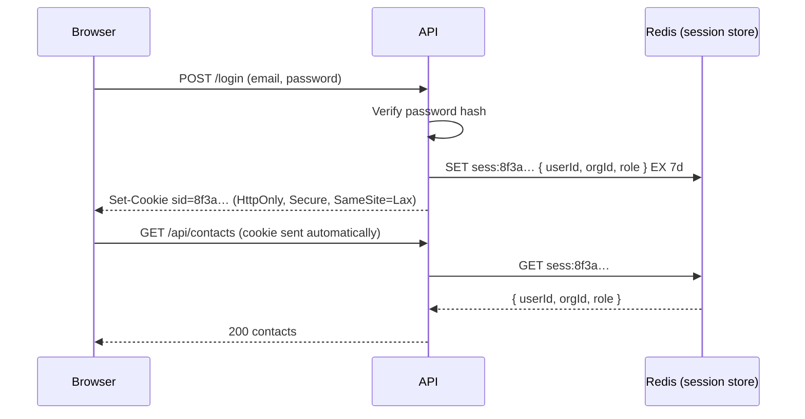
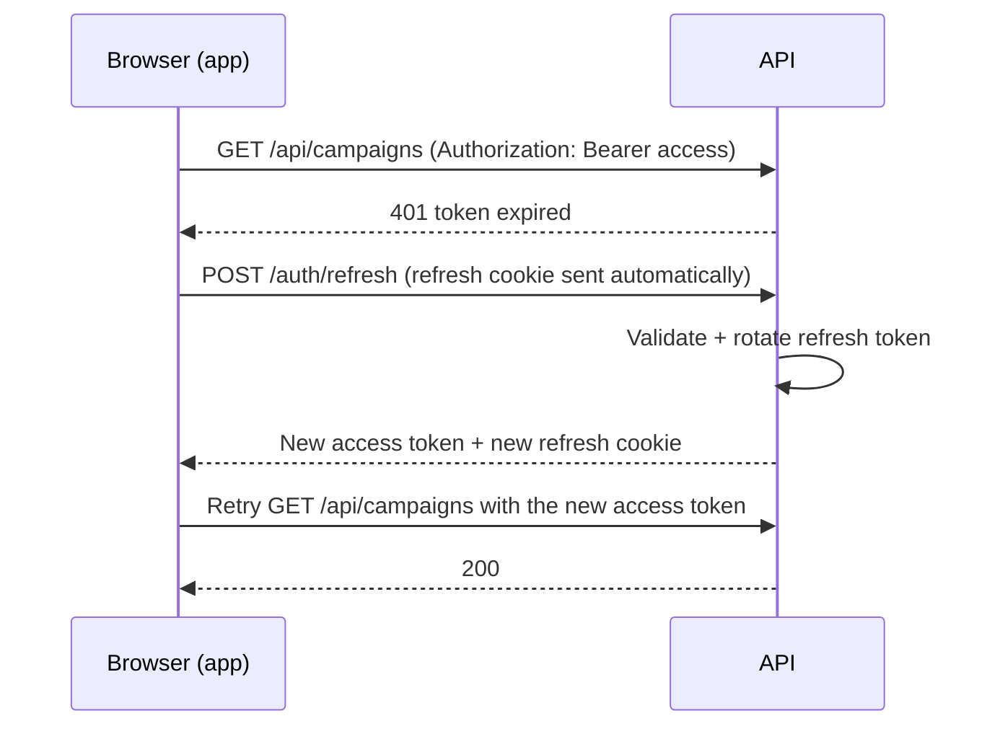
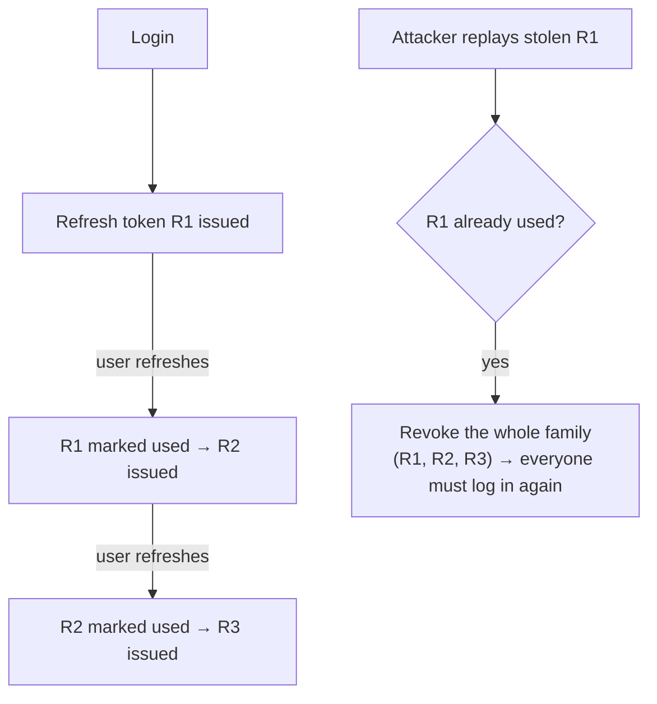
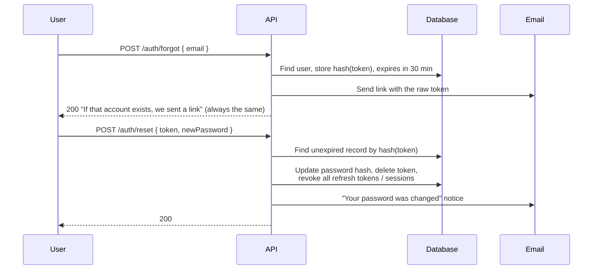
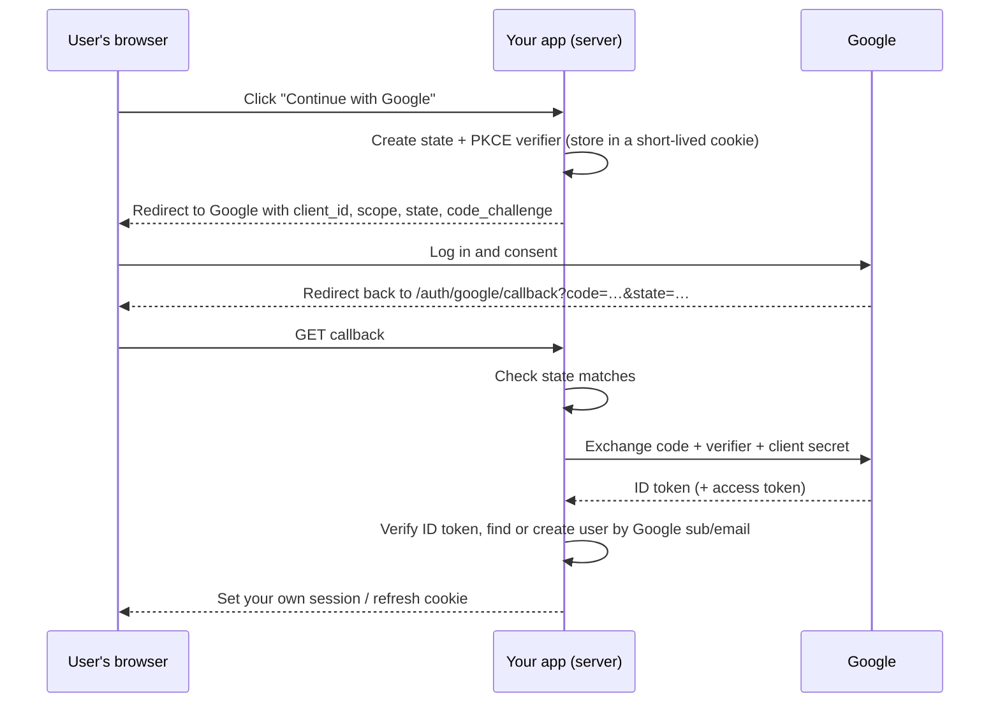
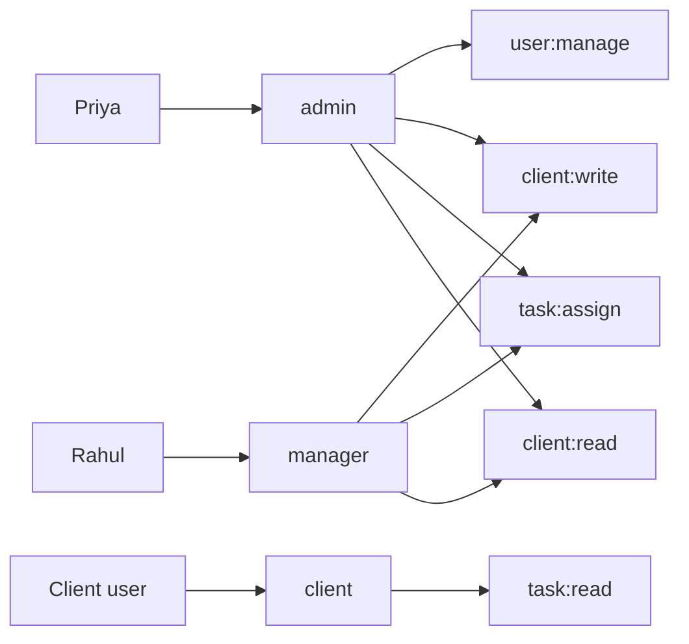
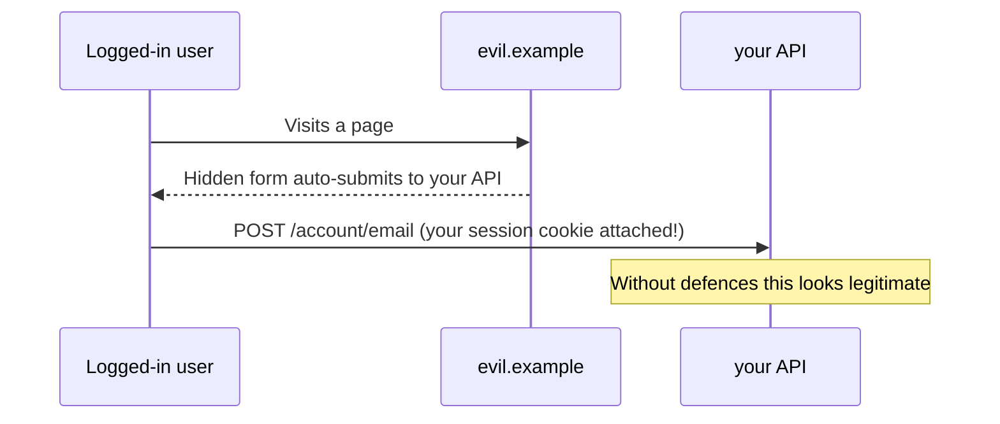

"How does your auth work?" comes up in almost every full-stack interview, and it's where many developers discover they copied a tutorial without understanding it. This chapter builds authentication from first principles: sessions and tokens, where to store them, how refresh tokens and rotation work, OAuth login, and then authorisation with roles, permissions and multi-tenant data isolation. It ends with the attacks you must defend against.

## Authentication vs authorisation

- **Authentication** answers *who are you?* It's logging in: proving identity with a password, a one-time code, or Google. Failure is **401 Unauthorized**.
- **Authorisation** answers *what are you allowed to do?* It's checking roles, permissions and ownership on every request. Failure is **403 Forbidden** (or 404, to avoid revealing that a resource exists).

Most real security bugs are authorisation bugs: a logged-in user reading another organisation's data because one query forgot to filter by organisation.

## Storing passwords

Never store passwords, and never store fast hashes of them (MD5, SHA-256). If your database leaks, fast hashes can be cracked by the billion per second.

Use a **slow, salted password hashing function**: **argon2id** (the modern recommendation), **bcrypt** (cost 12 or so), or **scrypt**.

- **Slow** makes each guess expensive for an attacker (and only slightly slower for you, once per login).
- A random **salt** per user, stored alongside the hash, means identical passwords produce different hashes and precomputed tables are useless.

```ts
import argon2 from 'argon2'

const hash = await argon2.hash(password)            // salt is generated and stored inside the hash string
const ok = await argon2.verify(user.passwordHash, attempt)
```

Also: enforce a minimum length (not composition rules), check passwords against known-breached lists, and rate-limit login attempts.

## Sessions

With **server-side sessions**, the server keeps the session data and the browser holds only a random, meaningless ID in a cookie.



Strengths: revoking access is instant (delete the session), the cookie is small, and nothing sensitive leaves the server. The cost: a lookup per request and a shared store (Redis) once you run several servers.

## JSON Web Tokens

A **JWT** is a signed token that *contains* the user's claims. Any server with the key can verify it without a database lookup.

It has three base64url parts: `header.payload.signature`.

```json
// header
{ "alg": "HS256", "typ": "JWT" }
// payload (claims)
{ "sub": "usr_42", "org": "org_7", "role": "manager", "iat": 1727500000, "exp": 1727500900 }
```

The signature proves the token hasn't been changed. It does **not** hide the contents: anyone can base64-decode the payload. Never put secrets or sensitive personal data in it.

```ts
import jwt from 'jsonwebtoken'

const token = jwt.sign({ sub: user.id, org: user.orgId, role: user.role }, env.JWT_ACCESS_SECRET, { expiresIn: '15m' })

export const requireAuth: RequestHandler = (req, _res, next) => {
  const header = req.headers.authorization ?? ''
  const token = header.startsWith('Bearer ') ? header.slice(7) : null
  if (!token) throw new UnauthorizedError()
  const claims = jwt.verify(token, env.JWT_ACCESS_SECRET) as AccessClaims // throws if tampered or expired
  req.user = { id: claims.sub, orgId: claims.org, role: claims.role }
  next()
}
```

Always pin the algorithm you expect and use long random secrets (or asymmetric keys like RS256/EdDSA when other services must verify tokens without being able to create them).

### Sessions vs JWTs

| | Server sessions | Stateless JWT |
|---|---|---|
| Verify a request | Look up the session | Check the signature |
| Revoke immediately | Delete the session | Hard: valid until it expires |
| Works across services | Needs the shared store | Yes, anyone with the key |
| Size | Tiny cookie | Larger (claims inside) |

The common production answer combines both ideas: **short-lived JWT access tokens** plus **long-lived, revocable refresh tokens** stored server-side.

## Access and refresh tokens

- The **access token** lives 5–15 minutes and is sent with every API call. If it's stolen, it's useful only briefly.
- The **refresh token** lives days or weeks, is stored in an `HttpOnly` cookie scoped to one path, and is only ever sent to `/auth/refresh` to get a new access token.



On the frontend, an HTTP interceptor handles this: when a request gets a 401, it calls refresh once (queueing other requests that fail meanwhile), then retries them.

```ts
let refreshing: Promise<string> | null = null

async function apiFetch(input: string, init: RequestInit = {}) {
  const res = await fetch(input, withAuth(init, getAccessToken()))
  if (res.status !== 401) return res

  refreshing ??= refreshAccessToken().finally(() => { refreshing = null }) // one refresh for many 401s
  const token = await refreshing
  return fetch(input, withAuth(init, token))
}
```

### Refresh token rotation

Every time a refresh token is used, **issue a new one and invalidate the old one**. Keep tokens in a *family*. If an already-used token ever comes back, someone has a copy: revoke the whole family and force a new login.



Store only a **hash** of each refresh token in the database, so a database leak doesn't hand out valid tokens.

## Where to keep tokens in the browser

| Storage | Readable by JavaScript | Sent automatically | Main risk |
|---|---|---|---|
| `localStorage` | Yes | No | Any XSS bug can steal it |
| Memory (a variable) | Yes, but gone on reload | No | Lost on refresh (use a refresh cookie to restore) |
| `HttpOnly` cookie | No | Yes | CSRF (handled with `SameSite` + checks) |

A strong default:

- **Refresh token** in a cookie: `HttpOnly; Secure; SameSite=Strict` (or `Lax`) and `Path=/auth/refresh`.
- **Access token** in memory only, obtained on page load by calling `/auth/refresh`.

`HttpOnly` doesn't make XSS harmless (injected script can still make requests as the user), but it stops the token being stolen and used elsewhere for weeks.

## Account flows

### Email verification and password reset

Both use the same building block: a **single-use, expiring, random token**.



The same response for existing and non-existing emails prevents **account enumeration** (discovering who has an account).

### OAuth 2.0 and "Log in with Google"

**OAuth 2.0** lets a user grant your app access to their account at another service without giving you their password. **OpenID Connect** (OIDC) adds an **ID token** on top, which tells you who the user is: that's what "Log in with Google" uses. Web apps use the **Authorization Code flow with PKCE**.



- The **state** value prevents CSRF on the callback.
- **PKCE** stops an intercepted code being exchanged by someone else.
- After login, issue **your own** session or tokens; don't use Google's access token as your app's session.

## Authorisation

### Role-based access control

Users have **roles**; roles grant **permissions**; routes check **permissions**, not role names. Changing what a role can do then means editing one table, not every route.



```ts
const permissions = {
  admin: ['user:manage', 'client:read', 'client:write', 'task:assign', 'task:read'],
  manager: ['client:read', 'client:write', 'task:assign', 'task:read'],
  client: ['task:read'],
} as const satisfies Record<Role, readonly string[]>

type Permission = (typeof permissions)[Role][number]

export const can =
  (permission: Permission): RequestHandler =>
  (req, _res, next) => {
    if (!(permissions[req.user!.role] as readonly string[]).includes(permission)) throw new ForbiddenError()
    next()
  }

router.patch('/clients/:id', requireAuth, can('client:write'), asyncHandler(clientController.update))
```

### Ownership and scope

A permission says a user may edit clients *in general*. You must also check they may edit *this* client. Put the scope in the query itself, so it's impossible to forget:

```ts
// Wrong: any manager in any organisation can edit any client by guessing IDs (an IDOR bug)
const client = await Client.findById(req.params.id)

// Right: scoped to the caller's organisation
const client = await Client.findOne({ _id: req.params.id, orgId: req.user!.orgId })
if (!client) throw new NotFoundError('Client')
```

This bug class, **Insecure Direct Object Reference** (IDOR), is the most common serious vulnerability in real APIs.

### Multi-tenancy

A SaaS product like a WhatsApp CRM serves many organisations (**tenants**) from one system. Isolation options:

| Strategy | Isolation | Cost and complexity |
|---|---|---|
| Shared tables with an `orgId` on every row | Logical: every query must filter | Cheapest, most common |
| A schema per tenant (Postgres) | Stronger | Migrations run per schema |
| A database per tenant | Strongest | Expensive to operate at scale |

With shared tables, don't rely on every developer remembering the filter. Enforce it centrally: a repository layer that always adds `orgId`, a Mongoose plugin, or Postgres **Row-Level Security** policies. Include `orgId` first in compound indexes, since nearly every query filters by it.

## Attacks you must defend against

### XSS: cross-site scripting

Attacker-controlled JavaScript runs on your page, usually through user content rendered as HTML (a contact named ``). React escapes text by default; the risks are `dangerouslySetInnerHTML`, user-supplied URLs (`javascript:` scheme), and third-party scripts. Defend with escaping, sanitising any HTML you must render (DOMPurify), a **Content-Security-Policy**, and `HttpOnly` cookies to limit the damage.

### CSRF: cross-site request forgery

Another site makes the user's browser send a request to your API, and the browser attaches your cookies automatically.



Defences: `SameSite=Lax` or `Strict` cookies (the main one), CSRF tokens for cookie-authenticated forms, checking the `Origin` header on state-changing requests, and never changing data on `GET`. APIs authenticated only by an `Authorization` header aren't exposed to classic CSRF, because browsers don't add that header automatically.

### Injection

User input interpreted as part of a query or command.

- **SQL**: always use parameterised queries or an ORM.
- **MongoDB operator injection**: `{ "password": { "$ne": null } }` sent as JSON matches any user if you pass `req.body.password` straight into `find`. Validate types with a schema so a string must be a string.
- **Command injection**: never build shell commands from user input; use `spawn` with an argument array.

### SSRF: server-side request forgery

Your server fetches a URL the user supplies (an SEO crawler, a link preview, a webhook tester). An attacker supplies `http://169.254.169.254/` (cloud metadata with credentials) or internal service addresses. Resolve the hostname and block private, loopback and link-local IP ranges; allow only `http`/`https`; limit redirects; and use timeouts.

### Brute force and credential stuffing

Rate-limit by IP *and* by account, add delays or temporary lockouts after repeated failures, show a CAPTCHA after several failures, return identical errors for "no such user" and "wrong password", and offer two-factor authentication.

## A checklist

- Passwords hashed with argon2id or bcrypt; breached-password check; login rate limits.
- Short-lived access tokens, rotated refresh tokens stored as hashes, `HttpOnly; Secure; SameSite` cookies.
- Logout and password change revoke refresh tokens and sessions.
- Every route authenticated; every query scoped by owner or organisation; permissions checked per action.
- Input validated with schemas; queries parameterised.
- `helmet`, a strict CORS allow-list, CSP, HTTPS everywhere.
- Secrets in environment variables or a secrets manager, never in Git; dependencies audited.
- Security-relevant events logged (logins, failed logins, permission changes) without logging secrets.

## Summary

- Authentication proves identity (401); authorisation decides access (403). Authorisation bugs are the common ones.
- Hash passwords slowly with a salt. Sessions are easy to revoke; JWTs are easy to verify anywhere.
- Short access tokens plus rotating, revocable refresh tokens in `HttpOnly` cookies is a strong default.
- OAuth login uses the Authorization Code flow with PKCE and `state`; then issue your own session.
- Check permissions per action and scope every query by owner or tenant.
- Defend against XSS, CSRF, injection, SSRF and brute force deliberately, not by accident.
