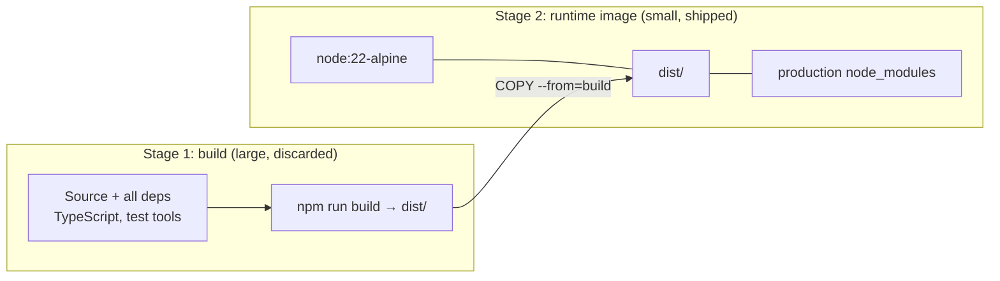
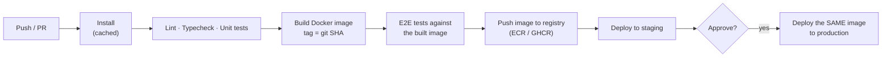
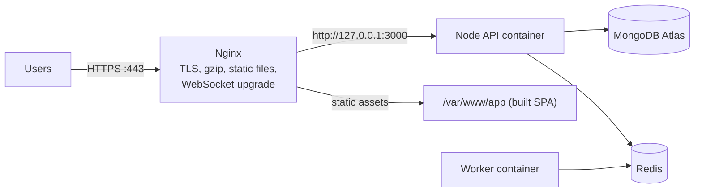
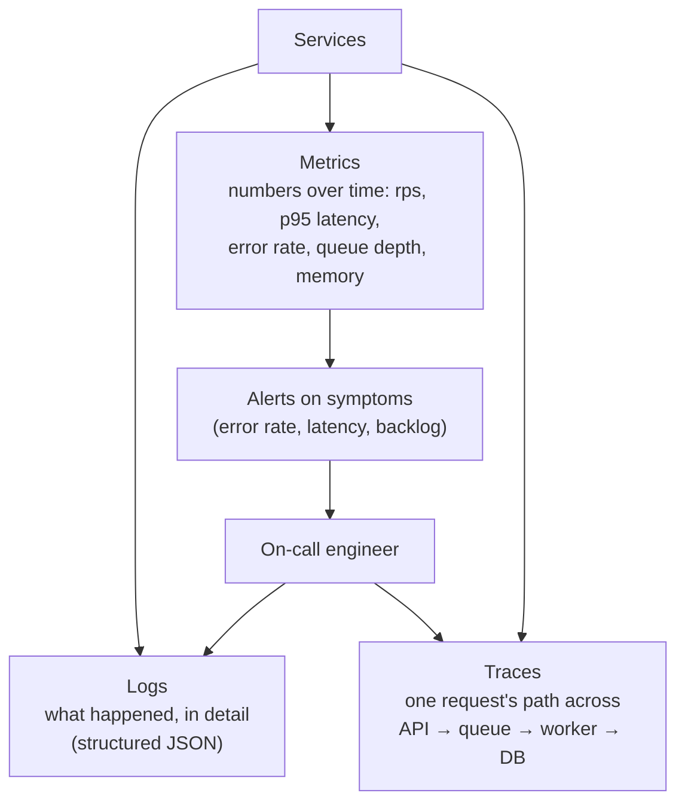

Code only creates value once it's running reliably for users. This chapter covers how modern web apps get there: packaging with Docker, running a local stack with Compose, automating checks and deploys with GitHub Actions, serving through Nginx with HTTPS on AWS, and knowing what's happening in production through logs, metrics, traces and alerts.

## Docker

### The problem it solves

"It works on my machine" happens because machines differ: Node versions, system libraries, environment variables, operating systems. Docker packages your app **together with its runtime and dependencies** into an **image**. The same image runs identically on your laptop, in CI and in production.

- An **image** is a read-only template, built from a `Dockerfile` in cached **layers**.
- A **container** is a running instance of an image, with its own isolated filesystem, process space and network.

Containers share the host's operating system kernel, which makes them much lighter than virtual machines: they start in seconds and use far less memory.

### A production Dockerfile

```dockerfile
# 1. Build stage: full toolchain, dev dependencies, source
FROM node:22-alpine AS build
WORKDIR /app
COPY package*.json ./
RUN npm ci
COPY . .
RUN npm run build && npm prune --omit=dev

# 2. Runtime stage: only what's needed to run
FROM node:22-alpine
WORKDIR /app
ENV NODE_ENV=production
COPY --from=build /app/node_modules ./node_modules
COPY --from=build /app/dist ./dist
COPY package.json ./
USER node
EXPOSE 3000
HEALTHCHECK CMD wget -qO- http://localhost:3000/healthz || exit 1
CMD ["node", "dist/server.js"]
```



Why each choice:

- **Multi-stage**: the final image has no compilers, TypeScript, test tools or source, so it's smaller, faster to pull, and has less to attack.
- **Copy `package*.json` and install before copying the source**: Docker caches each layer, so dependencies only reinstall when the package files change, not on every code edit.
- **`npm ci`** installs exactly what the lockfile says.
- **`USER node`**: don't run as root inside the container.
- **A `.dockerignore`** keeps `node_modules`, `.git`, `.env` and build output out of the build context.

### Volumes and networking

A container's filesystem disappears with the container. **Volumes** store data outside its lifecycle, which databases need. **Bind mounts** map a folder from your machine into a container, which is handy in development for live reloading.

Containers on the same Docker network reach each other by **service name**: your API connects to `mongodb://mongo:27017`, not `localhost`.

## Docker Compose

Compose describes a multi-container stack in one file and starts it with one command.

```yaml
# docker-compose.yml
services:
  api:
    build: .
    ports: ["3000:3000"]
    env_file: .env
    depends_on:
      mongo: { condition: service_healthy }
      redis: { condition: service_started }

  worker:
    build: .
    command: ["node", "dist/worker.js"]
    env_file: .env
    depends_on: [redis, mongo]

  mongo:
    image: mongo:7
    volumes: ["mongo-data:/data/db"]
    healthcheck:
      test: ["CMD", "mongosh", "--quiet", "--eval", "db.adminCommand('ping')"]
      interval: 5s

  redis:
    image: redis:7-alpine
    command: ["redis-server", "--maxmemory-policy", "noeviction"]

volumes:
  mongo-data:
```

`docker compose up --build` boots the API, a queue worker, MongoDB and Redis together. New teammates are productive in minutes, and integration tests in CI can use the same file.

## CI/CD with GitHub Actions

- **Continuous Integration**: every push and pull request is automatically installed, linted, type-checked, tested and built. Problems are caught before they're merged.
- **Continuous Delivery / Deployment**: when `main` passes, the app is packaged and deployed automatically, to staging and then production, possibly with a manual approval in between.



```yaml
# .github/workflows/ci.yml
name: CI
on:
  pull_request:
  push:
    branches: [main]

jobs:
  checks:
    runs-on: ubuntu-latest
    steps:
      - uses: actions/checkout@v4
      - uses: actions/setup-node@v4
        with: { node-version: 22, cache: npm }
      - run: npm ci
      - run: npm run lint
      - run: npm run typecheck
      - run: npm test -- --coverage

  image:
    needs: checks
    if: github.ref == 'refs/heads/main'
    runs-on: ubuntu-latest
    permissions: { contents: read, packages: write }
    steps:
      - uses: actions/checkout@v4
      - uses: docker/login-action@v3
        with: { registry: ghcr.io, username: ${{ github.actor }}, password: ${{ secrets.GITHUB_TOKEN }} }
      - uses: docker/build-push-action@v6
        with:
          push: true
          tags: ghcr.io/${{ github.repository }}:${{ github.sha }}
          cache-from: type=gha
          cache-to: type=gha,mode=max

  deploy:
    needs: image
    runs-on: ubuntu-latest
    environment: production   # can require a reviewer's approval
    steps:
      - name: Pull and restart on the server
        uses: appleboy/ssh-action@v1
        with:
          host: ${{ secrets.PROD_HOST }}
          username: deploy
          key: ${{ secrets.PROD_SSH_KEY }}
          script: |
            cd /srv/app
            export IMAGE_TAG=${{ github.sha }}
            docker compose pull api worker
            docker compose up -d api worker
```

Principles:

- **Build once, deploy the same artefact** everywhere. Tag images with the commit SHA, and promote the exact image that passed staging.
- **Secrets live in the CI's secret store**, never in the repository.
- **Cache dependencies and Docker layers** so pipelines stay fast.
- **Run migrations as a deliberate step**, and make them backwards compatible with the code that's still running.

## Deploying without downtime

- **Rolling**: replace instances one at a time behind a load balancer, sending traffic only to instances that pass health checks.
- **Blue-green**: bring up the new version alongside the old, switch traffic over in one step, keep the old version ready for instant rollback.
- **Canary**: send a small share of traffic to the new version first, watch error rates, then roll out fully.

All of them need **graceful shutdown** in the app (finish in-flight requests on `SIGTERM`) and **health checks** that tell the load balancer when an instance is ready.

## Nginx and HTTPS on EC2

For a single-server or small setup on EC2, Nginx sits in front of Node as a **reverse proxy**.



What Nginx does for you:

- **TLS termination**: handles HTTPS so Node doesn't have to.
- Serves **static files** and **compressed** responses efficiently.
- Buffers slow clients so Node's connections aren't tied up.
- **Load-balances** across several Node processes.
- Adds security headers and basic rate limits.

```nginx
server {
  listen 443 ssl http2;
  server_name app.example.com;

  ssl_certificate     /etc/letsencrypt/live/app.example.com/fullchain.pem;
  ssl_certificate_key /etc/letsencrypt/live/app.example.com/privkey.pem;

  root /var/www/app;
  location / {
    try_files $uri /index.html;          # SPA fallback for client-side routes
  }
  location /assets/ {
    add_header Cache-Control "public, max-age=31536000, immutable";
  }

  location /api/ {
    proxy_pass http://127.0.0.1:3000;
    proxy_set_header Host $host;
    proxy_set_header X-Forwarded-For $proxy_add_x_forwarded_for;
    proxy_set_header X-Forwarded-Proto $scheme;
  }

  location /socket.io/ {
    proxy_pass http://127.0.0.1:3000;
    proxy_http_version 1.1;
    proxy_set_header Upgrade $http_upgrade;
    proxy_set_header Connection "upgrade";
  }
}

server {
  listen 80;
  server_name app.example.com;
  return 301 https://$host$request_uri;
}
```

**Free certificates**: Certbot gets a Let's Encrypt certificate, configures Nginx, and renews it automatically (certificates last 90 days). Tell Express it's behind a proxy (`app.set('trust proxy', 1)`) so `req.ip` and secure cookies work.

Note the `try_files … /index.html` line: it's what makes client-side routes like `/book/react` or `/preparation` work when someone opens them directly.

## AWS services worth knowing

| Service | What it is | Typical use |
|---|---|---|
| EC2 | Virtual servers | Running Docker containers, Nginx |
| S3 | Object storage | Uploads, exports, rendered videos, static sites |
| CloudFront | CDN | Serving S3 and static assets close to users |
| IAM | Identities and permissions | Roles for EC2 instead of access keys; least privilege |
| Security Groups | Instance firewalls | Only 443/80 open publicly; database ports private |
| RDS / ElastiCache | Managed Postgres / Redis | Backups, failover and patching handled for you |
| ECR + ECS / Fargate | Image registry + container runner | Running containers without managing servers |
| CloudWatch | Logs, metrics, alarms | Central logs and alerts |
| Secrets Manager / SSM | Secret storage | Database passwords, API keys |

Two habits that prevent most AWS incidents: give each workload an **IAM role with only the permissions it needs** (never long-lived access keys on servers), and **never make S3 buckets or databases public** unless that is truly intended.

## Linux essentials for servers

```bash
ssh deploy@203.0.113.10                 # connect
docker ps                               # running containers
docker logs -f --tail 200 app-api-1     # follow a container's logs
docker compose up -d api                # (re)start a service in the background
df -h                                   # disk space (full disks cause mysterious failures)
free -m                                 # memory
top / htop                              # CPU and memory per process
sudo systemctl status nginx             # service status
sudo nginx -t && sudo systemctl reload nginx   # test config, reload without downtime
journalctl -u nginx --since "1 hour ago"
chmod 600 ~/.ssh/id_ed25519             # permissions: owner read/write only
```

## Observability

When something breaks at 2 a.m., you need to answer three questions quickly: **is** something wrong, **where**, and **why**.



### Structured logging

Log **JSON objects with consistent fields**, not free-form strings. Then your log tool can answer "all errors for organisation 7 in the last hour" instantly.

```ts
import pino from 'pino'
export const logger = pino({ level: env.LOG_LEVEL ?? 'info', redact: ['req.headers.authorization', '*.password'] })

// Attach a request id to every log line of a request
app.use((req, res, next) => {
  req.id = req.header('x-request-id') ?? crypto.randomUUID()
  req.log = logger.child({ requestId: req.id, orgId: req.user?.orgId })
  res.setHeader('x-request-id', req.id)
  next()
})

req.log.info({ campaignId, recipients: 1200 }, 'Campaign queued')
```

Pass the request ID into queue jobs too, so you can follow one user action from the API through the worker. Never log passwords, tokens or full personal data.

### Metrics and alerts

Track the **RED** metrics for every service: **R**ate (requests per second), **E**rrors (error rate), **D**uration (latency percentiles like p95 and p99, not averages). Add resource metrics (CPU, memory, event loop lag) and business metrics (queue depth, messages sent per minute).

Alert on **symptoms users feel** (error rate above 2%, p95 latency above 1 s, queue backlog growing for 10 minutes), not on every CPU spike.

### Error tracking and tracing

**Sentry** (or similar) captures exceptions from the frontend and backend with stack traces mapped to your source code, the user, the browser and the steps leading up to the error, groups duplicates, and alerts you. **Distributed tracing** (OpenTelemetry) records the timing of each step of a request across services, which shows exactly where a slow request spent its time.

### Health checks

- **Liveness** (`/healthz`): is the process alive? If not, restart it. Keep it trivial.
- **Readiness** (`/readyz`): can it serve traffic right now (database and Redis reachable, startup finished)? If not, stop sending it traffic, but don't restart it.

Don't make liveness depend on external services, or a brief database blip will restart every instance at once.

## Summary

- Docker packages the app with its runtime; multi-stage builds keep images small and safe; layer ordering keeps builds fast.
- Compose runs the whole stack locally with one command.
- CI checks every change; CD deploys the same tested image to staging and then production.
- Zero-downtime deploys need health checks and graceful shutdown.
- Nginx terminates TLS, serves static files, proxies the API and upgrades WebSockets; Let's Encrypt provides free certificates.
- Use IAM roles with least privilege, and keep storage and databases private.
- Structured logs with request IDs, RED metrics with symptom-based alerts, error tracking and traces make production debuggable.
