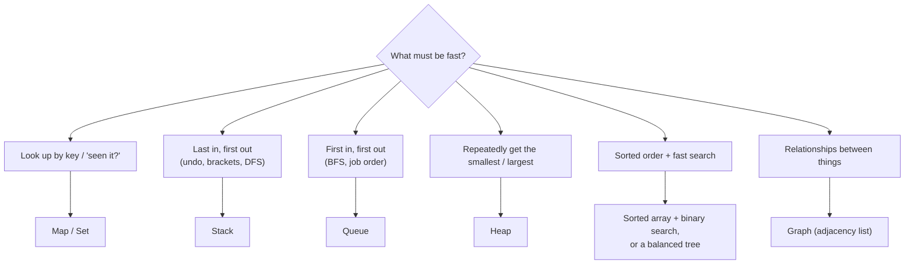
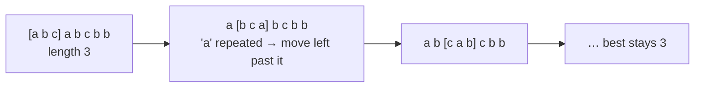
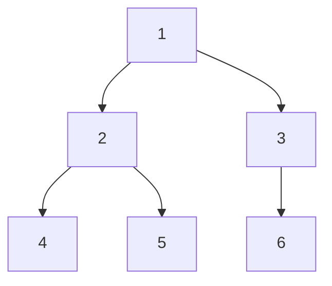
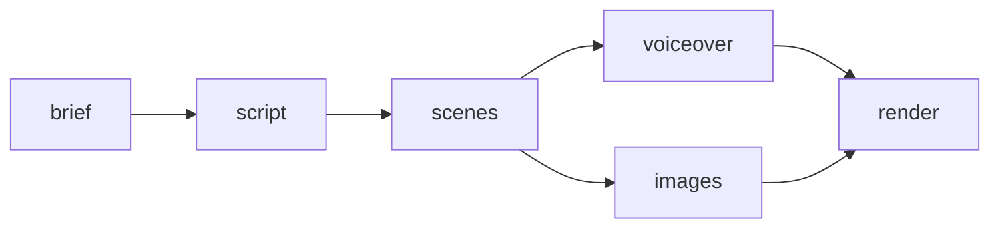
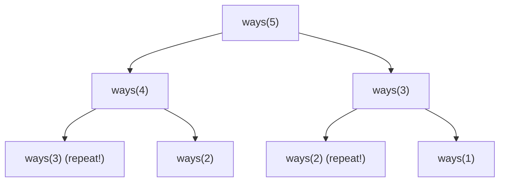

Many product companies screen with a coding round before anyone looks at your projects. The good news: most interview problems are variations on about a dozen patterns. This chapter teaches Big-O, the core data structures, and those patterns, each with a worked example in JavaScript, plus a routine for solving problems under pressure.

## Big-O in practice

Big-O describes how an algorithm's time (or memory) **grows** as the input grows, ignoring constants. It answers: "if the data is 10× bigger, how much slower is this?"

| Big-O | Name | Example | n = 1,000,000 |
|---|---|---|---|
| O(1) | Constant | Array index, `Map.get` | 1 step |
| O(log n) | Logarithmic | Binary search | ~20 steps |
| O(n) | Linear | One loop over the data | 1,000,000 |
| O(n log n) | Linearithmic | Good sorting | ~20,000,000 |
| O(n²) | Quadratic | Nested loops over the data | 10¹² (too slow) |
| O(2ⁿ) | Exponential | Naive recursion over subsets | Impossible |

Rules of thumb:

- Drop constants and smaller terms: O(2n + 5) is O(n).
- Loops in sequence add; nested loops multiply.
- Halving the problem each step gives log n.
- Count **space** too: building a `Map` of the input is O(n) extra memory.

### Spotting O(n²) in everyday code

The most common real-world slowdown is a lookup inside a loop:

```js
// O(n × m): .find scans all users for every order
const enriched = orders.map((o) => ({ ...o, user: users.find((u) => u.id === o.userId) }))

// O(n + m): build an index once, then O(1) lookups
const usersById = new Map(users.map((u) => [u.id, u]))
const enriched2 = orders.map((o) => ({ ...o, user: usersById.get(o.userId) }))
```

`.includes`, `.indexOf`, `.find` and `.filter` inside a loop are all O(n) each time.

## Core data structures

| Structure | Access | Search | Insert / delete | Notes |
|---|---|---|---|---|
| Array | O(1) by index | O(n) | O(1) at end, O(n) at start/middle | `shift`/`unshift` move every element |
| Hash map (`Map`, object) | — | O(1) average | O(1) average | The most useful structure in interviews |
| Set | — | O(1) average `has` | O(1) average | Uniqueness, "seen before?" |
| Stack | O(1) top | — | O(1) push/pop | Use an array with `push`/`pop` |
| Queue | O(1) front | — | O(1) enqueue/dequeue | Array `shift` is O(n); use an index pointer for big queues |
| Linked list | O(n) | O(n) | O(1) given the node | Common in interviews, rare in JS apps |
| Binary search tree (balanced) | — | O(log n) | O(log n) | Sorted data with fast updates |
| Heap (priority queue) | O(1) peek min/max | — | O(log n) | "Top k", scheduling; JS has none built in |



## Pattern 1: hash map lookups

Trade memory for time: remember what you've seen so each check is O(1).

```js
// Two Sum: indices of two numbers adding up to target. O(n)
function twoSum(nums, target) {
  const seen = new Map() // value → index
  for (let i = 0; i < nums.length; i++) {
    const need = target - nums[i]
    if (seen.has(need)) return [seen.get(need), i]
    seen.set(nums[i], i)
  }
  return null
}
```

Also for: counting frequencies, grouping (anagrams by sorted letters), detecting duplicates, first unique character.

## Pattern 2: two pointers

Two indexes moving through the data, usually from both ends towards the middle, or both forwards at different speeds. Often works on **sorted** input.

```js
// Pair with target sum in a SORTED array. O(n), O(1) space
function pairSum(sorted, target) {
  let l = 0, r = sorted.length - 1
  while (l < r) {
    const sum = sorted[l] + sorted[r]
    if (sum === target) return [l, r]
    if (sum < target) l++   // need bigger: move left pointer right
    else r--                // need smaller: move right pointer left
  }
  return null
}
```

Also for: palindromes, removing duplicates in place, merging two sorted arrays, container with most water.

## Pattern 3: sliding window

For "longest/shortest/best **contiguous** subarray or substring with some condition": keep a window `[left, right]`, grow it on the right, shrink it from the left when it breaks the condition.



```js
// Longest substring without repeating characters. O(n)
function longestUnique(s) {
  const lastSeen = new Map()
  let left = 0, best = 0
  for (let right = 0; right < s.length; right++) {
    const ch = s[right]
    if (lastSeen.has(ch) && lastSeen.get(ch) >= left) left = lastSeen.get(ch) + 1
    lastSeen.set(ch, right)
    best = Math.max(best, right - left + 1)
  }
  return best
}
```

Also for: maximum sum of k consecutive items, minimum window containing all characters, longest subarray with sum ≤ k (for non-negative numbers).

## Pattern 4: stacks

When the most recent unfinished thing matters: matching brackets, undo, parsing expressions, "next greater element".

```js
// Next greater element to the right for each item. O(n): each index pushed and popped once
function nextGreater(nums) {
  const result = new Array(nums.length).fill(-1)
  const stack = [] // indexes still waiting for a bigger number
  for (let i = 0; i < nums.length; i++) {
    while (stack.length && nums[i] > nums[stack[stack.length - 1]]) {
      result[stack.pop()] = nums[i]
    }
    stack.push(i)
  }
  return result
}
nextGreater([2, 1, 5, 3, 6]) // [5, 5, 6, 6, -1]
```

This "monotonic stack" idea also solves daily temperatures and stock span problems.

## Pattern 5: binary search

On sorted data (or any yes/no question that flips once, like "is this capacity big enough?"), check the middle and discard half each step: O(log n).

```js
// First index where arr[i] >= target (lower bound). O(log n)
function lowerBound(arr, target) {
  let lo = 0, hi = arr.length
  while (lo < hi) {
    const mid = (lo + hi) >> 1
    if (arr[mid] < target) lo = mid + 1
    else hi = mid
  }
  return lo
}
```

**Binary search on the answer**: "what's the minimum X such that condition(X) is true?" When the condition is false below some value and true above it, binary-search X itself (minimum ship capacity, minimum eating speed).

## Pattern 6: trees, BFS and DFS

A tree is nodes with children and no cycles. Two ways to visit every node:



- **DFS** (depth-first): 1, 2, 4, 5, 3, 6. Uses recursion or a stack. Natural for "compute something from children" (height, path sums, validating a BST).
- **BFS** (breadth-first): 1, 2, 3, 4, 5, 6. Uses a queue. Natural for "level by level" and **shortest paths** in unweighted graphs.

```js
// DFS: height of a binary tree
const maxDepth = (node) => (node ? 1 + Math.max(maxDepth(node.left), maxDepth(node.right)) : 0)

// BFS: values grouped by level
function levels(root) {
  if (!root) return []
  const out = []
  let queue = [root]
  while (queue.length) {
    out.push(queue.map((n) => n.val))
    queue = queue.flatMap((n) => [n.left, n.right].filter(Boolean))
  }
  return out
}

// Validate a BST: every node must fit the range set by ALL its ancestors
function isBST(node, min = -Infinity, max = Infinity) {
  if (!node) return true
  if (node.val <= min || node.val >= max) return false
  return isBST(node.left, min, node.val) && isBST(node.right, node.val, max)
}
```

## Pattern 7: graphs

A graph is nodes connected by edges: users following users, services calling services, cells in a grid. Store it as an **adjacency list**: `Map<node, neighbours[]>`.

```js
// Shortest number of hops between two users (unweighted): BFS. O(V + E)
function shortestPath(graph, start, goal) {
  const queue = [[start, 0]]
  const visited = new Set([start])
  for (let i = 0; i < queue.length; i++) {           // index pointer: O(1) dequeue
    const [node, dist] = queue[i]
    if (node === goal) return dist
    for (const next of graph.get(node) ?? []) {
      if (!visited.has(next)) { visited.add(next); queue.push([next, dist + 1]) }
    }
  }
  return -1
}
```

Other classics:

- **Connected components / flood fill** (number of islands): DFS or BFS from each unvisited cell.
- **Topological sort**: order tasks so each comes after its dependencies (build steps, course prerequisites). Kahn's algorithm uses in-degrees and a queue; a cycle means no valid order.
- **Dijkstra**: shortest paths with **weighted** edges, using a priority queue.



## Pattern 8: heaps for "top k"

A heap keeps the smallest (min-heap) or largest (max-heap) item on top, with O(log n) insert and remove. For "k largest" items, keep a **min-heap of size k**: anything smaller than the heap's top can't be in the answer. O(n log k).

When k is small or the input has a limited range, a simpler approach often works: count frequencies, then **bucket by count** in O(n).

```js
// Top k frequent elements with buckets. O(n)
function topKFrequent(nums, k) {
  const count = new Map()
  for (const n of nums) count.set(n, (count.get(n) ?? 0) + 1)
  const buckets = Array.from({ length: nums.length + 1 }, () => [])
  for (const [n, c] of count) buckets[c].push(n)
  const out = []
  for (let c = buckets.length - 1; c > 0 && out.length < k; c--) out.push(...buckets[c])
  return out.slice(0, k)
}
```

## Pattern 9: intervals

Sort by start, then sweep, merging or comparing neighbours. Real-world cousins: merging booked time slots, finding free time, detecting overlapping campaign schedules.

```js
function mergeIntervals(intervals) {
  const sorted = [...intervals].sort((a, b) => a[0] - b[0])
  const out = [sorted[0]]
  for (const [start, end] of sorted.slice(1)) {
    const last = out[out.length - 1]
    if (start <= last[1]) last[1] = Math.max(last[1], end)
    else out.push([start, end])
  }
  return out
}
```

## Pattern 10: backtracking

Build a solution step by step; when a choice leads nowhere, undo it and try the next. Used to generate all subsets, permutations and combinations, and to solve constraint puzzles.

```js
// All subsets. O(n × 2ⁿ): there are 2ⁿ subsets
function subsets(items) {
  const out = []
  const current = []
  function choose(i) {
    if (i === items.length) return out.push([...current])
    current.push(items[i]); choose(i + 1)   // include items[i]
    current.pop(); choose(i + 1)            // exclude items[i]
  }
  choose(0)
  return out
}
```

## Pattern 11: dynamic programming

When a problem breaks into **overlapping subproblems** (the same smaller question is asked many times), solve each once and reuse the answer.



Steps:

1. Define the state: "`dp[i]` = the answer for the first i items / amount i".
2. Write the recurrence: how `dp[i]` comes from smaller states.
3. Set base cases.
4. Compute bottom-up (or recurse with a memo).

```js
// Climbing stairs (1 or 2 steps at a time): ways(n) = ways(n-1) + ways(n-2). O(n), O(1) space
function climbStairs(n) {
  let a = 1, b = 1
  for (let i = 2; i <= n; i++) [a, b] = [b, a + b]
  return b
}

// Coin change: fewest coins to make amount. O(amount × coins)
function coinChange(coins, amount) {
  const dp = new Array(amount + 1).fill(Infinity)
  dp[0] = 0
  for (let x = 1; x <= amount; x++) {
    for (const c of coins) if (c <= x) dp[x] = Math.min(dp[x], dp[x - c] + 1)
  }
  return dp[amount] === Infinity ? -1 : dp[amount]
}
```

Classic DP problems to practise: house robber, longest increasing subsequence, longest common subsequence, edit distance, 0/1 knapsack, unique paths in a grid.

## Which pattern? A cheat sheet

| The problem says… | Reach for |
|---|---|
| "find a pair / complement", "seen before", "count" | Hash map / set |
| Sorted array, pairs, in-place changes | Two pointers |
| "longest / shortest contiguous subarray or substring" | Sliding window |
| Brackets, "next greater", undo, nested structure | Stack |
| Sorted data, or "minimum value that works" | Binary search |
| Tree questions | DFS (recursion) or BFS (levels) |
| Shortest path, fewest steps (unweighted) | BFS |
| Dependencies / ordering | Topological sort |
| "top k", "k closest", running median | Heap (or buckets) |
| Overlapping ranges | Sort + sweep |
| "all combinations / permutations" | Backtracking |
| "number of ways", "min/max cost" with repeated subproblems | Dynamic programming |

## Solving a problem in the interview

1. **Restate** the problem and confirm inputs, outputs and edge cases (empty input, duplicates, negatives, huge sizes).
2. **Work a small example** by hand.
3. **Say the brute force** and its complexity. It shows you can always get *an* answer.
4. **Find the pattern** that removes the wasted work.
5. **Code it cleanly**, narrating as you go. Use clear names.
6. **Test** with your example and the edge cases, tracing the code by hand.
7. **State the final time and space complexity.**

## How to practise

- Work through a curated list (NeetCode 150 or Striver's SDE sheet) **by pattern**, not randomly.
- Time-box: if you're stuck after 25–30 minutes, read the solution, understand it, and **re-solve it from scratch a few days later**.
- Keep a log of mistakes and which pattern you failed to spot.
- Daily beats weekly: an hour a day for months is what builds the instinct.

## Summary

- Big-O measures growth; nested loops over the same data are usually the problem, and a `Map` is usually the fix.
- Most interview problems map to a dozen patterns: hashing, two pointers, sliding window, stacks, binary search, BFS/DFS, graphs, heaps, intervals, backtracking and DP.
- Solve out loud: clarify, example, brute force, optimise, code, test, complexity.
- Practise by pattern, revisit failures, and do a little every day.
