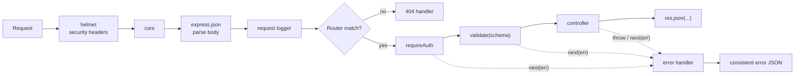
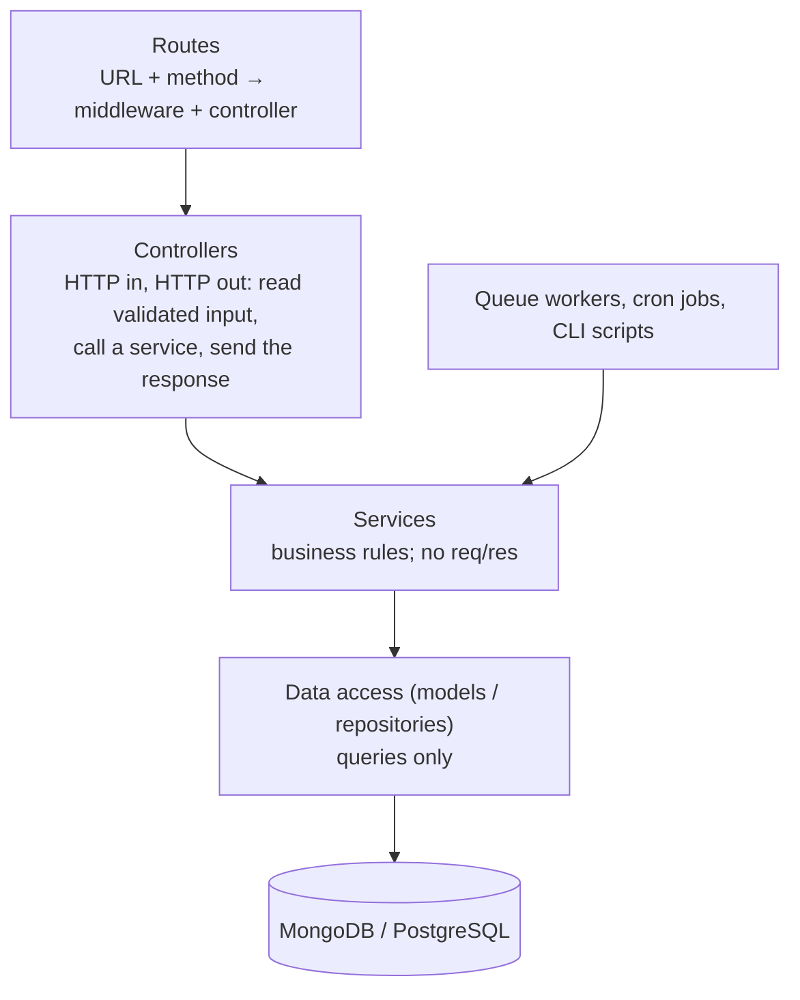
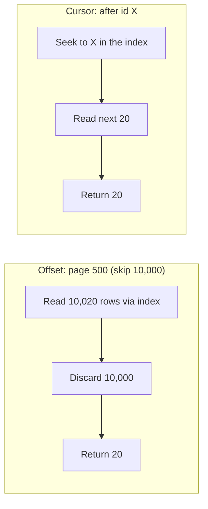
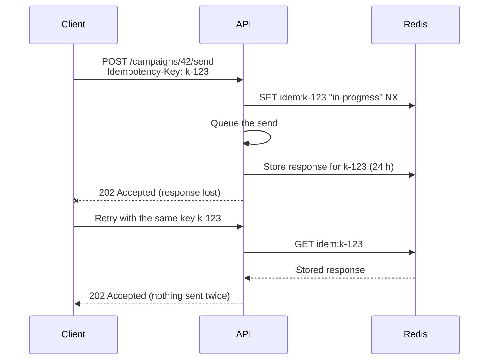
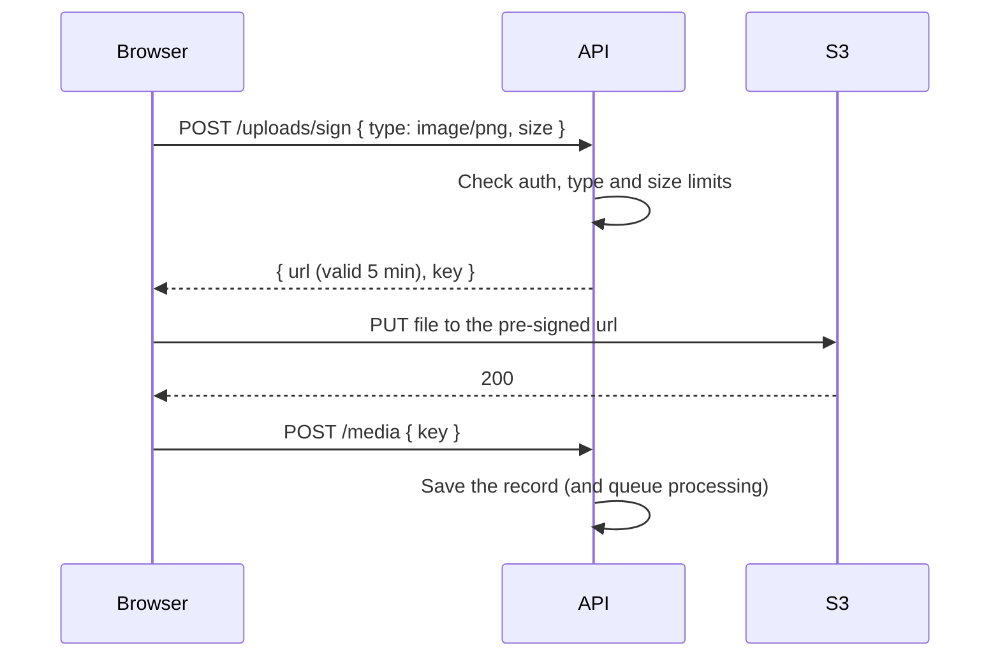

Express is small on purpose: it gives you routing and a middleware pipeline, and leaves everything else to you. That freedom is why Express codebases range from beautifully organised to impossible to change. This chapter covers how requests move through Express, how to structure a project that stays maintainable, and the API design decisions (errors, validation, pagination, rate limits, idempotency, webhooks) that separate a hobby API from a production one.

## The middleware pipeline

Every request passes through an ordered list of **middleware** functions. Each one receives `(req, res, next)` and either:

- **ends the request** by sending a response, or
- **passes control on** by calling `next()`, or
- **reports an error** by calling `next(err)` (or throwing, in Express 5), which skips to error-handling middleware.



Order matters. Body parsing must come before routes that read `req.body`; the 404 handler and error handler must come **after** all routes.

```ts
const app = express()

app.use(helmet())
app.use(cors({ origin: env.CLIENT_ORIGIN, credentials: true }))
app.use(express.json({ limit: '1mb' }))
app.use(requestLogger)

app.use('/api/auth', authRoutes)
app.use('/api/campaigns', requireAuth, campaignRoutes)
app.use('/api/contacts', requireAuth, contactRoutes)

app.use((req, res) => res.status(404).json({ error: { code: 'NOT_FOUND', message: 'Route not found' } }))
app.use(errorHandler) // four arguments: (err, req, res, next)
```

## Structuring a project

Put different concerns in different layers, with dependencies pointing inwards:



```text
src/
  app.ts                 ← builds the Express app (no listen, so tests can import it)
  server.ts              ← starts listening, handles shutdown
  config/env.ts
  modules/
    campaigns/
      campaign.routes.ts
      campaign.controller.ts
      campaign.service.ts
      campaign.repository.ts
      campaign.schema.ts   ← Zod schemas + inferred types
      campaign.test.ts
  middleware/
    auth.ts  validate.ts  errorHandler.ts  rateLimit.ts
  lib/
    logger.ts  redis.ts  queue.ts  errors.ts
```

Why bother:

- **Testable**: services can be unit-tested without HTTP; controllers can be tested with Supertest.
- **Reusable**: a queue worker or cron job calls the same service as the API, so business rules exist once.
- **Replaceable**: swapping MongoDB for Postgres touches the data layer, not your rules.

Grouping by **feature** (`modules/campaigns`) rather than by type (`controllers/`, `services/`) keeps related code together as the app grows.

```ts
// campaign.controller.ts
export async function create(req: Request, res: Response) {
  const campaign = await campaignService.create(req.user!.orgId, req.body)
  res.status(201).json({ data: campaign })
}

// campaign.service.ts
export async function create(orgId: string, input: CreateCampaignInput) {
  if (input.scheduledAt && input.scheduledAt < new Date()) {
    throw new BadRequestError('The schedule must be in the future')
  }
  const template = await templateRepo.findById(orgId, input.templateId)
  if (!template?.approved) throw new BadRequestError('Template is not approved yet')
  return campaignRepo.insert({ ...input, orgId, status: input.scheduledAt ? 'scheduled' : 'draft' })
}
```

## Errors

### One error shape, handled in one place

Define error classes that carry an HTTP status and a machine-readable code, throw them from anywhere, and translate them in a single error-handling middleware.

```ts
// lib/errors.ts
export class AppError extends Error {
  constructor(public status: number, public code: string, message: string, public details?: unknown) {
    super(message)
  }
}
export class BadRequestError extends AppError {
  constructor(message: string, details?: unknown) { super(400, 'BAD_REQUEST', message, details) }
}
export class NotFoundError extends AppError {
  constructor(what: string) { super(404, 'NOT_FOUND', what + ' not found') }
}
export class ForbiddenError extends AppError {
  constructor() { super(403, 'FORBIDDEN', 'You do not have access to this resource') }
}

// middleware/errorHandler.ts
export const errorHandler: ErrorRequestHandler = (err, req, res, _next) => {
  if (err instanceof AppError) {
    return res.status(err.status).json({ error: { code: err.code, message: err.message, details: err.details } })
  }
  if (err instanceof ZodError) {
    return res.status(422).json({ error: { code: 'VALIDATION', message: 'Invalid input', details: err.flatten().fieldErrors } })
  }
  req.log.error({ err }, 'Unhandled error')
  res.status(500).json({ error: { code: 'INTERNAL', message: 'Something went wrong' } })
}
```

Never send stack traces or raw database errors to clients in production: they leak internals and help attackers.

### Async handlers

Express 4 doesn't notice rejected promises. An `async` handler that throws leaves the request hanging and produces an unhandled rejection. Either wrap handlers so rejections reach `next`, or use **Express 5**, which forwards rejected promises to the error handler automatically.

```ts
export const asyncHandler =
  (fn: RequestHandler): RequestHandler =>
  (req, res, next) =>
    Promise.resolve(fn(req, res, next)).catch(next)
```

## Validation at the boundary

Validate **everything** from outside (body, params, query, headers) as it enters, before any business logic runs. Everything after that point can trust the data.

```ts
// middleware/validate.ts
export const validate =
  (schemas: { body?: ZodTypeAny; query?: ZodTypeAny; params?: ZodTypeAny }): RequestHandler =>
  (req, _res, next) => {
    if (schemas.body) req.body = schemas.body.parse(req.body)
    if (schemas.query) Object.assign(req.query, schemas.query.parse(req.query))
    if (schemas.params) Object.assign(req.params, schemas.params.parse(req.params))
    next()
  }

// campaign.routes.ts
router.post('/', validate({ body: CreateCampaign }), asyncHandler(controller.create))
router.get('/', validate({ query: ListCampaignsQuery }), asyncHandler(controller.list))
```

Validation also blocks a whole class of attacks: when a schema says `email` is a string, nobody can sneak in `{ "$ne": null }` to manipulate a MongoDB query.

## Designing the API

### Resources and verbs

```text
GET    /api/campaigns              list (filters, sort, pagination in the query)
POST   /api/campaigns              create
GET    /api/campaigns/:id          read one
PATCH  /api/campaigns/:id          update some fields
DELETE /api/campaigns/:id          delete
POST   /api/campaigns/:id/send     an action that isn't plain CRUD
GET    /api/campaigns/:id/messages a sub-collection
```

- Nouns for resources, HTTP methods for verbs, plural collection names.
- Actions that don't fit CRUD become sub-resources: `POST /campaigns/:id/send`, `POST /invoices/:id/void`.
- Consistent naming (camelCase JSON, ISO 8601 dates in UTC).

### Response shapes

Pick one envelope and use it everywhere so the frontend can handle responses generically:

```json
{ "data": { "id": "cmp_42", "name": "Diwali Sale", "status": "scheduled" } }

{ "data": [ { "id": "c_1" }, { "id": "c_2" } ], "nextCursor": "c_2" }

{ "error": { "code": "VALIDATION", "message": "Invalid input", "details": { "name": ["Required"] } } }
```

### Pagination

**Offset pagination** (`?page=3&limit=20` → `skip(40).limit(20)`) is simple and lets users jump to page 50. But the database still walks past every skipped row, so deep pages get slow, and rows shift if data is inserted while someone pages.

**Cursor pagination** (`?after=<lastId>&limit=20`) asks for "the next 20 after this one", which an index answers instantly at any depth, and stays stable while data changes. It's the right choice for feeds, inboxes, message history and infinite scroll.



```ts
export async function listMessages(chatId: string, after?: string, limit = 30) {
  const rows = await Message.find({ chatId, ...(after && { _id: { $lt: after } }) })
    .sort({ _id: -1 })
    .limit(limit + 1) // fetch one extra to know if there's another page
    .lean()
  const hasMore = rows.length > limit
  const items = rows.slice(0, limit)
  return { data: items, nextCursor: hasMore ? String(items[items.length - 1]._id) : null }
}
```

### Filtering and sorting

`GET /api/contacts?tag=vip&status=active&sort=-createdAt&limit=50`

Parse the query with a schema that allows only known fields and values, map it to a database query yourself, and make sure the common filter-and-sort combinations have an index. Never pass `req.query` straight into a database call.

### Versioning

Most APIs put a version in the path (`/api/v1`). Add fields freely (clients should ignore unknown fields); only create `v2` for breaking changes, and give clients time and warning before removing `v1`.

## Rate limiting

Limit how many requests a client can make in a time window, and respond with `429 Too Many Requests` and a `Retry-After` header when they exceed it. Keep counters in **Redis** so the limit holds across all server instances, and use stricter limits for login, OTP and password-reset routes.

```ts
import rateLimit from 'express-rate-limit'
import { RedisStore } from 'rate-limit-redis'

export const loginLimiter = rateLimit({
  windowMs: 15 * 60 * 1000,
  limit: 10,
  standardHeaders: 'draft-7',
  keyGenerator: (req) => req.ip + ':' + String(req.body?.email ?? ''),
  store: new RedisStore({ sendCommand: (...args: string[]) => redis.call(...args) }),
})

router.post('/login', loginLimiter, validate({ body: LoginBody }), asyncHandler(auth.login))
```

## Idempotency

Networks fail in the worst place: after the server did the work but before the client got the response. The client retries, and without protection you create two campaigns, send twice, or charge twice.



The client generates a unique key per logical operation and sends it on every retry. The server stores the result under that key and returns it for repeats. If a second request arrives while the first is still running, return `409 Conflict`.

## File uploads

- **Small files** through your server: `multer` with strict size limits, and check the real file type (magic bytes), not just the extension or client-supplied content type.
- **Large or many files**: let the browser upload **directly to S3** with a pre-signed URL. Your API only signs the request and later records the file key, so big files never pass through Node.



## Webhooks

### Receiving them

Providers such as WhatsApp, Stripe or GitHub call **your** endpoint when something happens. Build receivers that are secure, fast and tolerant of duplicates:

1. **Verify the signature** over the **raw** request body with the shared secret (HMAC), using a constant-time comparison.
2. **Respond 2xx quickly**, then do the work in the background (push to a queue). Slow responses make providers retry.
3. **Deduplicate**: providers deliver *at least once*. Store each event ID and skip ones you've processed.
4. **Don't assume order**: a "delivered" status can arrive before "sent". Compare timestamps or only move states forward.

```ts
app.post('/webhooks/whatsapp', express.raw({ type: 'application/json' }), async (req, res) => {
  const signature = req.header('x-hub-signature-256') ?? ''
  const expected = 'sha256=' + createHmac('sha256', env.WA_APP_SECRET).update(req.body).digest('hex')
  const valid = signature.length === expected.length && timingSafeEqual(Buffer.from(signature), Buffer.from(expected))
  if (!valid) return res.sendStatus(401)

  res.sendStatus(200) // acknowledge first
  const event = JSON.parse(req.body.toString('utf8'))
  await webhookQueue.add('whatsapp-event', event, { jobId: eventId(event) }) // jobId dedupes
})
```

### Sending them

When your system notifies customers' URLs: queue each delivery, sign the payload, include an event ID, retry failures with exponential backoff over hours, record every attempt, and let customers see and replay failed deliveries.

## Security basics for an Express API

- `helmet()` for security headers; a strict CORS allow-list.
- Validate all input; parameterise all queries.
- Authenticate every protected route and **check ownership** of every record (`{ _id, orgId: req.user.orgId }`), not just the role.
- Rate-limit authentication and expensive endpoints.
- Limit body sizes (`express.json({ limit })`) and upload sizes.
- Don't leak internals in errors; log them server-side instead.
- Keep dependencies updated (`npm audit`, Dependabot).

## Documenting the API

Describe endpoints, parameters, request and response schemas, auth and error codes in an **OpenAPI** spec, and serve it with Swagger UI or Redoc. Generating the spec from your Zod schemas (`zod-to-openapi`) keeps the documentation and the validation from ever disagreeing.

## Summary

- Express is a pipeline of middleware; order matters, and errors jump to one error handler.
- Layer the code: routes → controllers → services → data access, grouped by feature.
- Throw typed errors, translate them in one place, and never leak internals.
- Validate everything at the boundary with schemas; the rest of the code trusts the data.
- Use cursor pagination for large lists, Redis-backed rate limits, and idempotency keys for anything that shouldn't happen twice.
- Verify webhook signatures, acknowledge fast, process in a queue, and deduplicate.
