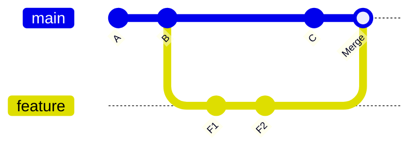
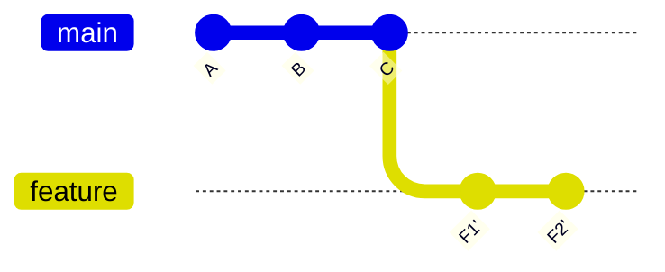

Git is the tool you use most after your editor, and most developers only know a handful of commands. Knowing a bit more of how it works turns scary situations ("I lost my commits", "the rebase went wrong") into two-minute fixes, and makes your pull requests far easier to review.

## How Git thinks

Git stores **snapshots**, not diffs. Each **commit** records the state of every file, a message, an author, and a pointer to its parent commit(s). Commits form a chain back to the first one.

A **branch** is just a movable label pointing at a commit. When you commit on a branch, the label moves forward. Creating a branch is instant because it's only a new label.

**`HEAD`** points at what you currently have checked out, usually a branch.

Your changes move through three areas:

1. **Working directory**: files as you edit them.
2. **Staging area** (index): what will go into the next commit (`git add`).
3. **Repository**: committed history (`git commit`).


```bash
git status              # what changed, what's staged
git diff                # unstaged changes
git diff --staged       # staged changes
git add -p              # stage changes piece by piece: review as you go
git commit -m "feat(contacts): add CSV import"
```

> **Tip:** `git add -p` is the single best habit for clean commits. It shows each change and asks whether to include it, so debug logs never sneak in.

## Branching

```bash
git switch -c feature/campaign-scheduler   # create and switch
git switch main                             # switch back
git branch -d feature/campaign-scheduler    # delete after merging
```

### Merge vs rebase

Both bring the changes from `main` into your feature branch (or the other way round). They differ in the history they leave behind.

**Merge** creates a new commit with two parents, joining the histories. Nothing is rewritten.




```bash
git switch feature/scheduler
git merge main
```

**Rebase** takes your branch's commits and replays them one by one on top of the latest `main`, as if you had started from there. History becomes a straight line, but your commits get new IDs.




```bash
git switch feature/scheduler
git fetch origin
git rebase origin/main
# fix any conflicts, then:
git push --force-with-lease
```

| | Merge | Rebase |
|---|---|---|
| History | True, with merge commits | Linear and tidy |
| Rewrites commits | No | Yes |
| Safe on shared branches | Yes | No |
| Conflict resolution | Once | Possibly once per commit |

**The golden rule**: rebase only commits that exist only on your machine or your own feature branch. Never rebase commits other people have already pulled, because their history will no longer match yours.

`--force-with-lease` is the safe force push: it refuses if someone else pushed to the branch since you last fetched.

## Cleaning up history with interactive rebase

Before opening a pull request, turn "wip", "fix", "fix again" into a few meaningful commits:

```bash
git rebase -i HEAD~5
```

Git opens a list of your last five commits. Change the word at the start of each line:

```text
pick   a1b2c3 Add scheduler model
squash d4e5f6 fix typo
squash 071829 fix tests
reword 9a8b7c Add scheduler API
drop   5f6e7d console.log debugging
```

- `pick`: keep as is.
- `reword`: keep, but edit the message.
- `squash`: merge into the commit above, combining messages. `fixup` does the same but throws away this message.
- `drop`: remove the commit.
- Reordering lines reorders commits.

`git commit --fixup <hash>` plus `git rebase -i --autosquash` automates this.

## Undoing things

| Situation | Command |
|---|---|
| Discard changes to a file | `git restore path/to/file` |
| Unstage a file | `git restore --staged path/to/file` |
| Change the last commit's message or add a forgotten file | `git commit --amend` |
| Undo the last commit, keep changes staged | `git reset --soft HEAD~1` |
| Undo the last commit, keep changes unstaged | `git reset HEAD~1` |
| Throw away the last commit and its changes | `git reset --hard HEAD~1` |
| Undo a commit that is already pushed and shared | `git revert <hash>` |

`reset` moves the branch label backwards, which rewrites history, so use it only on unpushed work. `revert` adds a new commit that undoes an old one, which is safe on shared branches.

### Reflog: the undo button for everything

Git keeps a log of every position `HEAD` has been at, for about 90 days. Even commits "lost" to a bad reset or rebase are still there.

```bash
git reflog
# 4c5d6e7 HEAD@{0}: rebase (finish): returning to refs/heads/feature
# 1a2b3c4 HEAD@{3}: commit: Add webhook signature check   <- the one you lost

git branch rescue 1a2b3c4     # or: git reset --hard 1a2b3c4
```

## Resolving conflicts calmly

A conflict means two branches changed the same lines differently, and Git needs you to decide. Git marks the file:

```text
<<<<<<< HEAD
const PAGE_SIZE = 50
=======
const PAGE_SIZE = 25
>>>>>>> feature/pagination
```

1. Open each conflicted file (`git status` lists them).
2. Decide what the correct result is. Often it's a combination of both sides, not simply one.
3. Delete the markers, save, and run the tests.
4. `git add` the file, then `git merge --continue` or `git rebase --continue`.
5. If it's going badly: `git merge --abort` or `git rebase --abort` returns you to where you started.

To reduce conflicts: keep branches short-lived, pull `main` in often, and keep pull requests small.

## Other everyday tools

```bash
git stash push -u -m "half-done filters"  # shelve work, including new files
git stash list
git stash pop                             # bring it back

git cherry-pick 1a2b3c4                   # copy one commit onto this branch

git log --oneline --graph --all           # see the shape of history
git log -S "PAGE_SIZE" --oneline          # which commits added or removed this text
git blame -L 40,60 src/api/campaigns.ts   # who last changed these lines, and why

git bisect start                          # binary-search for the commit that broke something
git bisect bad                            # current commit is broken
git bisect good v1.4.0                    # this one was fine
# Git checks out a middle commit; you test and mark good/bad until it finds the culprit
```

## Commits and pull requests people like reviewing

### Commit messages

Use **conventional commits**: a type, an optional scope, and a short summary in the imperative mood.

```text
feat(campaigns): allow scheduling in the org's time zone
fix(auth): rotate refresh token on every use
refactor(contacts): extract CSV parser into a service
test(inbox): cover unread badge after reconnect
chore(deps): bump mongoose to 8.6
```

Add a body when the *why* isn't obvious. Tools can generate changelogs and version numbers from these messages.

### Pull requests

- **Small and focused**: one change per PR. 200 lines get a real review; 2,000 lines get "LGTM".
- **A clear description**: what changed, why, how to test it, screenshots or a short video for UI changes, and any risks.
- **Self-review first**: read your own diff before requesting review. Remove debug code, check naming, add missing tests.
- **Green CI**: lint, type check and tests passing.
- **Respond to feedback** by pushing new commits during review, then squash when merging if your team prefers.

## Branching strategies

- **Trunk-based development**: everyone merges small, short-lived branches into `main` frequently (daily), unfinished features hide behind feature flags, and `main` is always deployable. Works best with good CI and automated tests.
- **GitHub flow**: a simpler version: branch from `main`, open a PR, review, merge, deploy.
- **GitFlow**: long-lived `develop` and `main`, plus `feature/`, `release/` and `hotfix/` branches. Suits scheduled releases (mobile apps, versioned products), but it's heavy for web apps that deploy often.

## Versions, tags and hooks

**Semantic versioning** is `MAJOR.MINOR.PATCH`:

- `MAJOR` for breaking changes,
- `MINOR` for new features that don't break anything,
- `PATCH` for bug fixes.

In `package.json`, `^2.3.1` accepts any `2.x.x` at or above `2.3.1`; `~2.3.1` accepts only `2.3.x`. The lockfile pins exact versions so installs are repeatable.

Mark releases with **tags**: `git tag -a v1.5.0 -m "Campaign scheduler"` and `git push --tags`.

**Git hooks** run scripts at moments like commit and push. Husky shares them through the repo:

```json
{
  "scripts": { "prepare": "husky" },
  "lint-staged": {
    "*.{ts,tsx}": ["eslint --fix", "prettier --write"]
  }
}
```

A `pre-commit` hook running `lint-staged` formats and lints only the files you changed, so it stays fast.

## `.gitignore` essentials

```text
node_modules/
dist/
build/
.env
.env.*
!.env.example
coverage/
*.log
.DS_Store
```

If you accidentally commit a secret, removing it in a new commit is **not enough**: it's still in history, and it may already be scraped. Rotate the secret immediately, then clean history if needed.

## Summary

- Commits are snapshots; branches are movable labels; `HEAD` is where you are.
- Merge preserves history; rebase rewrites it into a straight line. Rebase only your own unshared work, and force-push with `--force-with-lease`.
- Clean up with interactive rebase before opening a PR.
- `restore` and `reset` for local mistakes, `revert` for shared ones, `reflog` when something seems lost.
- Small PRs with clear descriptions and conventional commit messages get better reviews, faster.
