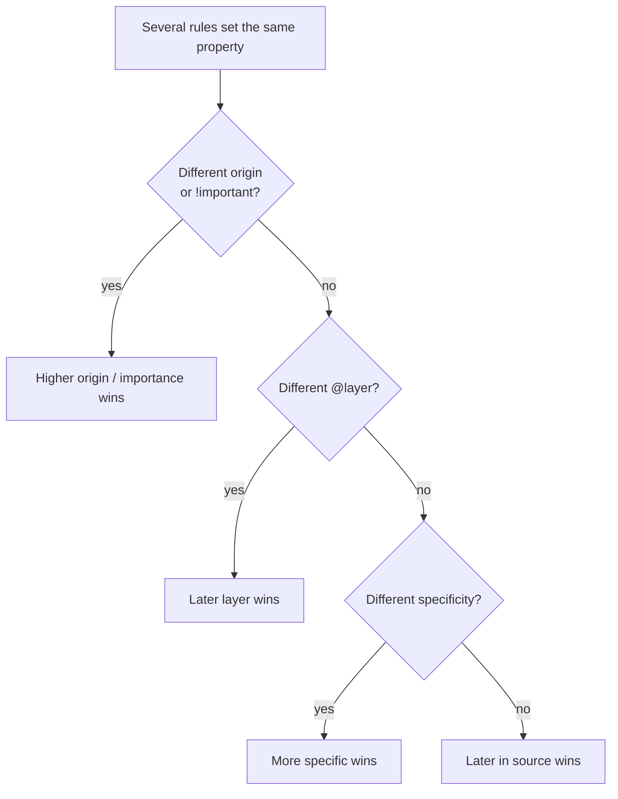
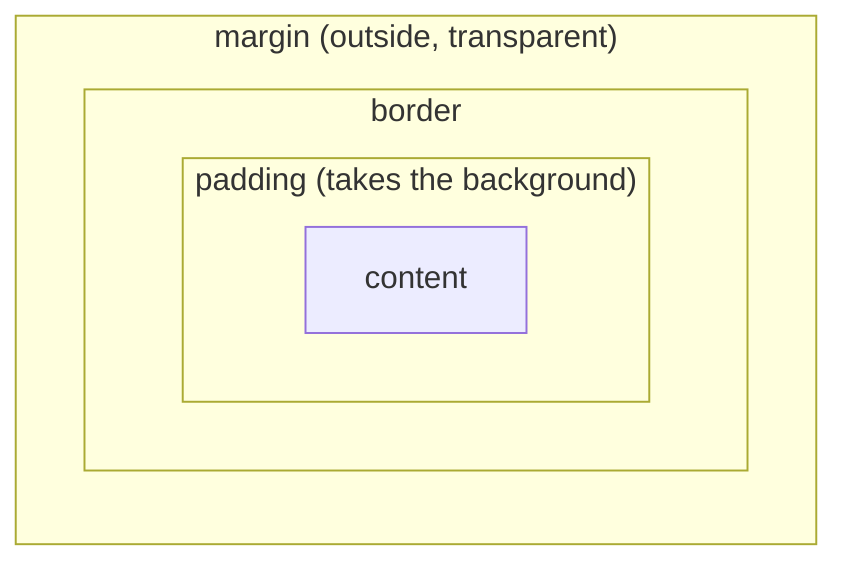
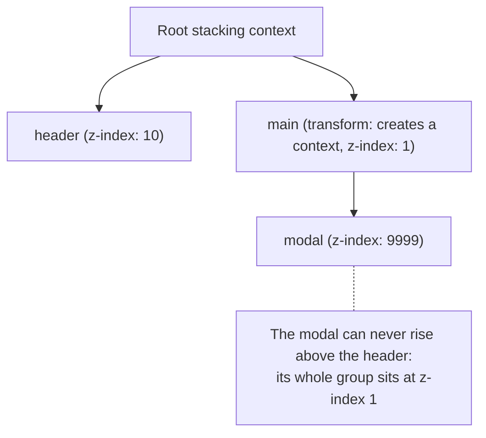

Component libraries like MUI hide a lot of HTML and CSS, which is great for speed and bad for understanding. When a layout breaks, a `z-index` refuses to work, or a screen reader user can't use your form, you need the fundamentals. This chapter covers the parts that matter most in real projects and interviews.

## Semantic HTML

**Semantic** HTML means choosing elements for what they *mean*, not how they look. `div` and `span` mean nothing; everything else carries meaning that browsers, screen readers and search engines use.

```html
<header>
  <nav aria-label="Main">…</nav>
</header>
<main>
  <article>
    <h1>Diwali campaign results</h1>
    <section aria-labelledby="delivery">
      <h2 id="delivery">Delivery</h2>
      …
    </section>
  </article>
</main>
<footer>…</footer>
```

What you get for free by using the right element:

- **`button`**: focusable with Tab, activated with Enter and Space, announced as "button", can be disabled.
- **`a href`**: a real link: middle-click opens a new tab, right-click shows link options, announced as "link".
- **`label`**: clicking it focuses its input, and screen readers read it when the input is focused.
- **Landmarks** (`header`, `nav`, `main`, `footer`): screen reader users can jump between them.
- **Headings** (`h1`–`h6`) in order: users skim a page by its headings, just like sighted users do.

> **Tip:** A rule of thumb: if it navigates, it's a link; if it does something on the page, it's a button. Never a clickable `div`.

## Forms that work for everyone

```html
<form>
  <label for="phone">WhatsApp number</label>
  <input
    id="phone"
    name="phone"
    type="tel"
    inputmode="numeric"
    autocomplete="tel"
    required
    aria-describedby="phone-hint phone-error"
    aria-invalid="true"
  />
  <p id="phone-hint">Include the country code, e.g. +91.</p>
  <p id="phone-error">This number looks too short.</p>

  <button type="submit">Save contact</button>
</form>
```

- Every input needs a **label**. Placeholders disappear as you type and are not labels.
- Use the right **`type`** (`email`, `tel`, `number`, `date`, `url`): you get the right mobile keyboard and basic validation.
- **`autocomplete`** lets browsers and password managers fill fields (`email`, `current-password`, `new-password`, `one-time-code`).
- Link hints and errors with **`aria-describedby`** and mark invalid fields with **`aria-invalid`**.
- Buttons inside a form submit it by default. Use `type="button"` for buttons that shouldn't.

## Accessibility (a11y)

Accessibility means people using keyboards, screen readers, magnification, voice control or high-contrast settings can use your product. It's increasingly asked about in frontend interviews, and it's often a legal requirement.

### Keyboard support

- Everything interactive must be reachable with **Tab** and usable with **Enter/Space**.
- **Escape** closes dialogs, menus and popovers.
- **Arrow keys** move within composite widgets: menus, tabs, listboxes, radio groups.
- Tab order should follow visual order. Avoid positive `tabIndex` values.
- Never remove focus outlines without replacing them. Use `:focus-visible` to show them for keyboard users only.

```css
button:focus-visible {
  outline: 2px solid var(--accent);
  outline-offset: 2px;
}
```

### Focus management

When the UI changes without a page load, move focus deliberately:

- **Opening a modal**: move focus inside it, keep Tab cycling within it (a *focus trap*), close on Escape, and return focus to the button that opened it. The native `<dialog>` element with `showModal()` does most of this for you.
- **Route changes in an SPA**: move focus to the new page's heading so screen reader users know the page changed.
- **Deleting an item from a list**: move focus to a sensible neighbour, not to nowhere.

### ARIA

**ARIA** attributes add accessibility information HTML can't express: `aria-expanded` on a toggle, `aria-selected` in tabs, `aria-live` for announcements, `role="dialog"`.

The first rule of ARIA: **don't use ARIA if a native element does the job**. ARIA changes what is *announced*, not how things *behave*. `<div role="button">` still doesn't respond to the keyboard until you write that code yourself.

Useful patterns:

```html
<!-- Icon-only button needs a name -->
<button aria-label="Delete contact"><TrashIcon aria-hidden="true" /></button>

<!-- Disclosure -->
<button aria-expanded="false" aria-controls="filters">Filters</button>
<div id="filters" hidden>…</div>

<!-- Announce changes without moving focus -->
<div aria-live="polite">3 contacts imported.</div>
```

### Visual accessibility

- **Contrast**: at least 4.5:1 for normal text and 3:1 for large text and UI borders (WCAG AA).
- **Don't rely on colour alone**: an error needs text or an icon, not just a red border.
- **Respect user settings**: `prefers-reduced-motion` for animations, and text that still works at 200% zoom.
- **Alt text**: describe the purpose of meaningful images; use `alt=""` for decorative ones.

### Testing accessibility

- Unplug your mouse and use the page with only the keyboard.
- Run Lighthouse or the axe browser extension.
- Try a screen reader: VoiceOver on macOS (Cmd + F5) or NVDA on Windows.
- In tests, React Testing Library's `getByRole` queries fail when elements lack proper roles and names, which pushes you towards accessible markup.

## The cascade and specificity

When several rules target the same element, the browser decides the winner in this order:

1. **Origin and importance**: browser defaults < your styles < your `!important` styles.
2. **Cascade layers** (`@layer`), if used: later layers win.
3. **Specificity**: more specific selectors win.
4. **Source order**: if everything else is equal, the later rule wins.




### Calculating specificity

Count three columns and compare left to right:

| Selector | IDs | Classes, attributes, pseudo-classes | Elements, pseudo-elements |
|---|---|---|---|
| `p` | 0 | 0 | 1 |
| `.card p` | 0 | 1 | 1 |
| `.card .title:hover` | 0 | 3 | 0 |
| `#sidebar .link` | 1 | 1 | 0 |

Inline `style` attributes beat all of these. `:where(...)` always counts as zero, which makes it perfect for easy-to-override base styles; `:is()` and `:not()` take the specificity of their most specific argument.

**Inheritance** is separate from the cascade: some properties (`color`, `font-*`, `line-height`) flow down to children automatically; others (`margin`, `border`, `background`) don't.

## The box model

Every element is a rectangle made of **content**, **padding**, **border** and **margin**.




With the default `box-sizing: content-box`, `width: 300px` sizes only the content, so adding padding makes the element wider than 300px. With `border-box`, `width` includes padding and border, which is what you almost always want:

```css
*, *::before, *::after { box-sizing: border-box; }
```

**Margin collapsing**: vertical margins between block siblings don't add up; the larger one wins. It also happens between a parent and its first or last child when nothing separates them. It never happens inside flex or grid containers, which is one reason layouts built with `gap` are more predictable.

## Layout: Flexbox and Grid

### Flexbox: one direction

Flexbox lays items out in a row or a column and distributes space between them.

```css
.toolbar {
  display: flex;
  align-items: center;          /* cross axis */
  justify-content: space-between; /* main axis */
  gap: 0.75rem;
}
.toolbar .search { flex: 1; min-width: 0; } /* take the leftover space */
```

`flex: 1` is shorthand for `flex-grow: 1; flex-shrink: 1; flex-basis: 0`. A frequent bug: flex items refuse to shrink below their content's width, so long text overflows. `min-width: 0` on the item fixes it.

### Grid: two directions

Grid defines rows and columns together, which suits page layouts and card grids.

```css
.dashboard {
  display: grid;
  grid-template-columns: 16rem 1fr;
  grid-template-rows: auto 1fr;
  grid-template-areas:
    "sidebar header"
    "sidebar main";
  min-height: 100vh;
}

.cards {
  display: grid;
  grid-template-columns: repeat(auto-fill, minmax(16rem, 1fr));
  gap: 1rem;
}
```

The `auto-fill` + `minmax` line creates a responsive grid with no media queries: as many columns as fit, each at least 16rem.

**Rule of thumb**: Grid for the overall layout, Flexbox for aligning things inside each piece.

## Positioning and stacking

| `position` | In normal flow? | Positioned relative to |
|---|---|---|
| `static` | Yes | Not positioned |
| `relative` | Yes (space kept) | Its own normal position |
| `absolute` | No | The nearest positioned ancestor |
| `fixed` | No | The viewport (or an ancestor with `transform`) |
| `sticky` | Yes, until the threshold | The scroll container |

`sticky` silently fails when an ancestor has `overflow: hidden` or `auto`, because that ancestor becomes the scroll container.

### Why `z-index` "doesn't work"

`z-index` only compares elements within the same **stacking context**. A stacking context is a group that gets layered as one unit. If a modal's parent creates a stacking context that sits below the header, no `z-index` on the modal can lift it above the header.

Things that create a stacking context include: `position` with a `z-index`, `opacity` below 1, `transform`, `filter`, `will-change`, `isolation: isolate` and `position: fixed`.




The practical fix is to render overlays (modals, dropdowns, tooltips) at the end of `body` with a **portal**, outside every other stacking context. MUI does exactly this.

## Responsive design

- **Mobile first**: write base styles for small screens, then add `@media (min-width: …)` rules for bigger ones.
- **Relative units**: `rem` for type and spacing (respects the user's font size), `%` and `fr` for layout, `ch` for readable line lengths (`max-width: 65ch`).
- **Viewport units**: `vw`/`vh`, and on mobile prefer `svh`/`dvh` for full-height sections, because `100vh` ignores the browser's toolbars.
- **Fluid values** with `clamp(min, preferred, max)`:

```css
h1 { font-size: clamp(2rem, 1rem + 4vw, 4rem); }
.section { padding-block: clamp(3rem, 8vw, 8rem); }
```

- **Container queries** let a component adapt to the space *it* has, not the whole screen:

```css
.card-list { container-type: inline-size; }

@container (min-width: 36rem) {
  .card { display: grid; grid-template-columns: 8rem 1fr; }
}
```

## Modern CSS worth knowing

- **Custom properties** (CSS variables) live at runtime, cascade, and can change per component or media query, which makes theming and dark mode simple:

```css
:root { --accent: #ff6a3d; --radius: 0.75rem; }
[data-theme="dark"] { --surface: #0b0b0b; }
.button { background: var(--accent); border-radius: var(--radius); }
```

- **`:has()`**, the parent selector: `.field:has(input:invalid) { … }`.
- **Logical properties**: `margin-inline`, `padding-block`, `inset-inline-start`. They adapt to right-to-left languages.
- **Nesting** is now native CSS, like SCSS.
- **Transitions and transforms**: animate `transform` and `opacity` for smooth motion, and respect reduced-motion settings:

```css
@media (prefers-reduced-motion: reduce) {
  *, *::before, *::after { animation: none !important; transition: none !important; }
}
```

## Styling approaches in React apps

| Approach | Strengths | Watch out for |
|---|---|---|
| Plain CSS / SCSS modules | Familiar, no runtime cost, scoped class names | Naming and organisation discipline |
| Tailwind CSS | Fast to build, consistent spacing and colour scales, no unused CSS | Long class lists; needs a design system mindset |
| MUI (`sx`, `styled`, theme) | Ready-made accessible components, one theme for everything | Runtime styling cost, bundle size, overriding deep styles |
| CSS-in-JS (styled-components, Emotion) | Styles next to logic, dynamic props | Runtime cost; less suited to Server Components |

Whatever you use, put design decisions (colours, spacing, radii, type scale) in **tokens** (theme values or CSS variables), not scattered hard-coded values. That's what keeps a shared component library consistent.

## Summary

- Semantic elements give you keyboard support, screen reader meaning and SEO for free. Use `button` for actions and `a` for navigation.
- Every input needs a label; link hints and errors with `aria-describedby`.
- Keyboard, focus and contrast are the core of accessibility. Use ARIA only when HTML can't express something.
- The cascade goes origin → layers → specificity → order. Keep specificity low and predictable.
- Use `border-box`, Grid for layout, Flexbox for alignment, and `gap` instead of margins between items.
- `z-index` works within stacking contexts; portals solve overlay problems.
- Build mobile first with `rem`, `clamp()` and container queries.
