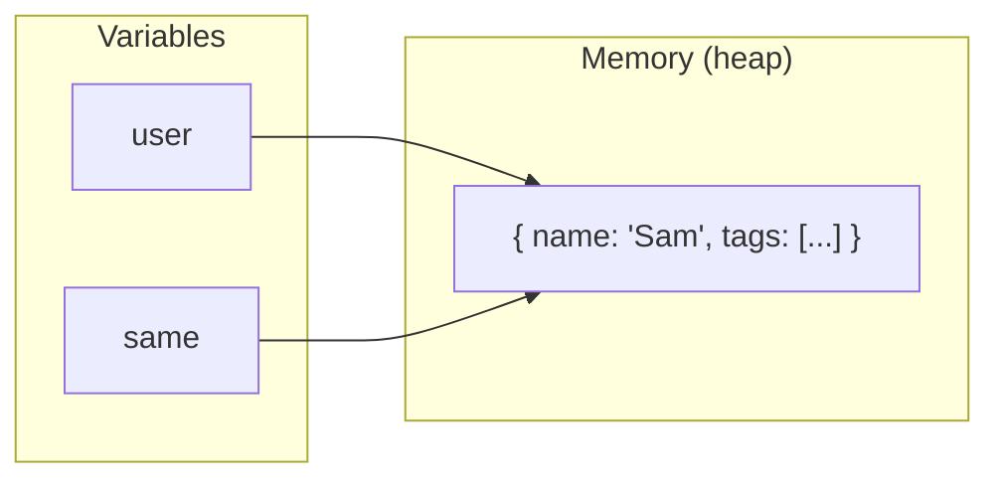
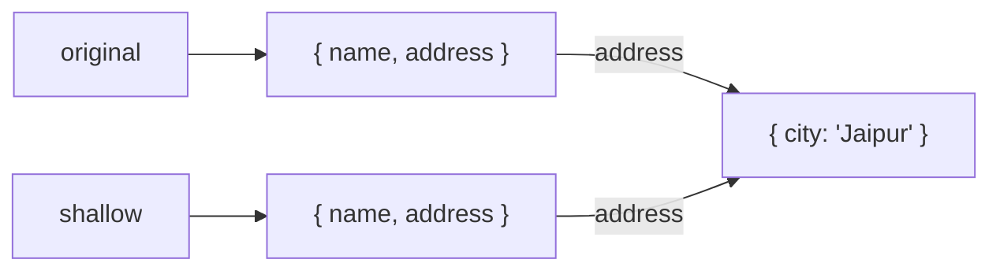
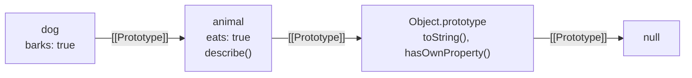
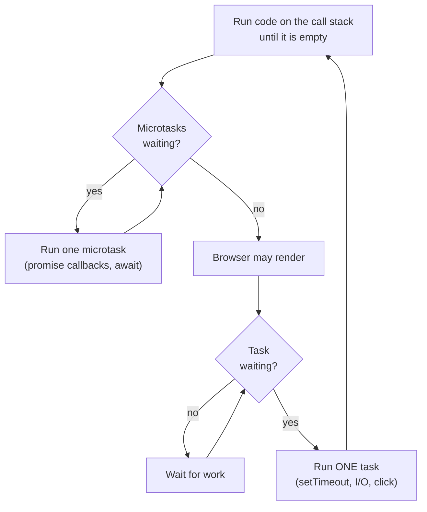
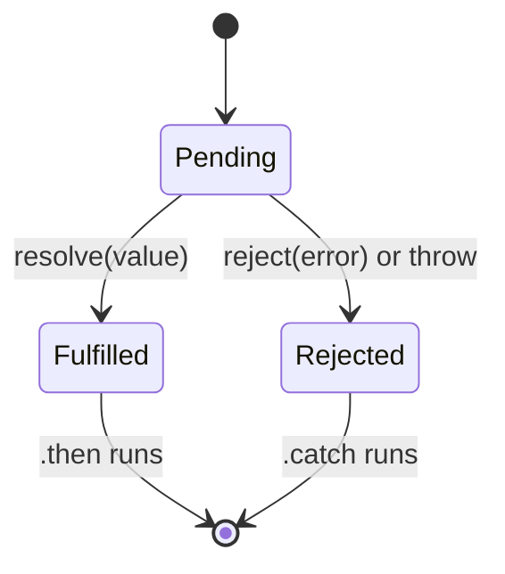

You already write JavaScript every day. This chapter is about the part you don't see: how values live in memory, how scope works, what `this` really points to, how objects inherit, and how one thread manages to do many things "at once". Once these click, bugs that used to feel random start to make sense.

## Values and memory

JavaScript has two kinds of values, and almost every "why did this change?" bug comes from mixing them up.

### Primitives are copied

The primitive types are `string`, `number`, `bigint`, `boolean`, `undefined`, `null` and `symbol`. A variable holding a primitive holds the value itself. Assigning it to another variable makes an independent copy.

```js
let a = 10
let b = a   // b gets its own 10
b = 20
console.log(a) // 10
```

Primitives are also immutable. String methods like `toUpperCase()` never change the original string; they return a new one.

### Objects are shared by reference

Objects, arrays, functions, dates, maps and sets are reference types. The variable holds a *reference*, a pointer to where the object lives in memory. Assigning it copies the pointer, not the object.

```js
const user = { name: 'Avi', tags: ['admin'] }
const same = user
same.name = 'Sam'
console.log(user.name) // 'Sam' — one object, two names for it
```




This is also why `===` on two objects compares identity, not contents:

```js
{ a: 1 } === { a: 1 } // false: two different objects
const x = { a: 1 }
x === x               // true: same reference
```

React relies on exactly this. It decides whether state changed by comparing references, which is why you must create a new object instead of mutating the old one.

### Shallow and deep copies

A **shallow copy** creates a new outer object, but anything nested is still shared.

```js
const original = { name: 'Avi', address: { city: 'Kota' } }
const shallow = { ...original }

shallow.name = 'Sam'             // fine: top level is independent
shallow.address.city = 'Jaipur'  // oops: address is still shared
console.log(original.address.city) // 'Jaipur'
```




Spread (`...`), `Object.assign`, `Array.from` and `slice` all make shallow copies.

A **deep copy** duplicates every level. Use `structuredClone`, which is built into modern browsers and Node 17+:

```js
const deep = structuredClone(original)
deep.address.city = 'Delhi'
console.log(original.address.city) // unchanged
```

`JSON.parse(JSON.stringify(obj))` is the old trick. It works for plain data but silently drops functions and `undefined`, turns dates into strings and fails on circular references.

> **Tip:** In React and Redux you rarely need a deep copy. You copy only the path you are changing: `{ ...state, address: { ...state.address, city } }`.

### Garbage collection

You never free memory by hand. The engine periodically finds objects that can no longer be reached from the "roots" (global variables and the current call stack) and frees them. This is called *mark and sweep*.

Memory leaks happen when something keeps a reference you forgot about:

- An event listener or `setInterval` that is never removed, holding a closure over large data.
- A cache (a `Map` or plain object) that only ever grows.
- A DOM node removed from the page but still referenced from JavaScript.

`WeakMap` and `WeakSet` hold their keys *weakly*: if nothing else references the key object, it can be collected. They are useful for attaching data to objects without keeping them alive.

## Scope and closures

### Three kinds of scope

*Scope* is where a variable can be seen.

- **Global scope**: visible everywhere.
- **Function scope**: `var` declarations are visible anywhere inside the function they are declared in.
- **Block scope**: `let` and `const` are visible only inside the nearest `{ }` block.

```js
function demo() {
  if (true) {
    var a = 1   // function-scoped
    let b = 2   // block-scoped
  }
  console.log(a) // 1
  console.log(b) // ReferenceError
}
```

JavaScript uses **lexical scope**: what a function can see is decided by *where it is written*, not where it is called from.

### Hoisting and the temporal dead zone

Before running a scope, the engine registers every declaration in it. That's why it can look like declarations were "moved to the top".

| Declaration | Hoisted? | Value before its line |
|---|---|---|
| `function f() {}` | Yes, with its body | The whole function (you can call it) |
| `var x` | Yes | `undefined` |
| `let` / `const` / `class` | Yes, but uninitialised | Accessing it throws a ReferenceError |

The stretch between the start of the scope and the `let`/`const` line is the **temporal dead zone** (TDZ). It exists to catch "used before assigned" bugs instead of quietly giving you `undefined`.

```js
console.log(total) // ReferenceError, not undefined
const total = 100
```

### Closures

A **closure** is a function together with the variables it could see when it was created. Even after the outer function returns, the inner function keeps access to those variables.

```js
function createCounter() {
  let count = 0
  return {
    increment() { return ++count },
    reset() { count = 0 },
  }
}

const counter = createCounter()
counter.increment() // 1
counter.increment() // 2
// Nothing outside can touch `count` directly: it's private.
```

Closures are everywhere once you look:

- **Private state**, as above.
- **Function factories**: `const double = multiplyBy(2)`.
- **Callbacks and event handlers** that remember the data they were set up with.
- **Utilities** like `once`, `memoize`, `debounce` and `throttle`.
- **React hooks**: every render creates new handler functions that close over *that render's* state. This is where "stale closure" bugs come from: a `setInterval` created on the first render keeps seeing the first render's values.

### The classic loop bug

```js
for (var i = 0; i < 3; i++) {
  setTimeout(() => console.log(i), 0)
}
// 3, 3, 3
```

There is only one `i` (function-scoped `var`), and by the time the callbacks run, the loop has finished and `i` is 3. With `let`, each iteration gets a fresh binding, so the callbacks print 0, 1, 2.

### Useful closure patterns

```js
function once(fn) {
  let done = false, result
  return (...args) => {
    if (!done) { done = true; result = fn(...args) }
    return result
  }
}

function memoize(fn) {
  const cache = new Map()
  return (arg) => {
    if (!cache.has(arg)) cache.set(arg, fn(arg))
    return cache.get(arg)
  }
}
```

## How `this` works

`this` is the most misunderstood keyword in JavaScript because it is not decided where a function is written. It is decided **by how the function is called**. There are four rules, checked in this order.

### 1. `new` binding

Calling a function with `new` creates a fresh object and sets `this` to it.

```js
function User(name) { this.name = name }
const u = new User('Avi') // this === u inside User
```

### 2. Explicit binding: `call`, `apply`, `bind`

You choose `this` yourself.

```js
function greet(greeting) { return greeting + ', ' + this.name }
const avi = { name: 'Avi' }

greet.call(avi, 'Hi')        // 'Hi, Avi'  — arguments one by one
greet.apply(avi, ['Hello'])  // 'Hello, Avi' — arguments as an array
const hiAvi = greet.bind(avi, 'Hey') // returns a new function, doesn't call it
hiAvi()                      // 'Hey, Avi'
```

### 3. Implicit binding: `obj.method()`

When you call a function as a property of an object, `this` is the object before the dot.

```js
const user = { name: 'Avi', greet() { return 'Hi ' + this.name } }
user.greet() // 'Hi Avi'
```

### 4. Default binding

A plain call, `fn()`, gets `this === undefined` in strict mode (all modules and classes are strict). In old sloppy-mode scripts it gets the global object instead.

### Losing `this`

The most common bug: passing a method as a callback. You pass only the function, and whoever calls it later calls it plainly, so rule 3 no longer applies.

```js
const fn = user.greet
fn() // TypeError: Cannot read properties of undefined

setTimeout(user.greet, 100)          // same problem
setTimeout(() => user.greet(), 100)  // fixed: called as user.greet()
setTimeout(user.greet.bind(user), 100) // also fixed
```

### Arrow functions

Arrow functions have **no `this` of their own**. They use the `this` of the code around them, fixed at the moment they are created. That makes them ideal for callbacks inside methods, and wrong for object methods that need `this` to be the object.

```js
class Timer {
  seconds = 0
  start() {
    setInterval(() => { this.seconds++ }, 1000) // arrow: this is the Timer
  }
}

const obj = {
  name: 'Avi',
  arrow: () => this?.name, // `this` here is the module's this (undefined)
}
```

Arrow functions also have no `arguments` object, can't be called with `new`, and have no `prototype`.

## Prototypes and classes

### The prototype chain

Every object has a hidden link to another object, its **prototype**. When you read a property that the object doesn't have, JavaScript follows the link and looks there, then on that object's prototype, and so on until it reaches `null`.

```js
const animal = { eats: true, describe() { return 'I eat: ' + this.eats } }
const dog = Object.create(animal) // dog's prototype is animal
dog.barks = true

dog.barks       // true  (own property)
dog.eats        // true  (found on animal)
dog.describe()  // 'I eat: true' — `this` is still dog
```

This is how every array has `.map`: arrays inherit from `Array.prototype`, which inherits from `Object.prototype`.




### Classes are prototypes with nicer syntax

```js
class Person {
  #secret = 'hidden'           // truly private field
  static species = 'human'     // lives on the class itself

  constructor(name) { this.name = name }
  greet() { return 'Hi ' + this.name } // lives on Person.prototype
}

class Developer extends Person {
  constructor(name, stack) {
    super(name)                // must call before using `this`
    this.stack = stack
  }
  greet() { return super.greet() + ', I write ' + this.stack }
}
```

Under the hood, `greet` is stored once on `Person.prototype` and shared by every instance. `extends` links `Developer.prototype` to `Person.prototype`. Differences from old constructor functions are small: classes must be called with `new`, their bodies are always strict, and they support `#private` fields.

`a instanceof B` simply walks `a`'s prototype chain looking for `B.prototype`.

## The event loop

JavaScript runs your code on **one thread** with **one call stack**. Yet a page can wait for network requests, run timers and respond to clicks without freezing. The event loop is how.

### The pieces

- **Call stack**: the functions currently running. Only one thing runs at a time.
- **Web APIs / Node APIs**: timers, network, file system. These run outside your JavaScript and notify it when done.
- **Task queue** (macrotasks): callbacks from `setTimeout`, `setInterval`, I/O, UI events.
- **Microtask queue**: promise callbacks (`.then`, `.catch`, `.finally`, code after `await`) and `queueMicrotask`.

### The loop

1. Run the current script until the call stack is empty.
2. Run **all** microtasks, including any new ones they add, until the microtask queue is empty.
3. In the browser, render if needed.
4. Take **one** task from the task queue, run it, and go back to step 2.




```js
console.log('A')
setTimeout(() => console.log('B'), 0)
Promise.resolve().then(() => console.log('C'))
console.log('D')

// A, D, C, B
```

`A` and `D` are synchronous. `C` is a microtask, so it runs as soon as the stack empties. `B` is a task, so it waits for the next turn of the loop, even with a 0 ms delay.

### `await` is a microtask boundary

Code before the first `await` in an async function runs synchronously. Everything after it is scheduled as a microtask.

```js
async function load() {
  console.log('1')
  await null
  console.log('3')
}
load()
console.log('2')
// 1, 2, 3
```

### Starvation

Because microtasks all run before the next task, a microtask that keeps scheduling more microtasks blocks timers, clicks and rendering forever. Heavy synchronous work has the same effect: nothing else can happen until it finishes. Split big jobs into chunks (or move them to a worker) to keep the page responsive.

## Asynchronous code

### From callbacks to promises to async/await

Callbacks were the first approach: pass a function to call later. Nesting several of them leads to deeply indented "callback hell", and every level has to handle errors itself.

A **promise** is an object representing a value that will exist later. It is *pending*, then either *fulfilled* with a value or *rejected* with an error. You chain work with `.then()` and handle any error once with `.catch()`.




`async`/`await` is syntax on top of promises. An `async` function always returns a promise, and `await` pauses that function (not the whole program) until a promise settles.

```js
async function loadDashboard(userId) {
  try {
    const user = await api.getUser(userId)
    const campaigns = await api.getCampaigns(user.orgId)
    return { user, campaigns }
  } catch (err) {
    logger.error(err)
    throw new Error('Could not load dashboard')
  }
}
```

### Sequential vs parallel

This is the most common async mistake in real code and a favourite interview question.

```js
// Sequential: total time = time(a) + time(b)
const stats = await getStats()
const contacts = await getContacts()

// Parallel: total time = the slower of the two
const [stats2, contacts2] = await Promise.all([getStats(), getContacts()])
```

Use sequential only when the second call needs the result of the first.

```mermaid
%% Awaiting one after the other adds the times; Promise.all overlaps them.
gantt
  title Two 1-second requests
  dateFormat X
  axisFormat %Ss
  section Sequential
  getStats    :0, 1
  getContacts :1, 2
  section Promise.all
  getStats    :0, 1
  getContacts :0, 1
```




### The promise combinators

| Method | Resolves when | Rejects when | Use it for |
|---|---|---|---|
| `Promise.all` | All succeed (array of values) | Any one fails (first error) | Independent requests that all must succeed |
| `Promise.allSettled` | All finish (array of results with status) | Never | "Do all, then report which failed" |
| `Promise.race` | The first one settles | The first one rejects | Timeouts |
| `Promise.any` | The first one succeeds | All fail (`AggregateError`) | Trying several mirrors or sources |

### Error handling rules

- Wrap `await` calls in `try/catch`, or add `.catch()` at the end of a chain.
- A rejected promise with no handler triggers `unhandledrejection` in browsers and, by default, crashes a Node process. Don't leave promises floating.
- A `try/catch` around `setTimeout(() => { throw ... })` won't catch the error, because the callback runs later on a fresh call stack.

### Cancelling with AbortController

```js
const controller = new AbortController()
fetch('/api/search?q=phone', { signal: controller.signal })
  .catch((err) => { if (err.name !== 'AbortError') throw err })

controller.abort() // the fetch rejects with an AbortError
```

In React effects, abort in the cleanup function so a slow old request can't overwrite newer results.

## Iterators and generators

`for...of`, spread (`[...x]`) and destructuring all work with anything **iterable**: an object with a `[Symbol.iterator]()` method that returns an **iterator** (an object with `next()` returning `{ value, done }`). Arrays, strings, maps, sets and `arguments` are all iterable.

A **generator** function (`function*`) is the easy way to make one. `yield` hands out a value and pauses; the next `next()` call resumes where it left off.

```js
function* paginate(items, size) {
  for (let i = 0; i < items.length; i += size) {
    yield items.slice(i, i + size)
  }
}

for (const batch of paginate(contacts, 500)) {
  await sendBatch(batch)
}
```

Generators are lazy: nothing runs until you ask for the next value, so they can describe huge or even infinite sequences. Async generators (`async function*` with `for await...of`) do the same for streams of async data, like reading a database cursor page by page.

## Modules

### ES modules vs CommonJS

| | ES modules | CommonJS |
|---|---|---|
| Syntax | `import` / `export` | `require` / `module.exports` |
| When resolved | Before the code runs (static) | While running (dynamic) |
| Loading | Asynchronous | Synchronous |
| Tree shaking | Yes | Not reliably |
| Top-level `await` | Yes | No |
| Imported values | Live bindings | Copies of `exports` at the time |

In Node, a file is an ES module if it ends in `.mjs` or the nearest `package.json` has `"type": "module"`. For conditional or lazy loading in ESM, use dynamic `import()`, which returns a promise. Bundlers use it for code splitting.

**Tree shaking** is the bundler removing exports nobody imports. It works because ESM imports are static. Top-level side effects in a module can prevent it.

**Circular imports** (A imports B, B imports A) mean one module sees the other half-initialised. Move shared code into a third module to break the cycle.

## Modern syntax worth mastering

```js
// Destructuring with defaults and renaming
const { name, role = 'member', address: { city } = {} } = user
const [first, ...rest] = queue

// Spread to copy and merge
const settings = { ...defaults, ...userSettings }

// Optional chaining: stop at null/undefined instead of throwing
const zip = user?.address?.zip
const firstItem = list?.[0]
callback?.()

// Nullish coalescing: fallback only for null/undefined (keeps 0 and '')
const pageSize = options.pageSize ?? 20

// Logical assignment
config.retries ??= 3
```

`??` vs `||` matters: `0 || 20` is `20`, which is wrong if 0 was a real setting. `0 ?? 20` is `0`.

Other everyday tools:

- `Map` and `Set` for keyed data and uniqueness, with O(1) lookups.
- `Object.entries`, `Object.fromEntries` and `Object.groupBy` for reshaping data.
- `Array.prototype.at(-1)` for the last element.
- `toSorted`, `toReversed` and `with`, which return new arrays instead of mutating (unlike `sort` and `reverse`).

## Common pitfalls

- **Equality**: always use `===`. The one accepted `==` is `x == null`, which checks both `null` and `undefined`.
- **Floating point**: `0.1 + 0.2 !== 0.3`. For money, store integers (paise) or use a decimal library.
- **`typeof null` is `'object'`**, a bug kept for compatibility. Check `x === null` directly.
- **`sort()` sorts as strings by default**: `[10, 9, 1].sort()` gives `[1, 10, 9]`. Pass a comparator: `(a, b) => a - b`.
- **Mutating methods**: `push`, `pop`, `splice`, `sort`, `reverse` change the original array. That breaks React state if you use them on state directly.
- **`for...in` loops over keys** (including inherited ones); `for...of` loops over values of an iterable. Use `for...of` for arrays.

## Summary

- Primitives are copied; objects are shared by reference. Copy the path you change, and use `structuredClone` for true deep copies.
- Scope is lexical. `let`/`const` are block-scoped and live in the TDZ until declared. Closures keep outer variables alive, which powers private state, utilities and React hooks.
- `this` depends on the call: `new`, then explicit `call/apply/bind`, then `obj.method()`, then plain call. Arrow functions borrow `this` from their surroundings.
- Objects inherit through the prototype chain; classes are a cleaner way to write the same thing.
- One thread, one stack: synchronous code first, then all microtasks (promises), then one task (timers, I/O), repeat.
- Run independent async work in parallel with `Promise.all`, handle every rejection, and cancel stale requests with `AbortController`.
