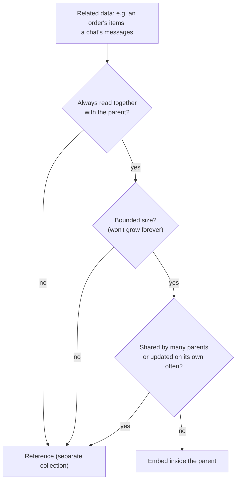
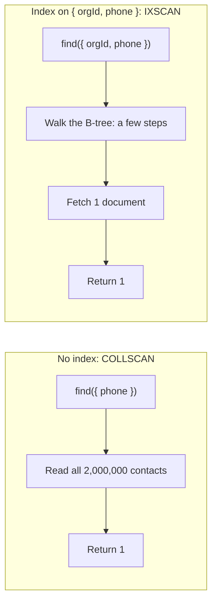
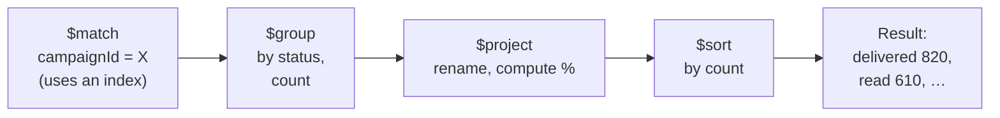
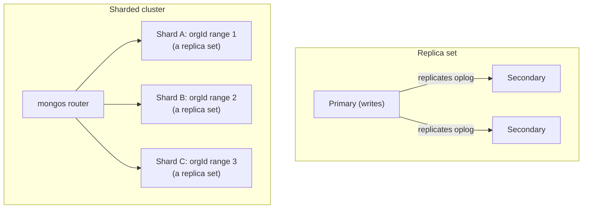

Most MongoDB performance problems come from two decisions: how documents are shaped, and which indexes exist. Get those right and MongoDB is fast and pleasant; get them wrong and no amount of hardware helps. This chapter covers modelling, indexes and how to prove they work with `explain()`, the aggregation pipeline, transactions, Mongoose, and how MongoDB scales.

## The document model

MongoDB stores **documents** (JSON-like objects, stored as BSON) in **collections**. Documents in a collection don't need identical fields, and they can contain nested objects and arrays.

```js
{
  _id: ObjectId('66f1…'),
  orgId: ObjectId('65a0…'),
  name: 'Priya Sharma',
  phone: '+919812345678',
  tags: ['vip', 'diwali-2026'],
  attributes: { city: 'Jaipur', plan: 'gold' },
  optedIn: true,
  createdAt: ISODate('2026-09-01T10:00:00Z')
}
```

Every document has a unique `_id`. The default `ObjectId` contains a timestamp, so sorting by `_id` roughly sorts by creation time, which is handy for cursor pagination. One document can be at most **16 MB**.

"Schemaless" doesn't mean "no schema": it means the database doesn't enforce one. Your application (Mongoose schemas, Zod) and optionally MongoDB's JSON Schema validation should.

## Modelling: embed or reference

The central modelling question is whether related data lives **inside** a document or in **its own collection** with a reference.



**Embed** when the child belongs to the parent, is read with it, and stays small: an order's line items, a user's addresses, a campaign's template variables. One read returns everything, and updates to the document are atomic.

**Reference** when the child grows without limit, is shared, or is often queried on its own: messages in a chat (could be millions), contacts referenced by many campaigns, products referenced by many orders.

```js
// chats
{ _id, orgId, contactId, lastMessageAt, lastMessagePreview, unreadCount }

// messages: one document per message, referencing the chat
{ _id, chatId, orgId, direction: 'inbound', body, status: 'read', waMessageId, createdAt }
```

### Design for your queries

In SQL you normalise first and write queries later. In MongoDB you start from the **access patterns**: what the screens and APIs need to read and how often. Then shape documents so the frequent reads are simple.

That often means some deliberate **duplication**. Storing `lastMessagePreview` on the chat lets the inbox list render from one query instead of looking up the latest message for 50 chats. The price is keeping the copy updated when a message arrives, which happens in one place in your code.

### Anti-patterns

- **Unbounded arrays**: pushing every message or event into an array on one document. It grows towards 16 MB, every update rewrites a larger document, and indexes on the array explode.
- **Massive numbers of collections** (one per customer), which hurts memory and operations.
- **Treating MongoDB as relational**: every read needing several `$lookup` joins suggests either a different shape or a relational database.

## Indexes

Without an index, MongoDB must read **every document** in the collection to answer a query: a **collection scan** (`COLLSCAN`). An index is a separate, sorted structure (a B-tree) holding the indexed field values with pointers to documents, so MongoDB can jump straight to the matches (`IXSCAN`).



Indexes cost memory, disk and write speed (every insert and update must update every index), so add the ones your queries need and remove the ones they don't.

### Compound indexes

A compound index sorts by its first field, then by the second within each value of the first, and so on, like a phone book sorted by surname, then first name.

It can serve any query that uses a **prefix** of its fields. `{ orgId: 1, status: 1, createdAt: -1 }` helps queries on `orgId`, on `orgId + status`, and on `orgId + status` sorted by `createdAt`, but not queries on `status` alone.

### The ESR rule

Order compound index fields as **Equality, Sort, Range**:

1. Fields matched exactly (`orgId`, `status`) first,
2. then the field you sort on,
3. then fields filtered by a range (`$gte`, `$lt`, `$in` with many values).

```js
// Query: an org's scheduled campaigns created since a date, newest first
Campaign.find({ orgId, status: 'scheduled', createdAt: { $gte: since } }).sort({ createdAt: -1 })

// ESR index: equality (orgId, status) → sort + range (createdAt)
campaignSchema.index({ orgId: 1, status: 1, createdAt: -1 })
```

Following ESR lets MongoDB narrow with equality, read the results already in sorted order (no in-memory sort), and apply the range while scanning.

### Proving it with `explain()`

```js
const plan = await Campaign.find({ orgId, status: 'scheduled' })
  .sort({ createdAt: -1 })
  .limit(20)
  .explain('executionStats')
```

What to read:

| Field | Healthy | Warning sign |
|---|---|---|
| Winning plan stage | `IXSCAN` → `FETCH` | `COLLSCAN` |
| `totalDocsExamined` vs `nReturned` | Close to each other | Examining 50,000 to return 20 |
| Sort stage | None (index provides order) | `SORT` in memory |
| `executionTimeMillis` | Small and stable | Grows with collection size |

This is the evidence behind a resume line like "improved API response times by rewriting slow queries and adding indexes": the before/after `totalDocsExamined` and timings.

### Covered queries

If every field the query filters on **and returns** is in the index, MongoDB can answer from the index without reading documents at all. Project only indexed fields and exclude `_id` (unless it's in the index); `totalDocsExamined` becomes 0.

### Special indexes

- **Unique**: `{ orgId: 1, phone: 1 }, { unique: true }` enforces one contact per phone number per organisation.
- **Partial**: index only documents matching a filter, e.g. only `status: 'pending'` jobs. Smaller and faster.
- **TTL**: `{ createdAt: 1 }, { expireAfterSeconds: 600 }` auto-deletes OTPs, sessions and temporary data.
- **Multikey**: created automatically when you index an array field (like `tags`), one entry per element.
- **Text** and **2dsphere** for basic search and geospatial queries. For serious search, use Atlas Search or a search engine.

## Querying and updating well

- **Project** only the fields you need: `.select('name phone tags')`.
- **Use `.lean()`** in Mongoose for read-only queries: plain objects instead of full documents with change tracking. Much faster.
- **Update in place** with operators (`$set`, `$inc`, `$push`, `$addToSet`) instead of reading, changing in JavaScript, and saving the whole document. Operators are atomic per document, so concurrent increments don't lose updates.
- **Upserts** create or update in one step: `updateOne(filter, update, { upsert: true })`, ideal for "insert this contact unless it exists".
- **Bulk writes** (`bulkWrite`, `insertMany`) for imports: one round trip instead of thousands.

```js
// Atomic counters, safe under concurrency
await Campaign.updateOne({ _id: campaignId }, { $inc: { 'stats.delivered': 1, 'stats.sent': -1 } })

// Import contacts, skipping duplicates by phone
await Contact.bulkWrite(
  rows.map((r) => ({
    updateOne: {
      filter: { orgId, phone: r.phone },
      update: { $setOnInsert: { orgId, phone: r.phone, createdAt: new Date() }, $set: { name: r.name }, $addToSet: { tags: { $each: r.tags } } },
      upsert: true,
    },
  })),
  { ordered: false },
)
```

### The N+1 problem

Loading 50 tasks, then querying each task's assignee separately, is 51 round trips. Batch instead: collect the IDs and fetch them with one `$in` query (this is what Mongoose's `populate` does), or join with `$lookup`.

## The aggregation pipeline

An aggregation is a **pipeline of stages**; each stage transforms the stream of documents and passes it on.



```js
const stats = await Message.aggregate([
  { $match: { campaignId: new Types.ObjectId(campaignId) } },
  { $group: { _id: '$status', count: { $sum: 1 } } },
  { $sort: { count: -1 } },
])
```

The stages you'll use most:

| Stage | Does |
|---|---|
| `$match` | Filter (put it first so it can use indexes) |
| `$project` / `$addFields` | Shape fields, compute new ones |
| `$group` | Aggregate: `$sum`, `$avg`, `$min`, `$max`, `$push` |
| `$sort`, `$limit`, `$skip` | Order and paginate |
| `$lookup` | Join another collection |
| `$unwind` | One document per array element |
| `$facet` | Several sub-pipelines on the same input (counts + a page of results) |
| `$bucket` / `$dateTrunc` | Histograms, per-day or per-hour series |

```js
// Messages per day for the last 30 days, split by direction
await Message.aggregate([
  { $match: { orgId, createdAt: { $gte: thirtyDaysAgo } } },
  {
    $group: {
      _id: { day: { $dateTrunc: { date: '$createdAt', unit: 'day', timezone: 'Asia/Kolkata' } }, direction: '$direction' },
      count: { $sum: 1 },
    },
  },
  { $sort: { '_id.day': 1 } },
])
```

For dashboards over large collections, don't aggregate millions of documents on every page view. Pre-compute: keep counters updated with `$inc` as events happen, or roll up results periodically into a summary collection.

## Transactions

Writes to a **single document are always atomic**, which is another reason to keep data that changes together in one document.

When several documents must change together or not at all (deduct credits and create a campaign), use a **multi-document transaction**. It needs a replica set (every Atlas cluster is one).

```js
const session = await mongoose.startSession()
try {
  await session.withTransaction(async () => {
    const wallet = await Wallet.findOneAndUpdate(
      { orgId, credits: { $gte: cost } },   // only if there's enough
      { $inc: { credits: -cost } },
      { session, new: true },
    )
    if (!wallet) throw new BadRequestError('Not enough credits')
    await Campaign.create([{ orgId, name, cost, status: 'scheduled' }], { session })
  })
} finally {
  await session.endSession()
}
```

Transactions cost more than single writes and should be short. Good modelling makes them rare.

## Mongoose

Mongoose adds structure on top of the driver:

- **Schemas** with types, defaults, `required`, `enum`, `min`/`max` and custom validators.
- **Middleware** (hooks): `pre('save')`, `post('findOneAndUpdate')`.
- **Virtuals**, instance methods and static methods.
- **`populate`** to replace references with documents.
- **Plugins** for cross-cutting behaviour, like always scoping queries by `orgId`.

Gotchas:

- `updateOne`, `findOneAndUpdate` and friends **skip validators and `save` hooks** unless you pass `{ runValidators: true }`, and use query middleware instead of document middleware.
- `find` returns full documents; use `.lean()` for reads.
- Define indexes in the schema, but in production create them deliberately (with `autoIndex: false` and a migration step), because building a big index can be heavy.

## Replication, sharding and consistency

A **replica set** is a group of servers holding the same data: one **primary** accepts writes; **secondaries** copy its operation log. If the primary fails, the others elect a new one within seconds.



- **Write concern** decides when a write counts as done: `w: 'majority'` waits until most members have it, so it survives a primary failure.
- **Read preference** decides where reads go: `primary` always sees the latest data; `secondary` spreads load but may be slightly behind.

**Sharding** splits a collection across several replica sets by a **shard key**, for when data or write volume outgrows one machine. The shard key is the critical decision: it should have many distinct values, spread writes evenly, and appear in most queries so they go to one shard. For a multi-tenant SaaS, `orgId` (often combined with another field) is a common starting point.

**Change streams** let you subscribe to inserts, updates and deletes in real time, useful for pushing changes to sockets or syncing to a search index without polling.

## MongoDB or PostgreSQL?

MongoDB fits well when data is naturally **document-shaped** and read as a whole, the schema evolves quickly, and access patterns are known (event streams, messages, product catalogues, CMS content). PostgreSQL fits better when data is highly **relational**, integrity constraints matter everywhere (money, inventory, permissions), and you need flexible ad-hoc reporting. Many systems use both, each for what it does best.

## Summary

- Model from your access patterns: embed what's bounded and read together; reference what grows or is shared.
- Avoid unbounded arrays; duplicate small fields deliberately when it removes a hot join.
- Index for your queries using ESR order; prove it with `explain()` (`IXSCAN`, docs examined close to returned, no in-memory sort).
- Use update operators, upserts and bulk writes; batch lookups to avoid N+1.
- Aggregations are pipelines: `$match` first, and pre-compute dashboards instead of aggregating on every view.
- Single-document writes are atomic; transactions exist but should be rare and short.
- Replica sets give availability; sharding gives scale, and the shard key decides whether it works.
