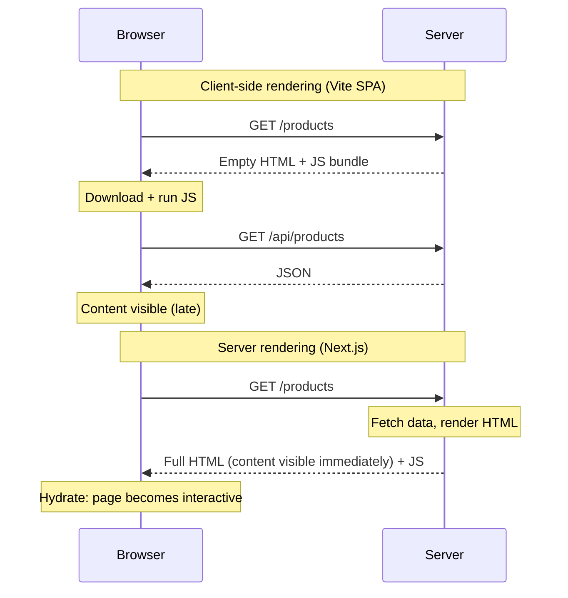
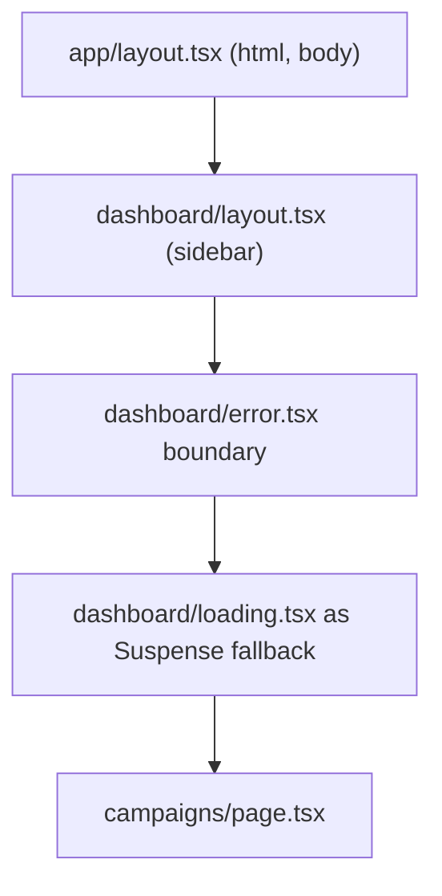
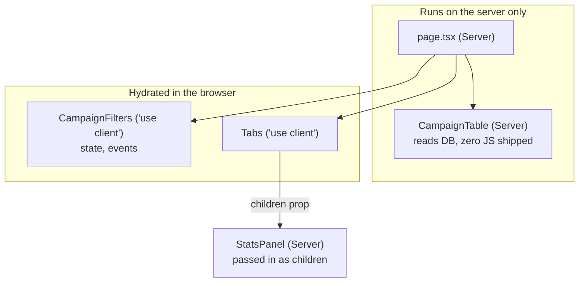
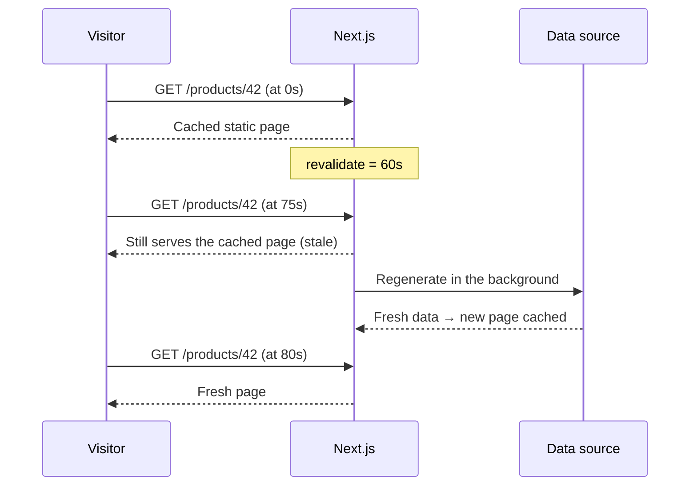

Next.js is React with a server attached. It decides where your components run, when your pages are rendered, and how long results are cached. That's powerful, but only if you understand the model; otherwise it feels like magic that sometimes breaks. This chapter covers the App Router model from the ground up.

## Why Next.js exists

A plain React app built with Vite is a **single-page application**: the server sends an almost-empty HTML file and a JavaScript bundle, and the browser builds the page.



Next.js adds:

- **Server rendering and static generation**: pages arrive as real HTML, which is faster to see and easy for search engines to read.
- **File-based routing** with nested layouts.
- **Server Components**: components that run only on the server and ship no JavaScript.
- **Server Actions** and **Route Handlers**: backend code in the same project.
- Built-in optimisation for images, fonts and scripts.

For a logged-in dashboard where SEO doesn't matter, a Vite SPA is often simpler. For marketing sites, content, e-commerce, and anything that needs SEO or a fast first view, Next.js shines.

## App Router basics

Folders inside `app/` define URL segments. Special files inside a folder give it behaviour.

```text
app/
  layout.tsx            ← root layout (html, body), wraps everything
  page.tsx              ← /
  (marketing)/          ← route group: organises files, not part of the URL
    pricing/page.tsx    ← /pricing
  dashboard/
    layout.tsx          ← sidebar shared by all dashboard pages
    loading.tsx         ← shown while a dashboard page loads
    error.tsx           ← shown if a dashboard page throws
    page.tsx            ← /dashboard
    campaigns/
      page.tsx          ← /dashboard/campaigns
      [id]/page.tsx     ← /dashboard/campaigns/42
  api/
    webhooks/route.ts   ← POST /api/webhooks
```

| File | Purpose |
|---|---|
| `page.tsx` | Makes the route publicly accessible and renders its UI |
| `layout.tsx` | Shared UI that wraps child routes and **stays mounted** between them |
| `loading.tsx` | A Suspense fallback shown while the page's data loads |
| `error.tsx` | An error boundary for the segment (must be a Client Component) |
| `not-found.tsx` | UI for `notFound()` |
| `route.ts` | An API endpoint instead of a page |



## Server Components and Client Components

This is the most important idea in modern Next.js.

**Server Components** are the default in `app/`. They run only on the server, at build time or per request. They can:

- be `async` and `await` data directly,
- read databases, files and secrets,
- import heavy libraries without adding to the browser bundle.

They **cannot** use state, effects, event handlers or browser APIs.

**Client Components** start with `'use client'`. They're rendered to HTML on the server for the first load, then **hydrated** in the browser so they become interactive. You need them for `useState`, `useEffect`, `onClick`, and browser APIs.

```tsx
// app/dashboard/campaigns/page.tsx — Server Component
import { db } from '@/lib/db'
import { CampaignFilters } from './CampaignFilters' // a Client Component

export default async function CampaignsPage() {
  const campaigns = await db.campaign.findMany({ orderBy: { createdAt: 'desc' } })
  return (
    <>
      <CampaignFilters />
      <CampaignTable campaigns={campaigns} />
    </>
  )
}
```

```tsx
// app/dashboard/campaigns/CampaignFilters.tsx
'use client'
import { useRouter, useSearchParams } from 'next/navigation'

export function CampaignFilters() {
  const router = useRouter()
  const params = useSearchParams()
  // interactive filter UI that updates the URL
}
```

### The boundary rules



- `'use client'` marks a **boundary**: that file and everything it imports becomes client code.
- A Client Component **can't import** a Server Component, but it **can receive one** as `children` or another prop from a Server Component parent.
- Props crossing from server to client must be **serialisable**: plain objects, arrays, strings, numbers. Not functions (except Server Actions) or class instances.
- Mark modules with secrets or database access with `import 'server-only'`, so importing them into client code fails at build time.

The strategy: keep most of the tree on the server and push `'use client'` down to small interactive leaves.

## Rendering strategies

| Strategy | When HTML is made | Freshness | Cost | Good for |
|---|---|---|---|---|
| Static (SSG) | At build time | Until next build | Cheapest, fastest | Marketing pages, docs, blogs |
| ISR | At build, then regenerated in the background | Every N seconds or on demand | Cheap | Product pages, listings |
| Dynamic (SSR) | On every request | Always fresh | Server work per request | Personalised pages, dashboards needing SEO |
| Client (CSR) | In the browser after load | Whenever it fetches | Moves work to the client | Highly interactive, logged-in screens |



Next decides static vs dynamic per route based on what you use: reading `cookies()`, `headers()` or search params, or opting out of caching, makes a route dynamic.

## Data fetching and caching

In Server Components you simply fetch:

```tsx
export default async function ProductPage({ params }: { params: Promise<{ id: string }> }) {
  const { id } = await params
  const product = await fetch('https://api.example.com/products/' + id, {
    next: { revalidate: 60, tags: ['product-' + id] },
  }).then((r) => r.json())
  return <ProductView product={product} />
}
```

Controlling freshness:

- `fetch(url, { cache: 'force-cache' })`: cache it.
- `fetch(url, { next: { revalidate: 60 } })`: cache, refresh at most every 60 seconds (ISR).
- `fetch(url, { cache: 'no-store' })`: always fresh.
- Route-level: `export const revalidate = 60` or `export const dynamic = 'force-dynamic'`.
- On demand, after a change: `revalidatePath('/dashboard/campaigns')` or `revalidateTag('product-42')`.

For database calls (which don't go through `fetch`), wrap them with React's `cache()` to deduplicate within a request, and use the route's revalidation settings or the newer `'use cache'` directive for longer-lived caching.

> **Note:** Caching defaults have changed between major versions (Next 15 made `fetch` uncached by default). Always check the docs for the version you're using, and say so in interviews.

### Avoiding waterfalls

Awaiting one request after another in a Server Component is slow for the same reason it's slow anywhere. Start independent requests together:

```tsx
const [campaign, stats] = await Promise.all([getCampaign(id), getCampaignStats(id)])
```

Or split slow sections into their own components wrapped in `<Suspense>`, so the fast parts of the page stream to the browser first.

## Streaming with Suspense

The server can send HTML in pieces. The page shell and fast sections arrive immediately; slow sections show their fallback and are filled in as their data resolves.

```tsx
export default function CampaignPage({ params }: Props) {
  return (
    <>
      <CampaignHeader id={params.id} />               {/* fast */}
      <Suspense fallback={<ChartSkeleton />}>
        <DeliveryChart id={params.id} />              {/* slow aggregation, streams in later */}
      </Suspense>
    </>
  )
}
```

`loading.tsx` is simply a Suspense boundary around the whole page.

## Mutations: Server Actions and Route Handlers

### Server Actions

A Server Action is an async function marked `'use server'`. You can pass it to a form's `action` or call it from a Client Component. Next creates the endpoint for you.

```tsx
// app/dashboard/contacts/actions.ts
'use server'
import { revalidatePath } from 'next/cache'
import { z } from 'zod'

const ContactInput = z.object({ name: z.string().min(1), phone: z.string().min(10) })

export async function createContact(_prev: unknown, formData: FormData) {
  const session = await auth()
  if (!session) return { error: 'Please log in again.' }

  const parsed = ContactInput.safeParse(Object.fromEntries(formData))
  if (!parsed.success) return { error: 'Check the highlighted fields.', fields: parsed.error.flatten().fieldErrors }

  await db.contact.create({ data: { ...parsed.data, orgId: session.orgId } })
  revalidatePath('/dashboard/contacts')
  return { ok: true }
}
```

```tsx
'use client'
import { useActionState } from 'react'
import { createContact } from './actions'

export function NewContactForm() {
  const [state, formAction, pending] = useActionState(createContact, null)
  return (
    <form action={formAction}>
      <input name="name" />
      <input name="phone" />
      <button disabled={pending}>Save</button>
      {state?.error && <p role="alert">{state.error}</p>}
    </form>
  )
}
```

Server Actions are **public HTTP endpoints**. Always authenticate, authorise and validate inside them, exactly as you would in an Express route.

### Route Handlers

`route.ts` files export functions named after HTTP methods. Use them for webhooks, public APIs, and anything called by something other than your own forms.

```ts
// app/api/webhooks/whatsapp/route.ts
export async function POST(request: Request) {
  const raw = await request.text()
  if (!verifySignature(raw, request.headers.get('x-hub-signature-256'))) {
    return new Response('Invalid signature', { status: 401 })
  }
  await queue.add('incoming', JSON.parse(raw))
  return Response.json({ received: true })
}
```

## Hydration

**Hydration** is React attaching state and event handlers to HTML that the server already rendered. React expects the first client render to produce *exactly* the same HTML. When it doesn't, you get a hydration mismatch.

Common causes:

- Rendering `new Date()`, `Date.now()` or `Math.random()` directly.
- Checking `typeof window` to render different output.
- Locale- or time-zone-dependent formatting that differs between server and browser.
- Invalid HTML nesting (a `<div>` inside a `<p>`), which the browser silently rearranges.
- Browser extensions modifying the page.

Fix it by rendering browser-only values after mount (in `useEffect`), or making that component client-only.

## Middleware

`middleware.ts` runs **before** a request reaches a route. It's good for redirects (unauthenticated users to `/login`), rewrites, geolocation or A/B routing, and setting headers.

```ts
export function middleware(request: NextRequest) {
  const session = request.cookies.get('session')
  if (!session && request.nextUrl.pathname.startsWith('/dashboard')) {
    return NextResponse.redirect(new URL('/login', request.url))
  }
}
export const config = { matcher: ['/dashboard/:path*'] }
```

Keep it light, since it runs on every matched request. It's a first gate: data access must still check auth itself.

## SEO and performance

- **Metadata**: export `metadata` or `generateMetadata` from layouts and pages for titles, descriptions, canonical URLs and Open Graph images.
- **`app/sitemap.ts`** and **`app/robots.ts`** generate those files from code.
- **Rendering**: static or ISR pages give crawlers complete HTML immediately.
- **`next/image`**: resizes per device, serves WebP/AVIF, lazy-loads, and reserves space to prevent layout shift. Add `priority` to the main above-the-fold image for a better LCP.
- **`next/font`**: self-hosts fonts with no layout shift.
- **Structured data** (JSON-LD) for rich search results.

```tsx
export async function generateMetadata({ params }: Props): Promise<Metadata> {
  const { slug } = await params
  const post = await getPost(slug)
  return {
    title: post.title,
    description: post.excerpt,
    alternates: { canonical: '/blog/' + post.slug },
    openGraph: { title: post.title, images: [post.coverUrl] },
  }
}
```

If you've built an SEO audit tool, you can speak to exactly which checks (titles, meta descriptions, canonical tags, headings, image alt text, page speed) Next.js helps you pass by default.

## Deployment

- **Vercel**: zero-config, handles ISR, image optimisation and edge middleware for you.
- **Self-hosting**: set `output: 'standalone'` in `next.config` to get a minimal Node server with only the files it needs. Package it in Docker and run it behind Nginx or a load balancer on EC2 or ECS, with static assets on a CDN. With several instances, features like ISR need a shared cache.

## Summary

- Next.js renders React on the server so pages arrive as HTML, then hydrates them.
- Folders are routes; `layout`, `loading`, `error` and `page` files add structure.
- Server Components fetch data and ship no JavaScript; Client Components (`'use client'`) handle interactivity. Push the boundary down to small leaves.
- Choose static, ISR, dynamic or client rendering per route based on freshness and cost.
- Cache deliberately and revalidate after mutations; avoid waterfalls with `Promise.all` and Suspense streaming.
- Server Actions and Route Handlers are public endpoints: authenticate and validate inside them.
