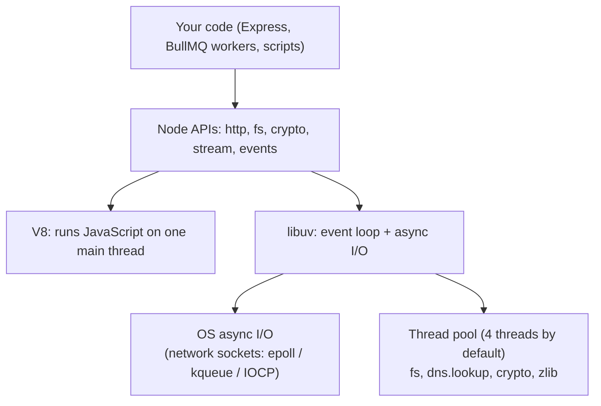
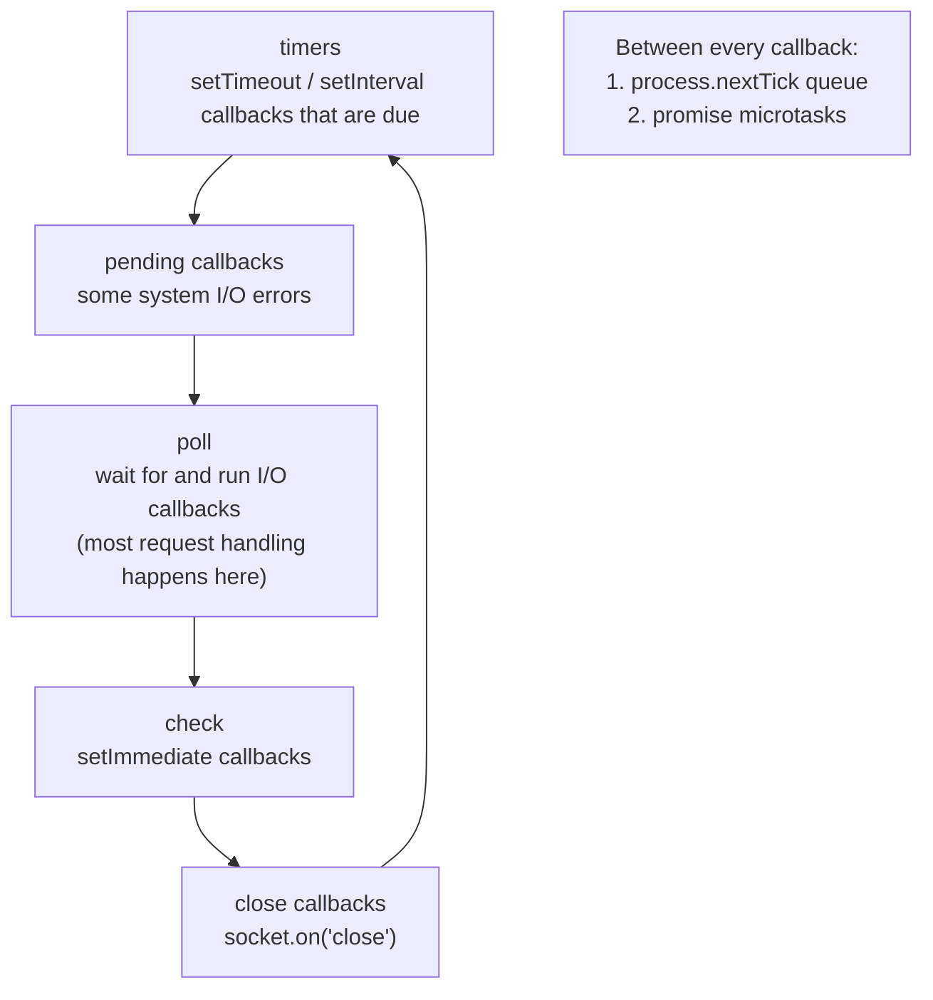
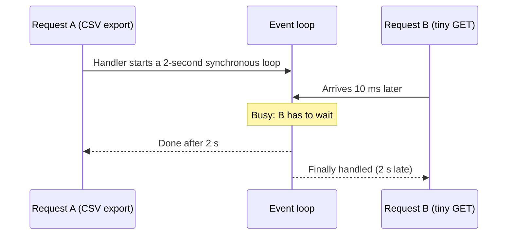
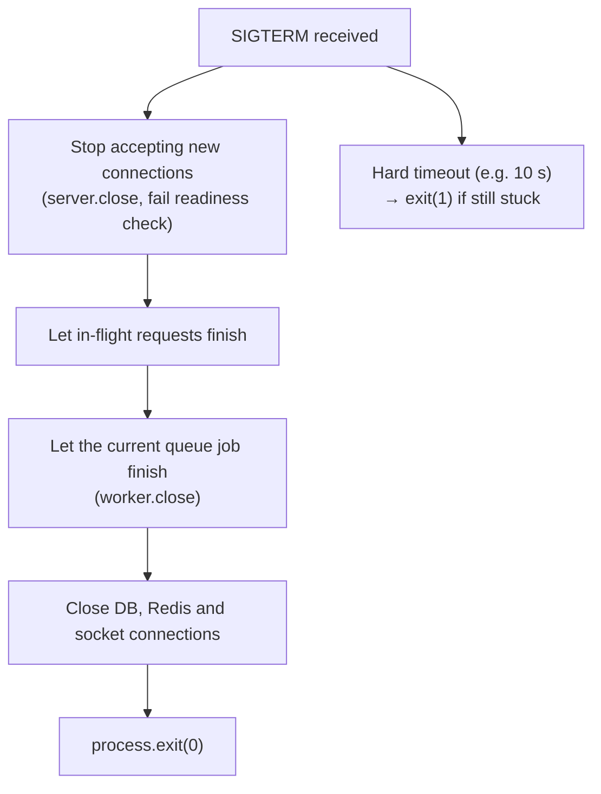

Node.js lets JavaScript run outside the browser, and it's especially good at one job: handling many slow things (network calls, database queries, file reads) at the same time on a single thread. To use it well, and to answer the questions interviewers love, you need to know how that single thread stays unblocked, what libuv does behind it, and how streams, workers and processes fit in.

## What Node is made of



- **V8** is Chrome's JavaScript engine. It compiles and runs your code on **one main thread**.
- **libuv** is a C library that provides the **event loop** and asynchronous I/O. Network I/O uses the operating system's non-blocking mechanisms directly. Work that has no non-blocking OS API (most file system calls, `dns.lookup`, `crypto.pbkdf2`, `zlib`) runs on libuv's **thread pool**.
- **Node's APIs** (`http`, `fs`, `stream`, `events`) connect the two.

The key consequence: **while your code waits for I/O, the thread is free to handle other requests.** A server can hold thousands of open connections without a thread per connection.

## The event loop in Node

Node's event loop runs in **phases**, each with its own queue of callbacks:



Between every single callback, Node drains two queues first: all `process.nextTick` callbacks, then all promise microtasks.

```js
setTimeout(() => console.log('timeout'), 0)
setImmediate(() => console.log('immediate'))
process.nextTick(() => console.log('nextTick'))
Promise.resolve().then(() => console.log('promise'))
console.log('sync')

// sync, nextTick, promise, then timeout and immediate
// (their order can vary in the main module; inside an I/O callback, immediate always runs first)
```

Differences from the browser's loop:

- Node has explicit phases and `setImmediate` (check phase).
- Node has `process.nextTick`, which runs before promise callbacks.
- Node has no rendering step and no `requestAnimationFrame`.

## Blocking the event loop

Because your JavaScript runs on one thread, **any slow synchronous work stops every request** until it finishes. Common culprits:

- `JSON.parse` / `JSON.stringify` of very large payloads.
- Loops over huge arrays, sorting big datasets in memory.
- Synchronous APIs inside request handlers: `fs.readFileSync`, `crypto.pbkdf2Sync`, `zlib.gzipSync`.
- Regular expressions with catastrophic backtracking on user input.
- Image, PDF or video processing in-process.



How to avoid it:

- Use the async versions of APIs.
- **Stream** large data instead of loading it all.
- Break big jobs into chunks and yield between them (`setImmediate`).
- Move CPU-heavy work to **worker threads**, a **child process**, or a **queue worker** (BullMQ) running in a separate process.
- Watch **event loop lag** in production (`perf_hooks.monitorEventLoopDelay`) as a health signal.

The thread pool can be a bottleneck too: with only four threads, a burst of `bcrypt` hashes or large file reads makes other file and crypto work wait. `UV_THREADPOOL_SIZE` can raise it.

## Modules and packages

Node supports both **CommonJS** (`require`) and **ES modules** (`import`). A file is ESM if it ends in `.mjs` or the nearest `package.json` has `"type": "module"`. New projects should use ESM.

`package.json` essentials:

- `dependencies` are needed at runtime; `devDependencies` only to build and test.
- Version ranges: `^1.4.2` allows `1.x.x` at or above 1.4.2; `~1.4.2` allows `1.4.x` only.
- The **lockfile** (`package-lock.json`) records exact versions of everything, including sub-dependencies. Commit it, and use `npm ci` in CI for a clean, exact install.
- `scripts` are the project's commands: `dev`, `build`, `test`, `lint`, `start`.

## EventEmitter

Much of Node is built on `EventEmitter`: HTTP servers, streams and sockets all emit events that you listen to.

```js
import { EventEmitter } from 'node:events'

class CampaignRunner extends EventEmitter {
  async run(campaign) {
    this.emit('started', campaign.id)
    for (const batch of campaign.batches) {
      await sendBatch(batch)
      this.emit('progress', { id: campaign.id, sent: batch.length })
    }
    this.emit('finished', campaign.id)
  }
}

const runner = new CampaignRunner()
runner.on('progress', ({ id, sent }) => io.to('campaign:' + id).emit('progress', sent))
runner.on('error', (err) => logger.error(err)) // without an 'error' listener, an error event crashes the process
```

Listeners run **synchronously** in the order they were added. Remove listeners you no longer need (`off`), or they leak, and Node warns when more than 10 are attached to one event.

## Buffers and streams

A **Buffer** is raw binary data: file contents, network packets, images. You convert between buffers and text with an encoding (`utf8`, `base64`, `hex`).

A **stream** processes data piece by piece instead of all at once. Four kinds:

- **Readable**: a source (file read stream, HTTP request body, database cursor).
- **Writable**: a destination (file write stream, HTTP response).
- **Duplex**: both (a TCP socket).
- **Transform**: changes data as it flows (gzip, CSV parser, encryption).


```js
import { pipeline } from 'node:stream/promises'
import { Transform } from 'node:stream'
import { createGzip } from 'node:zlib'

app.get('/contacts/export.csv.gz', async (req, res) => {
  res.setHeader('Content-Type', 'text/csv')
  res.setHeader('Content-Encoding', 'gzip')

  const toCsv = new Transform({
    objectMode: true,
    transform(contact, _enc, done) {
      done(null, [contact.name, contact.phone].join(',') + '\n')
    },
  })

  await pipeline(Contact.find({ orgId: req.user.orgId }).cursor(), toCsv, createGzip(), res)
})
```

Exporting 500,000 contacts this way uses a few megabytes of memory, and the download starts immediately.

### Backpressure

If the source produces data faster than the destination can consume it, data piles up in memory. **Backpressure** is the signal that slows the source down: `writable.write()` returns `false` when its internal buffer is full, and you should wait for the `'drain'` event before writing more. `pipeline()` handles backpressure (and error cleanup) for you, which is why you should use it instead of wiring `data` events by hand.

## Using more than one core

Node runs your JavaScript on one thread, but a server has many cores. Options:

| Tool | What it is | Shares memory? | Use it for |
|---|---|---|---|
| `worker_threads` | Extra JS threads in the same process | Can (`SharedArrayBuffer`) | CPU-heavy JavaScript: parsing, hashing, image work |
| `child_process` | Separate OS processes | No | Running other programs (FFmpeg, Python scripts, Playwright browsers) |
| `cluster` / PM2 | Several copies of your server sharing a port | No | Using all cores for an HTTP server |
| Multiple containers | Several instances behind a load balancer | No | Production scaling, the most common today |

```js
// Render a video with FFmpeg without blocking Node
import { spawn } from 'node:child_process'

function render(input, output) {
  return new Promise((resolve, reject) => {
    const ff = spawn('ffmpeg', ['-y', '-i', input, '-vf', 'scale=1080:-2', output])
    ff.stderr.on('data', (d) => logger.debug(d.toString()))
    ff.on('close', (code) => (code === 0 ? resolve(output) : reject(new Error('ffmpeg exited ' + code))))
  })
}
```

## Configuration

Read configuration from **environment variables**, load them from `.env` locally (never committed), and **validate them at startup** so a missing value fails immediately with a clear message instead of halfway through a request.

```ts
import { z } from 'zod'

const Env = z.object({
  NODE_ENV: z.enum(['development', 'test', 'production']).default('development'),
  PORT: z.coerce.number().default(3000),
  MONGO_URL: z.string().url(),
  REDIS_URL: z.string().url(),
  JWT_ACCESS_SECRET: z.string().min(32),
})

export const env = Env.parse(process.env)
```

## Errors and resilience

### Two kinds of errors

- **Operational errors** are expected failures in correct code: invalid input, a timeout calling WhatsApp's API, a duplicate key, a file that doesn't exist. Handle them: validate, retry, return a clear error, log.
- **Programmer errors** are bugs: reading a property of `undefined`, calling a function with the wrong arguments. You can't reliably recover. Log them and let the process restart cleanly.

### Last-resort handlers

```js
process.on('unhandledRejection', (reason) => {
  logger.fatal({ reason }, 'Unhandled promise rejection')
  shutdown(1)
})

process.on('uncaughtException', (err) => {
  logger.fatal({ err }, 'Uncaught exception')
  shutdown(1)
})
```

After an uncaught exception, the process may be in a broken state, so exit and let a supervisor (Docker's restart policy, PM2, Kubernetes) start a fresh one.

### Graceful shutdown

When a deploy or scale-down sends `SIGTERM`, finish what's in progress before exiting:



```js
async function shutdown(code = 0) {
  logger.info('Shutting down')
  const force = setTimeout(() => process.exit(1), 10_000)
  force.unref()
  server.close()
  await worker.close()
  await Promise.all([mongoose.disconnect(), redis.quit()])
  process.exit(code)
}

process.on('SIGTERM', () => shutdown(0))
process.on('SIGINT', () => shutdown(0))
```

## Finding performance problems and leaks

- **Profiling CPU**: run with `node --inspect`, open `chrome://inspect`, record a CPU profile while reproducing the slow path, and look for the widest bars in the flame chart. `clinic.js` automates this.
- **Memory leaks**: watch heap usage over time. A leak grows steadily and never drops after garbage collection. Take two heap snapshots a few minutes apart and compare which object types keep growing.
- **Usual leak causes**: caches without limits or TTLs, listeners added per request and never removed, timers never cleared, closures holding large objects, and global arrays used as logs.

## Browser automation in Node

Playwright and Puppeteer drive real browsers from Node, which is how scrapers, SEO crawlers and end-to-end tests work. Running them in production has specific rules:

- **Reuse the browser**. Launching one per job is slow and memory-hungry; create a new *context* (an isolated session) per job instead.
- **Always close pages and contexts** in `finally`, or memory leaks until the process dies.
- **Wait for conditions, not time**: `page.waitForSelector`, `waitForLoadState('networkidle')`, rather than fixed sleeps.
- **Limit concurrency**: each page uses real CPU and memory; a queue with a concurrency setting (BullMQ) controls it.
- **Timeouts and retries** for slow or flaky sites.
- **Be a good citizen**: respect `robots.txt`, rate-limit per domain, and follow sites' terms.

```js
const browser = await chromium.launch()

export async function audit(url) {
  const context = await browser.newContext({ userAgent: 'SEOAuditBot/1.0' })
  const page = await context.newPage()
  try {
    await page.goto(url, { waitUntil: 'domcontentloaded', timeout: 30_000 })
    return {
      title: await page.title(),
      metaDescription: await page.locator('meta[name="description"]').getAttribute('content'),
      h1Count: await page.locator('h1').count(),
      imagesWithoutAlt: await page.locator('img:not([alt])').count(),
    }
  } finally {
    await context.close()
  }
}
```

## Summary

- Node = V8 running your JavaScript on one thread + libuv handling I/O and a small thread pool.
- The loop runs in phases (timers, poll, check, close), draining `nextTick` and promise microtasks between callbacks.
- Never block the thread: use async APIs, stream large data, and move CPU work to workers or queues.
- Streams keep memory flat; `pipeline()` handles backpressure and cleanup.
- Validate config at startup, separate operational from programmer errors, and shut down gracefully on `SIGTERM`.
