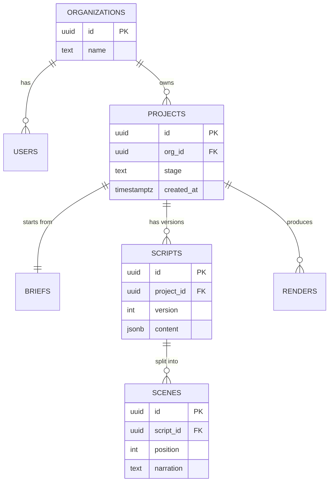
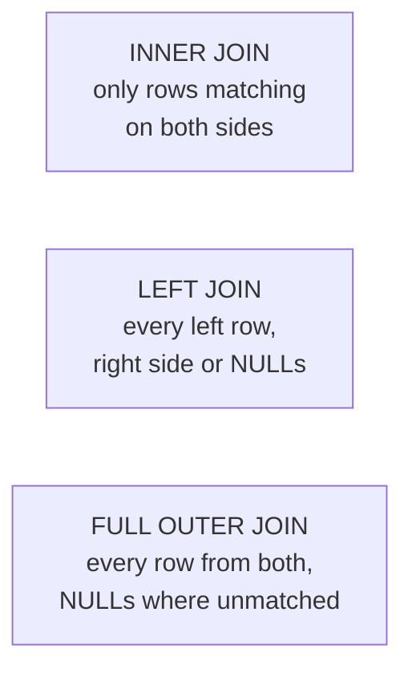

Relational databases have run the world's important data for fifty years because they are very good at one thing: keeping related data correct. This chapter covers relational modelling, SQL that goes beyond `SELECT *`, keys and constraints, transactions and isolation, reading query plans, indexes, JSONB, and running PostgreSQL well from Node.

## The relational model

Data lives in **tables** of rows and columns. Every table has a **primary key** that identifies each row. Relationships are expressed with **foreign keys**: a column that holds another table's primary key.



The three relationship shapes:

- **One-to-many**: an organisation has many projects. The "many" side holds the foreign key (`projects.org_id`).
- **One-to-one**: a project has one brief. Either side holds a unique foreign key.
- **Many-to-many**: contacts and tags. A **join table** (`contact_tags(contact_id, tag_id)`) holds pairs.

## Keys and constraints

Constraints make the database refuse bad data, no matter which code path writes it.

```sql
CREATE TABLE projects (
  id          uuid PRIMARY KEY DEFAULT gen_random_uuid(),
  org_id      uuid NOT NULL REFERENCES organizations(id) ON DELETE CASCADE,
  name        text NOT NULL CHECK (length(name) BETWEEN 1 AND 120),
  stage       text NOT NULL DEFAULT 'brief'
              CHECK (stage IN ('brief', 'script', 'scenes', 'render', 'done')),
  created_at  timestamptz NOT NULL DEFAULT now(),
  UNIQUE (org_id, name)
);
```

- **`PRIMARY KEY`**: unique and not null.
- **`REFERENCES`** (foreign key): the referenced row must exist. `ON DELETE CASCADE` deletes children with the parent; `RESTRICT` blocks deleting a parent that still has children.
- **`UNIQUE`**: no duplicates in a column or combination.
- **`NOT NULL`**, **`CHECK`**, **`DEFAULT`**.

Application validation gives users friendly errors; constraints guarantee correctness even when there's a bug or a second service writing to the same table. Use both.

## Normalisation, and when to break it

**Normalisation** means storing each fact once. If a customer's name is copied into every invoice row, changing it means updating many rows, and missing one leaves the data contradicting itself.

In practice, aim for **third normal form**: every column describes the whole primary key and nothing else. Then **denormalise deliberately** where reads demand it: a `message_count` column on campaigns, or a customer name copied onto invoices *as it was at the time of sale* (which is actually a different fact). Keep copies in sync with triggers, application code, or periodic recalculation.

## SQL beyond the basics

### Joins



```sql
-- Every project with its latest render status (projects without renders included)
SELECT p.id, p.name, r.status AS last_render
FROM projects p
LEFT JOIN LATERAL (
  SELECT status FROM renders WHERE project_id = p.id ORDER BY created_at DESC LIMIT 1
) r ON true
WHERE p.org_id = $1
ORDER BY p.created_at DESC;
```

### Grouping

`WHERE` filters rows **before** grouping; `HAVING` filters groups **after**.

```sql
SELECT org_id, count(*) AS renders_this_month
FROM renders
WHERE created_at >= date_trunc('month', now())
GROUP BY org_id
HAVING count(*) > 100
ORDER BY renders_this_month DESC;
```

### CTEs

A **Common Table Expression** (`WITH`) names a subquery so complex queries read top to bottom. `WITH RECURSIVE` walks hierarchies (comment threads, org charts, category trees).

```sql
WITH latest_audit AS (
  SELECT DISTINCT ON (site_id) site_id, score, created_at
  FROM audits
  ORDER BY site_id, created_at DESC
)
SELECT s.domain, la.score, la.created_at
FROM sites s
JOIN latest_audit la ON la.site_id = s.id
WHERE s.org_id = $1;
```

### Window functions

Window functions calculate across related rows **without collapsing them** into one row per group: rankings, running totals, and comparisons with the previous row.

```sql
-- Follower change between snapshots, and each profile's rank by growth
SELECT
  profile_id,
  captured_at,
  followers,
  followers - lag(followers) OVER (PARTITION BY profile_id ORDER BY captured_at) AS change,
  rank() OVER (ORDER BY followers DESC) AS size_rank
FROM snapshots;
```

### Upserts

```sql
INSERT INTO contacts (org_id, phone, name)
VALUES ($1, $2, $3)
ON CONFLICT (org_id, phone)
DO UPDATE SET name = EXCLUDED.name, updated_at = now()
RETURNING id;
```

`ON CONFLICT` needs a unique constraint or index on the conflict columns. It's atomic, so it's safe under concurrency, unlike "select, then insert if missing".

## Transactions and ACID

A **transaction** groups statements so they succeed or fail together.

```sql
BEGIN;
UPDATE wallets SET credits = credits - 50 WHERE org_id = $1 AND credits >= 50;
-- the application checks that exactly 1 row was updated, otherwise ROLLBACK
INSERT INTO renders (project_id, cost, status) VALUES ($2, 50, 'queued');
COMMIT;
```

- **Atomicity**: all or nothing.
- **Consistency**: constraints hold before and after.
- **Isolation**: concurrent transactions don't see each other's half-finished work.
- **Durability**: once committed, it survives a crash (written to the write-ahead log).

### Isolation levels and race conditions

Two requests read a balance of 100 at the same moment, both see enough credits, both deduct. Isolation levels decide what each transaction can see:

| Level | Sees | Can still happen |
|---|---|---|
| Read Committed (Postgres default) | Data committed before each **statement** | A value changing between two reads in one transaction; lost updates with read-then-write logic |
| Repeatable Read | One snapshot for the whole transaction | Postgres aborts one of two conflicting updates (you retry) |
| Serializable | As if transactions ran one at a time | Serialization failures you must retry |

Practical fixes for "check then update" races:

- **Do it in one atomic statement**: `UPDATE … SET credits = credits - 50 WHERE credits >= 50` and check the affected row count.
- **Lock the row**: `SELECT … FOR UPDATE` inside the transaction, so a second transaction waits.
- **Use a constraint**: `CHECK (credits >= 0)` makes the database reject overdrafts.

**Deadlocks** happen when two transactions each hold a lock the other needs. Postgres detects them and aborts one; prevent them by always locking rows in the same order, and retry on the error.

## Reading query plans

`EXPLAIN` shows how Postgres plans to run a query; `EXPLAIN ANALYZE` runs it and shows what actually happened.

```sql
EXPLAIN ANALYZE
SELECT id, score FROM audits WHERE site_id = 42 ORDER BY created_at DESC LIMIT 20;
```

```text
Limit  (actual time=0.03..0.05 rows=20)
  ->  Index Scan using idx_audits_site_created on audits  (actual rows=20)
        Index Cond: (site_id = 42)
Planning Time: 0.1 ms
Execution Time: 0.07 ms
```

What to look for:

- **`Seq Scan`** on a big table where you expected an index: missing or unusable index.
- **Estimated vs actual rows** far apart: stale statistics (run `ANALYZE`) or skewed data.
- **`Sort`** with `external merge Disk`: not enough memory or no index providing the order.
- **Nested Loop** over many rows: often a missing index on the join column.

## Indexes in Postgres

The default **B-tree** index handles equality, ranges and sorting. Column order in multi-column indexes follows the same logic as MongoDB's ESR: equality columns first, then the sort or range column.

```sql
CREATE INDEX CONCURRENTLY idx_audits_site_created ON audits (site_id, created_at DESC);
```

`CONCURRENTLY` builds the index without locking writes, which matters on a live table.

Other index types and tricks:

| Index | Use it for |
|---|---|
| B-tree | Equality, ranges, `ORDER BY` (the default) |
| GIN | JSONB containment, arrays, full-text search |
| GiST | Geometric data, ranges, nearest-neighbour |
| BRIN | Huge, naturally time-ordered tables (logs, events): tiny index |
| Partial (`WHERE status = 'queued'`) | Indexing only the rows you query |
| Expression (`ON lower(email)`) | Queries that filter on a computed value |

And remember foreign keys aren't indexed automatically in Postgres: index the child side (`renders.project_id`) or deletes and joins get slow.

## JSONB

`jsonb` stores JSON in a parsed binary format you can query and index. It's the pragmatic way to keep a mostly relational schema while storing a flexible part: SEO check results, LLM outputs, provider webhook payloads, per-customer settings.

```sql
CREATE TABLE audits (
  id         bigint GENERATED ALWAYS AS IDENTITY PRIMARY KEY,
  site_id    bigint NOT NULL REFERENCES sites(id),
  score      int NOT NULL,
  results    jsonb NOT NULL,           -- { "title": { "passed": true }, "meta_description": { "passed": false, "length": 0 }, … }
  created_at timestamptz NOT NULL DEFAULT now()
);

-- Audits where the meta description check failed
SELECT id FROM audits WHERE results @> '{"meta_description": {"passed": false}}';

-- Read one nested value as text
SELECT results -> 'title' ->> 'value' AS title FROM audits WHERE id = $1;
```

Index it according to how you query:

```sql
-- Containment queries (@>) on any key
CREATE INDEX idx_audits_results ON audits USING gin (results jsonb_path_ops);

-- One key you filter or sort on often: an expression index is smaller and faster
CREATE INDEX idx_audits_meta_passed ON audits (((results -> 'meta_description' ->> 'passed')::boolean));
```

Rule of thumb: fields you filter, join or sort on regularly deserve real columns; JSONB is for the parts whose shape varies or that you mostly read as a whole.

## Postgres from Node

### Connection pooling

Opening a connection is slow, and each one uses memory on the database server, which allows only a limited number. A **pool** keeps connections open and lends them to requests.

```ts
import pg from 'pg'

export const pool = new pg.Pool({ connectionString: env.DATABASE_URL, max: 10, idleTimeoutMillis: 30_000 })

const { rows } = await pool.query('SELECT id, name FROM projects WHERE org_id = $1 ORDER BY created_at DESC LIMIT 20', [orgId])
```

With many app instances (or serverless functions), each with its own pool, you can exhaust the database's connection limit. Put **PgBouncer** in front to share a small number of real connections.

### Parameterised queries

Always pass values as parameters (`$1`, `$2`), never by concatenating strings. The driver sends them separately from the SQL, which makes SQL injection impossible.

### ORMs and query builders

ORMs (Prisma, Drizzle, TypeORM, AdonisJS's Lucid) map rows to objects, generate typed queries and manage migrations. Query builders (Knex, Kysely) stay closer to SQL. Either way, understand the SQL being generated: watch for N+1 queries from lazy relationship loading, and drop to raw SQL for complex reports.

```ts
// AdonisJS Lucid: eager-load to avoid N+1
const projects = await Project.query()
  .where('org_id', orgId)
  .preload('scripts', (q) => q.orderBy('version', 'desc').limit(1))
  .orderBy('created_at', 'desc')
```

### Migrations

Schema changes live in versioned migration files, reviewed like code and run automatically on deploy. For zero-downtime changes, **expand, migrate, contract**:

1. **Expand**: add the new column (nullable) or table. Old code keeps working.
2. **Migrate**: deploy code that writes both, backfill old rows in batches.
3. **Contract**: once nothing uses the old column, add constraints and drop it.

Never rename or drop a column that running code still reads.

## Modelling a staged workflow

Your AI video pipeline (brief → script → scenes → render) is a good example of relational modelling for workflows:

- A `projects.stage` column (constrained to known values) records where each project is.
- Each stage's output is its own table (or a versioned JSONB column), so a user can **regenerate one stage** without losing the others: new script version, same brief.
- `renders` rows track long-running jobs (`queued`, `rendering`, `done`, `failed`) updated by queue workers.
- Foreign keys guarantee a scene can't reference a script that doesn't exist, and cascade deletes clean up everything when a project is removed.

## Summary

- Tables, primary keys and foreign keys model relationships; constraints keep data correct regardless of application bugs.
- Normalise by default; denormalise deliberately and keep copies in sync.
- Know joins, grouping with `HAVING`, CTEs, window functions and `ON CONFLICT` upserts.
- Transactions are all-or-nothing. Prevent races with atomic updates, row locks or constraints.
- Read `EXPLAIN ANALYZE` plans; index for your queries and index foreign keys.
- JSONB handles the flexible parts; index it with GIN or expression indexes.
- Pool connections, parameterise everything, and migrate with expand → migrate → contract.
