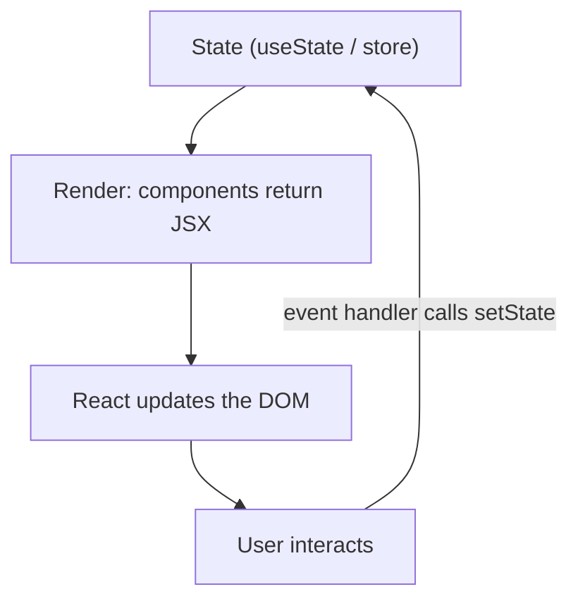
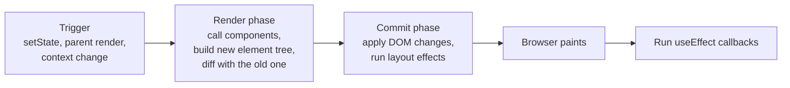
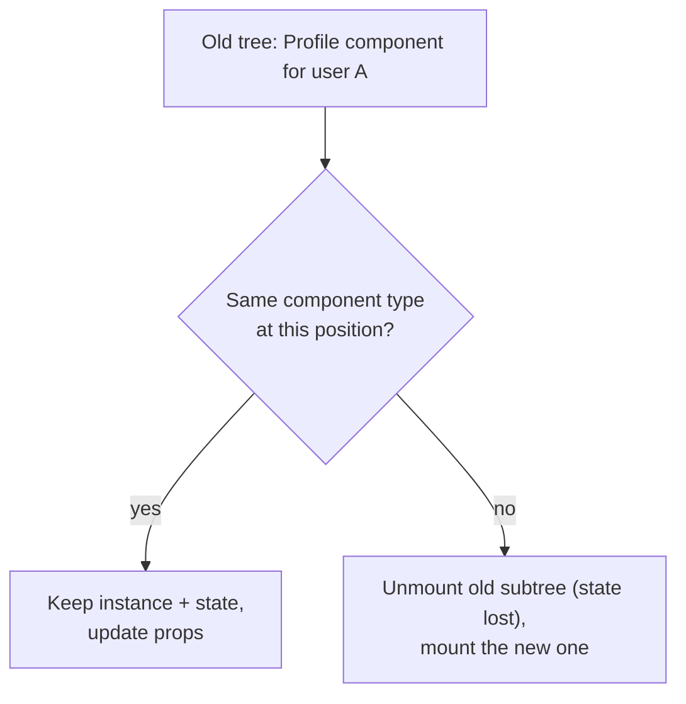
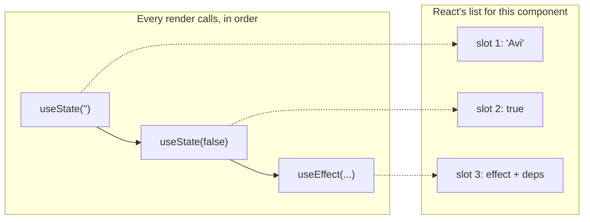
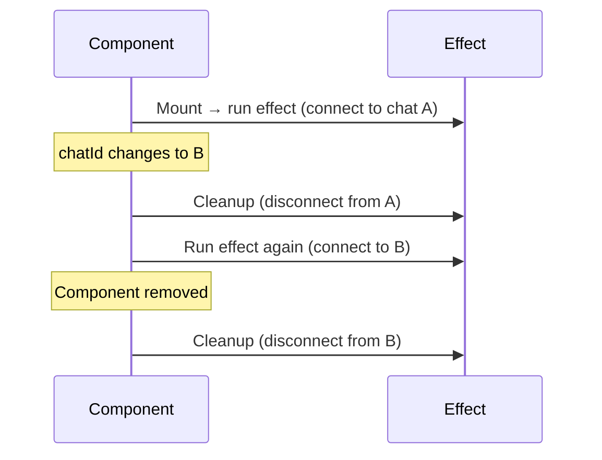
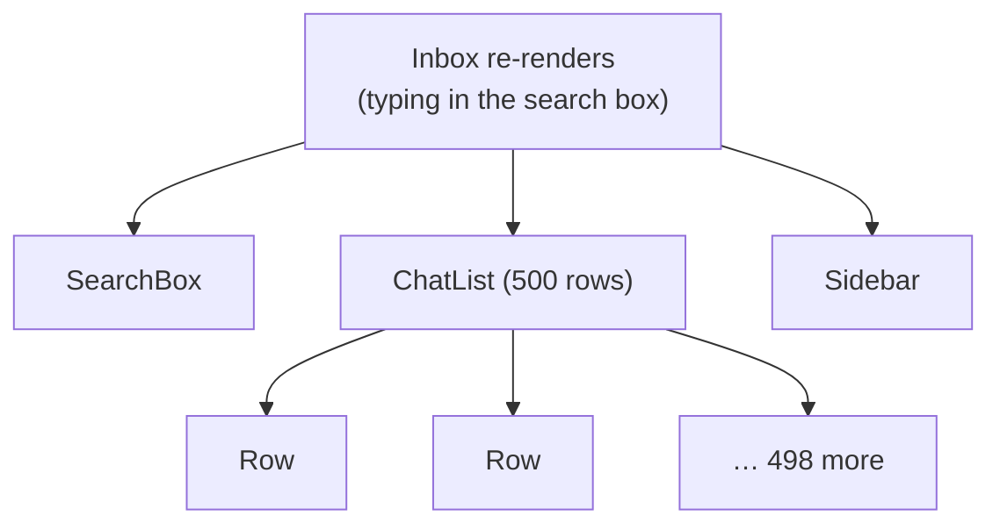

You've built a component library and shipped features with React for years. This chapter is about the model underneath: what actually happens when state changes, how React decides what to update, why effects cause so many bugs, and how to find and fix slow renders. Interviewers probe exactly this layer.

## The mental model

React's core idea fits in one line:

**UI = f(state)**

Your components are functions that take props and state and return a description of the UI. You never tell React *how* to change the page. You change the state, and React works out the difference and updates the DOM.



Everything else in this chapter follows from taking that idea seriously.

## Rendering, step by step

### What triggers a render

A component renders again when:

1. **Its state changes**: you call a setter with a value that is different (by `Object.is`) from the current one.
2. **Its parent renders**: by default, when a component renders, all of its children render too, whether their props changed or not.
3. **A context it reads changes**: every component calling `useContext(X)` renders when X's value changes.

Props changing is not a separate trigger: props only change because a parent rendered.

### Render and commit

Each update has two phases.



- **Render phase**: React calls your components to get the new tree and compares it with the previous one. This must be **pure**: same inputs, same output, no side effects. React may call it more than once, pause it, or throw the result away.
- **Commit phase**: React applies only the necessary DOM changes, runs `useLayoutEffect`, lets the browser paint, then runs `useEffect`.

A render does not mean the DOM changes. If the output is identical, React commits nothing.

### Reconciliation

Comparing the new tree with the old one is called **reconciliation**. A perfect tree diff would be far too slow, so React uses two simple rules:

1. **Different type at the same position → replace.** If a `<div>` becomes a `<section>`, or `<LoginForm>` becomes `<SignupForm>`, React destroys the old subtree (including all its state) and builds a new one.
2. **Same type → update.** React keeps the DOM node and the component's state and only updates what changed.

For lists, React matches children by **key**.



A practical consequence: never define a component inside another component's body. Each render creates a new function, so React sees a "different type" every time and remounts it, losing its state and focus.

### Keys

Keys tell React which item is which between renders.

```tsx
// Bug: index keys. Delete the first row and the second row's input text
// now appears in what used to be the first row's position.
{rows.map((row, i) => <EditableRow key={i} row={row} />)}

// Correct: a stable id from your data
{rows.map((row) => <EditableRow key={row.id} row={row} />)}
```

With index keys, keys stay attached to positions, not items. When items are inserted, removed or reordered, state and DOM nodes end up paired with the wrong data.

Keys are also a tool. Changing a component's `key` makes React treat it as a new component, which resets all its state:

```tsx
<EditContactForm key={contact.id} contact={contact} />
```

## State

### State is a snapshot

Inside one render, a state variable never changes. Calling the setter doesn't update the variable; it asks React for a *new* render with a new value.

```tsx
function Counter() {
  const [count, setCount] = useState(0)

  function addThree() {
    setCount(count + 1) // count is 0 → asks for 1
    setCount(count + 1) // count is still 0 → asks for 1
    setCount(count + 1) // still 0 → asks for 1
  }
  // Result: 1, not 3
}
```

When the next value depends on the previous one, pass a function. React queues these and applies each to the latest value:

```tsx
setCount((c) => c + 1)
setCount((c) => c + 1)
setCount((c) => c + 1) // Result: 3
```

Functional updates also fix **stale closures** in intervals and async callbacks, which otherwise keep seeing the state from the render they were created in.

### Batching

React groups all state updates from the same event into a single re-render. Since React 18 this applies everywhere: event handlers, promises, timeouts and native listeners. You see the final result once, not the in-between states.

### Treat state as immutable

React compares state by reference. Mutating an object and setting the same reference changes nothing as far as React can tell.

```tsx
// Wrong: same array, React skips the update
contacts.push(newContact)
setContacts(contacts)

// Right: a new array
setContacts([...contacts, newContact])

// Updating one item
setContacts((list) => list.map((c) => (c.id === id ? { ...c, starred: !c.starred } : c)))
```

### Where state should live

- **Colocate**: keep state in the lowest component that needs it. State that lives too high makes large parts of the tree re-render for no reason.
- **Lift up** when siblings need to share it: move it to their closest common parent and pass it down.
- **Don't store derived values.** If you can calculate something from existing props or state, calculate it during render.

```tsx
// Avoid: two sources of truth, an extra render, and they can drift apart
const [visible, setVisible] = useState<Contact[]>([])
useEffect(() => {
  setVisible(contacts.filter((c) => c.name.includes(query)))
}, [contacts, query])

// Better: derive it
const visible = contacts.filter((c) => c.name.includes(query))
```

If the calculation is genuinely expensive, wrap it in `useMemo`, but it's still derived, not stored.

## Hooks

### Why the rules of hooks exist

React doesn't know your hooks by name. For each component it keeps a list of hook slots and matches them by **call order**: the first `useState` call gets slot 1, the second gets slot 2, and so on.



If a hook is called conditionally, some renders skip a slot and every hook after it reads the wrong state. Hence the rules:

- Call hooks only at the top level: not in conditions, loops or nested functions.
- Call them only from components or custom hooks.

### `useEffect`: synchronising with the outside world

`useEffect` exists to keep your component **in sync with something outside React**: a WebSocket, a browser API, a timer, a third-party widget, or data on a server.

```tsx
useEffect(() => {
  const socket = io(API_URL, { auth: { token } })
  socket.emit('chat:join', chatId)
  socket.on('message:new', addMessage)

  return () => {
    socket.off('message:new', addMessage)
    socket.disconnect()
  }
}, [chatId, token])
```



The dependency array lists every reactive value the effect uses:

- no array: runs after every render,
- `[]`: runs after the first render (and cleans up on unmount),
- `[a, b]`: runs after the first render and whenever `a` or `b` changes.

In development, StrictMode mounts every component twice (mount → cleanup → mount) to expose missing cleanups. If that causes a bug, the cleanup is what needs fixing.

### When you don't need an effect

Most effect bugs come from using effects for things that aren't synchronisation.

| Instead of an effect that… | Do this |
|---|---|
| Computes a value from props/state and stores it | Calculate it during render (`useMemo` if expensive) |
| Runs when a button was clicked (POST, analytics, toast) | Put the logic in the event handler |
| Resets state when a prop changes | Give the component a `key` |
| Tells the parent that something changed | Call the parent's callback in the same event handler |
| Chains: effect sets state → another effect reacts | Compute everything in one place, in the event or during render |

An effect runs *after* render, so every unnecessary effect costs an extra render and makes data flow harder to follow.

### Fetching data without race conditions

If the user switches from contact A to contact B quickly, the request for A might finish *after* the one for B and overwrite it. Ignore stale responses in the cleanup:

```tsx
useEffect(() => {
  const controller = new AbortController()
  fetch('/api/contacts/' + contactId, { signal: controller.signal })
    .then((r) => r.json())
    .then(setContact)
    .catch((err) => {
      if (err.name !== 'AbortError') setError(err)
    })
  return () => controller.abort()
}, [contactId])
```

In real apps, prefer a data library like TanStack Query, which handles caching, deduplication, retries and races for you (see the next chapter).

### `useRef`

A ref is a box whose `.current` survives renders and **doesn't trigger a render when changed**. Two uses:

- **DOM access**: focusing an input, measuring an element, scrolling into view.
- **Mutable values that aren't displayed**: a timer ID, the previous value, whether a request is in flight.

Don't read or write `ref.current` during render; use it in effects and event handlers.

### `useLayoutEffect`

Same as `useEffect`, but it runs after the DOM is updated and **before the browser paints**. Use it only when you must measure something and adjust immediately, like positioning a tooltip, to avoid a visible flicker. It blocks painting, so keep it rare.

### `useReducer`

When state has several related pieces that change together, a reducer keeps all the update logic in one pure, testable function. Components describe *what happened*; the reducer decides *how state changes*.

```tsx
type State = { status: 'idle' | 'sending' | 'sent' | 'failed'; error?: string }
type Action = { type: 'send' } | { type: 'sent' } | { type: 'failed'; error: string }

function reducer(state: State, action: Action): State {
  switch (action.type) {
    case 'send':   return { status: 'sending' }
    case 'sent':   return { status: 'sent' }
    case 'failed': return { status: 'failed', error: action.error }
  }
}

const [state, dispatch] = useReducer(reducer, { status: 'idle' })
```

### Context

Context passes a value deep into the tree without threading props through every level. It's ideal for values that change rarely: the current user, theme, locale, feature flags.

The catch: **every consumer re-renders whenever the value changes**, and a provider that creates a new object each render changes it every time.

```tsx
function AuthProvider({ children }: { children: React.ReactNode }) {
  const [user, setUser] = useState<User | null>(null)
  const value = useMemo(() => ({ user, setUser }), [user]) // stable unless user changes
  return <AuthContext.Provider value={value}>{children}</AuthContext.Provider>
}
```

For frequently changing shared state, split contexts (state and actions separately) or use a store with selectors, like Zustand or Redux.

### Custom hooks

A custom hook is a function starting with `use` that calls other hooks. It shares **logic**, not state: every component that calls it gets its own copy.

```tsx
function useMediaQuery(query: string) {
  const [matches, setMatches] = useState(() => window.matchMedia(query).matches)
  useEffect(() => {
    const mql = window.matchMedia(query)
    const onChange = () => setMatches(mql.matches)
    mql.addEventListener('change', onChange)
    return () => mql.removeEventListener('change', onChange)
  }, [query])
  return matches
}

const isMobile = useMediaQuery('(max-width: 640px)')
```

Good custom hooks do one thing, return a small API, and clean up everything they start.

## Forms

- **Controlled** inputs keep the value in React state (`value` + `onChange`). You can validate and transform on every keystroke, at the cost of a render per keystroke.
- **Uncontrolled** inputs keep the value in the DOM (`defaultValue`, read with a ref or `FormData`). Less code and fewer renders.

For real forms, React Hook Form (built on uncontrolled inputs) plus a Zod schema gives you performance, validation and types from one definition, and the same schema can validate the request on the server.

```tsx
const ContactSchema = z.object({
  name: z.string().min(1, 'Name is required'),
  phone: z.string().regex(/^\+?\d{10,15}$/, 'Enter a valid phone number'),
})

function ContactForm({ onSave }: { onSave: (c: z.infer<typeof ContactSchema>) => void }) {
  const { register, handleSubmit, formState } = useForm({ resolver: zodResolver(ContactSchema) })
  return (
    <form onSubmit={handleSubmit(onSave)}>
      <label htmlFor="name">Name</label>
      <input id="name" {...register('name')} />
      {formState.errors.name && <p role="alert">{formState.errors.name.message}</p>}
      {/* … */}
    </form>
  )
}
```

## Errors, Suspense and code splitting

- **Error boundaries** catch errors thrown while rendering their children and show a fallback instead of a blank screen. They don't catch errors in event handlers or async code; handle those with `try/catch` and state.
- **`React.lazy`** loads a component's code only when it first renders.
- **`<Suspense fallback>`** shows the fallback while lazy code (or Suspense-enabled data) loads.

```tsx
const Analytics = lazy(() => import('./pages/Analytics'))

<ErrorBoundary fallback={<p>Analytics failed to load.</p>}>
  <Suspense fallback={<PageSkeleton />}>
    <Analytics />
  </Suspense>
</ErrorBoundary>
```

Route-level splitting like this is usually the biggest single win for initial load time.

## Performance

### Measure first

Open React DevTools → Profiler, record an interaction, and look at which components rendered, how long each took, and *why* (enable "Record why each component rendered"). Optimise what the profiler shows, not what you guess.

### Why components render when you didn't expect it



Typing in a search box that lives in `Inbox` state re-renders the whole inbox on every keystroke. Fixes, roughly in order of preference:

1. **Move state down**: put the search state inside `SearchBox` (or a small component) so only it re-renders.
2. **Pass children**: components passed as `children` from above don't re-render when the wrapper's state changes.
3. **Memoise the expensive child**: `React.memo(ChatList)`, and keep its props stable with `useMemo`/`useCallback`.
4. **Virtualise long lists**: render only the ~20 rows on screen (`@tanstack/react-virtual`).
5. **Defer non-urgent work**: `useDeferredValue` or `startTransition` keep typing responsive while the list catches up.

### `React.memo`, `useMemo` and `useCallback`

- `React.memo(Component)` skips re-rendering when props are shallowly equal to last time.
- `useMemo(fn, deps)` caches a computed value.
- `useCallback(fn, deps)` caches a function reference.

They're not free (memory, dependency comparisons, harder code), and they only help when:

- the calculation is genuinely expensive, or
- a stable reference is needed by a memoised child or another hook's dependencies.

```tsx
const ChatRow = memo(function ChatRow({ chat, onOpen }: { chat: Chat; onOpen: (id: string) => void }) {
  return <li onClick={() => onOpen(chat.id)}>{chat.name}</li>
})

function ChatList({ chats }: { chats: Chat[] }) {
  const navigate = useNavigate()
  const onOpen = useCallback((id: string) => navigate('/chats/' + id), [navigate])
  return <ul>{chats.map((c) => <ChatRow key={c.id} chat={c} onOpen={onOpen} />)}</ul>
}
```

Without `useCallback`, `onOpen` would be a new function on every render and `memo` would never skip anything. (The React Compiler inserts this memoisation automatically when enabled.)

### Concurrent features

- **`useTransition`**: mark a state update as non-urgent. React can interrupt it to handle typing or clicks, and `isPending` lets you show a subtle loading state.
- **`useDeferredValue`**: get a "lagging" copy of a value, so an expensive list filters on the deferred query while the input stays instant.

```tsx
const [query, setQuery] = useState('')
const deferredQuery = useDeferredValue(query)
const results = useMemo(() => search(contacts, deferredQuery), [contacts, deferredQuery])
```

## Component patterns

### Composition over configuration

A component with fifteen boolean props is hard to use and harder to change. Prefer composition: accept `children` and small building blocks.

```tsx
// Configuration: every new need adds a prop
<Card title="Campaign" showFooter footerAlign="right" hasBorder icon="send" />

// Composition: callers arrange the pieces
<Card>
  <Card.Header icon={<SendIcon />}>Campaign</Card.Header>
  <Card.Body>…</Card.Body>
  <Card.Footer align="end"><Button>Send</Button></Card.Footer>
</Card>
```

### Building a shared component library

What makes a component library people actually use:

- A **consistent API** across components (`size`, `variant`, `disabled`, `loading`).
- **Typed props** with sensible defaults, and extra props passed through to the root element (`...rest`) so consumers can add `aria-*`, `data-*` and event handlers.
- **Refs forwarded** to the underlying DOM element (a plain `ref` prop in React 19).
- **Theme tokens** (MUI theme, CSS variables) instead of hard-coded colours and spacing.
- **Accessibility built in**: labels, focus styles, keyboard support.
- **Documentation and examples**, plus tests on the most-used components.

### Portals

`createPortal(children, document.body)` renders into a different DOM node while staying in the same React tree, so context and events work normally. Use it for modals, dropdowns and tooltips that must escape `overflow: hidden` and stacking contexts.

## Summary

- UI is a function of state. Change state; React works out the DOM changes.
- A render is triggered by own state, a parent render, or a context change. Render must be pure; commit applies the changes.
- Same type keeps state, different type remounts; keys identify list items and can reset components.
- State is a snapshot. Use functional updates, never mutate, and derive instead of storing.
- Hooks are matched by call order. Effects are for syncing with external systems; most other "effects" belong in render or in event handlers.
- Profile before optimising. Move state down, virtualise long lists, and memoise only where references matter.
