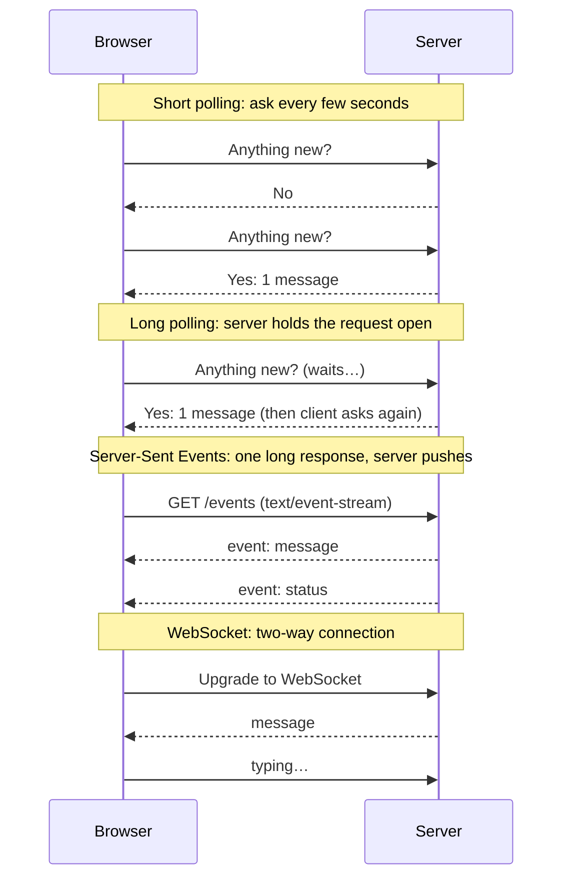
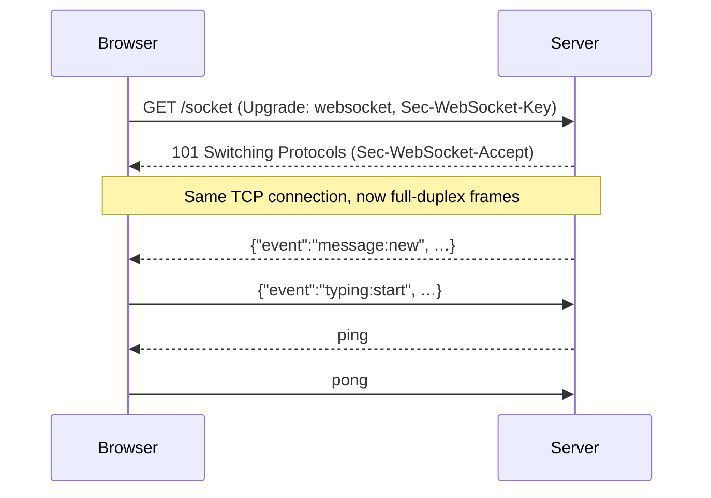
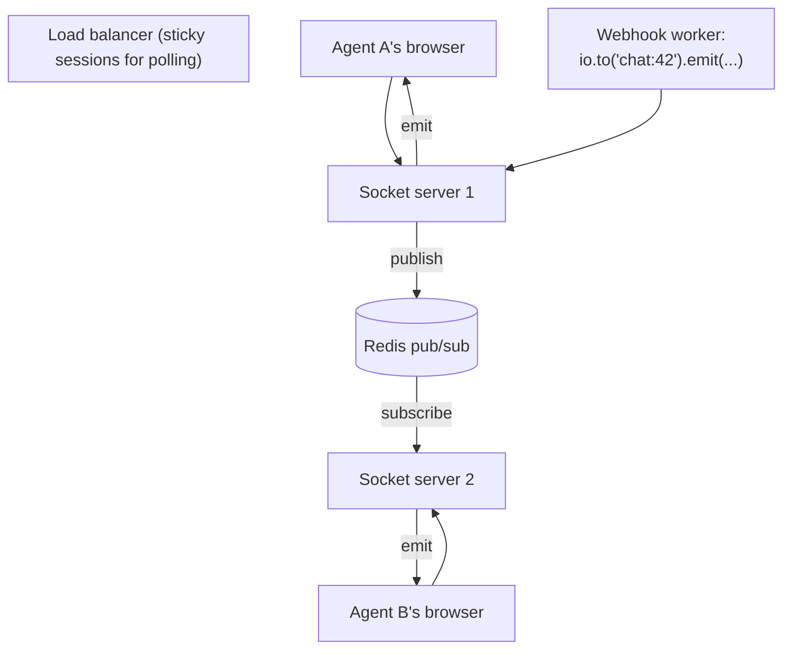
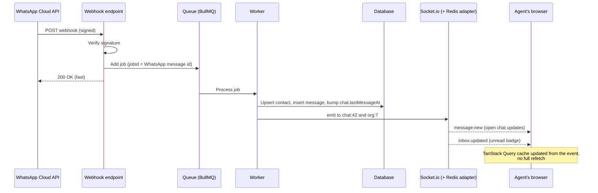

A WhatsApp CRM, a chat app, a live campaign dashboard: users expect these to update the moment something happens, without refreshing. This chapter covers the ways to push data from server to browser, how WebSockets and Socket.io work, authenticating and scaling socket servers, and designing a reliable live message pipeline.

## Getting updates to the browser

HTTP was designed for the client to ask and the server to answer. For live updates, there are four approaches:



| Approach | Direction | Latency | Cost | Good for |
|---|---|---|---|---|
| Short polling | Client asks | Up to the interval | Many wasted requests | Simple status checks every 30 s |
| Long polling | Client asks, server waits | Low | A held request per client | Fallback when WebSockets are blocked |
| Server-Sent Events | Server → client | Low | One HTTP connection | Notifications, progress, live dashboards |
| WebSockets | Both ways | Lowest | One persistent connection | Chat, typing indicators, collaboration |

**Server-Sent Events** are underrated: plain HTTP, automatic reconnection built into the browser's `EventSource`, and perfect when only the server needs to push (campaign send progress, audit progress).

```ts
app.get('/api/campaigns/:id/progress', requireAuth, (req, res) => {
  res.writeHead(200, { 'Content-Type': 'text/event-stream', 'Cache-Control': 'no-cache', Connection: 'keep-alive' })
  const send = (data: unknown) => res.write('data: ' + JSON.stringify(data) + '\n\n')
  const unsubscribe = progressBus.subscribe(req.params.id, send)
  req.on('close', unsubscribe)
})
```

## How WebSockets work

A WebSocket starts as a normal HTTP request asking to **upgrade** the connection. If the server agrees, it replies `101 Switching Protocols`, and the same TCP connection becomes a two-way channel where either side can send messages at any time.



Things to know:

- Proxies must pass the upgrade through (Nginx needs `proxy_http_version 1.1` and the `Upgrade`/`Connection` headers).
- Idle connections get closed by proxies and load balancers, so both sides send **heartbeats** (ping/pong).
- Connections drop all the time on mobile networks and sleeping laptops. **Reconnection is normal, not exceptional.**

## Socket.io

Socket.io is a library on top of WebSockets that adds the things you'd otherwise build yourself:

- **Automatic reconnection** with backoff.
- **Fallback** to HTTP long polling where WebSockets are blocked.
- **Named events** instead of raw messages.
- **Rooms and namespaces** for grouping connections.
- **Acknowledgements**: callbacks that confirm a message was received.
- **Adapters** for broadcasting across many servers.

It uses its own protocol, so a Socket.io client must talk to a Socket.io server.

```ts
import { Server } from 'socket.io'

const io = new Server(httpServer, { cors: { origin: env.CLIENT_ORIGIN, credentials: true } })

io.on('connection', (socket) => {
  const { id: userId, orgId } = socket.data.user

  socket.join('org:' + orgId)   // everyone in the organisation
  socket.join('user:' + userId) // all of this user's tabs and devices

  socket.on('chat:open', async (chatId: string, ack) => {
    if (!(await chats.belongsToOrg(chatId, orgId))) return ack({ error: 'forbidden' })
    socket.join('chat:' + chatId)
    ack({ ok: true })
  })

  socket.on('chat:close', (chatId: string) => socket.leave('chat:' + chatId))
})

// Anywhere in the backend:
io.to('chat:' + chatId).emit('message:new', message)
io.to('org:' + orgId).emit('inbox:updated', { chatId, unread })
```

### Rooms and namespaces

- **Namespaces** (`/`, `/admin`) split one server into separate channels, each with its own middleware and events.
- **Rooms** are groups inside a namespace. A socket can be in many rooms; you broadcast to a room with `io.to(room).emit(...)`. Rooms are created and destroyed automatically as sockets join and leave.

A useful convention: a room per organisation, per user, and per open conversation.

## Authenticating sockets

Check identity **during the handshake**, before the connection is accepted, and check permission **whenever a socket asks to join a room**.

```ts
io.use(async (socket, next) => {
  try {
    const token = socket.handshake.auth.token as string | undefined
    if (!token) return next(new Error('unauthorized'))
    const claims = jwt.verify(token, env.JWT_ACCESS_SECRET) as AccessClaims
    socket.data.user = { id: claims.sub, orgId: claims.org, role: claims.role }
    next()
  } catch {
    next(new Error('unauthorized'))
  }
})
```

```ts
// Client
const socket = io(API_URL, {
  auth: (cb) => cb({ token: getAccessToken() }), // fresh token on every (re)connection
})
socket.on('connect_error', async (err) => {
  if (err.message === 'unauthorized') {
    await refreshAccessToken()
    socket.connect()
  }
})
```

Tokens expire while sockets stay open. Either disconnect sockets when their token expires, or re-validate periodically; at minimum, re-check authorisation on sensitive events.

## Scaling across servers

With one server, `io.to(room).emit()` reaches everyone. With several servers behind a load balancer, each server only knows its **own** connections.



The **Redis adapter** fixes this: every server publishes broadcasts to Redis and subscribes to the others', so a room broadcast reaches sockets on every server.

```ts
import { createAdapter } from '@socket.io/redis-adapter'

const pub = new Redis(env.REDIS_URL)
const sub = pub.duplicate()
io.adapter(createAdapter(pub, sub))
```

Background workers that aren't socket servers can still emit with `@socket.io/redis-emitter`.

If clients can fall back to long polling, the load balancer needs **sticky sessions**, because a polling client's several HTTP requests must reach the same server.

## Reliability: the socket is not the source of truth

Treat the socket as a **fast notification channel**, not as storage. Messages can be missed during a disconnect, and servers restart.

- **Persist first, then emit.** Save the message to the database, then broadcast it.
- **Recover on reconnect.** The client remembers the last message ID it saw and fetches everything newer from the API when it reconnects (and re-joins its rooms).
- **Deduplicate on the client.** A message might arrive both through the socket and through the catch-up fetch; merge by ID.
- **Acknowledge important client actions** and retry on timeout.

```ts
// Client: send with an acknowledgement and a timeout
socket.timeout(5000).emit('message:send', { chatId, tempId, body }, (err: Error | null, saved?: Message) => {
  if (err) markFailed(tempId)            // show a retry button
  else replaceOptimistic(tempId, saved!)  // swap the temporary bubble for the saved message
})
```

## Presence and typing indicators

**Typing indicators** are fire-and-forget: the client emits `typing:start` at most every couple of seconds while the user types; the server relays it to the chat room; receivers hide the indicator a few seconds after the last event. Nothing is stored.

**Presence** (online/offline) tracks connections per user, in Redis when you have several servers:

```ts
io.on('connection', async (socket) => {
  const key = 'presence:' + socket.data.user.id
  if ((await redis.incr(key)) === 1) io.to('org:' + socket.data.user.orgId).emit('presence', { userId: socket.data.user.id, online: true })

  socket.on('disconnect', async () => {
    if ((await redis.decr(key)) <= 0) {
      // small grace period so a page refresh doesn't flicker offline/online
      setTimeout(async () => {
        if (Number(await redis.get(key)) <= 0) io.to('org:' + socket.data.user.orgId).emit('presence', { userId: socket.data.user.id, online: false })
      }, 5000)
    }
  })
})
```

## Case study: live messages in a WhatsApp CRM



Design points worth saying out loud:

- **Acknowledge the webhook fast** and do the work in a queue; WhatsApp retries slow endpoints.
- **Idempotency**: the WhatsApp message ID as the job ID (and a unique index) means retries never duplicate messages.
- **Status updates** (sent, delivered, read) arrive as more webhooks. Only move status forward (`read` never goes back to `delivered`), because they can arrive out of order.
- **Outgoing messages** follow the reverse path: agent → API (save as `pending`) → queue → WhatsApp API → status webhooks → socket updates.
- **Reconnects**: the agent's client fetches messages since its last seen ID.

## Summary

- Poll for rare checks, Server-Sent Events for server-to-client streams, WebSockets for two-way, low-latency features.
- A WebSocket is an upgraded HTTP connection; expect disconnects and use heartbeats.
- Socket.io adds reconnection, fallbacks, rooms, acknowledgements and adapters.
- Authenticate during the handshake, and authorise every room join.
- Scale with the Redis adapter (plus sticky sessions if polling is enabled).
- Persist first, emit second, and catch up on reconnect: the database is the source of truth.
