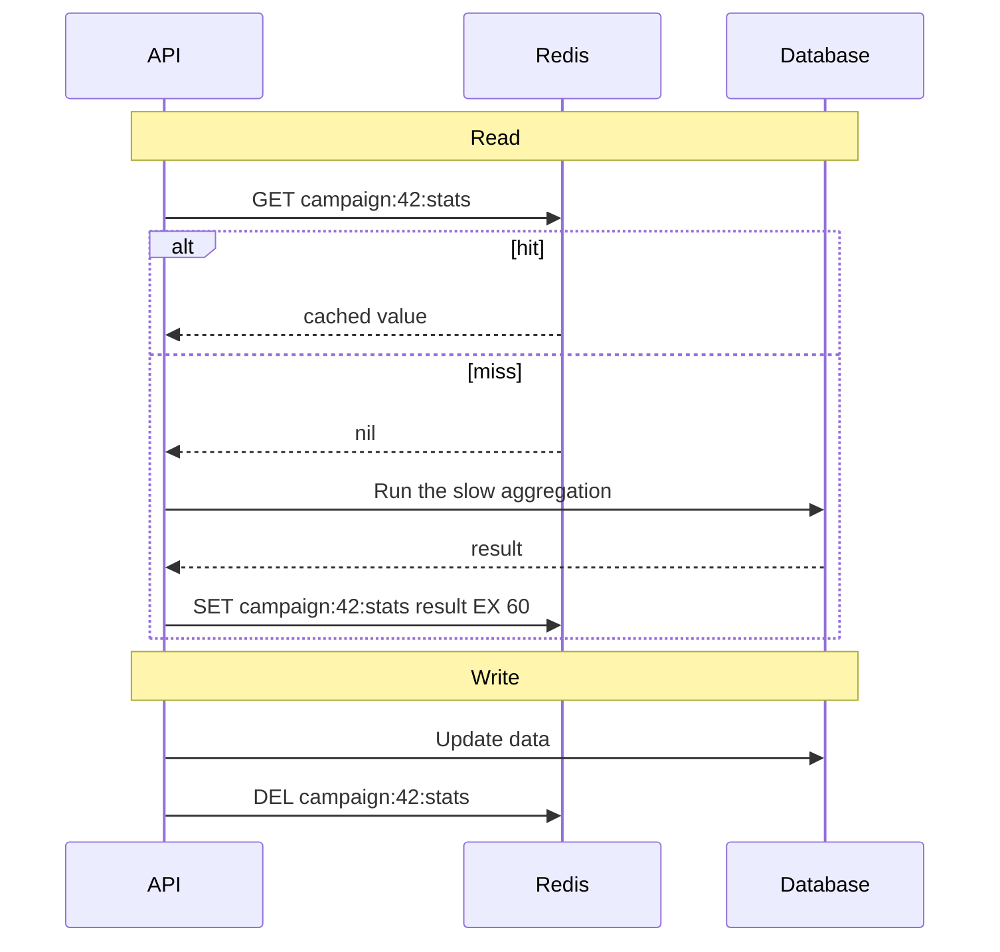
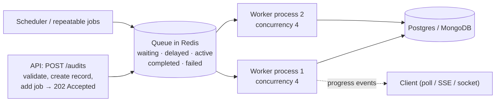
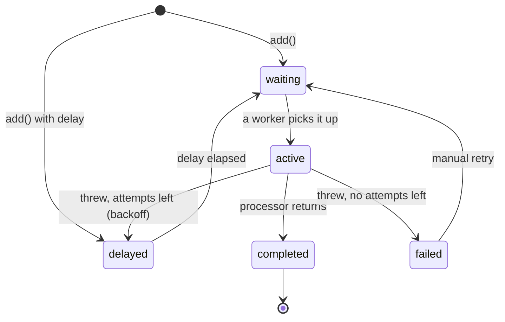

Redis shows up in almost every production Node stack: as a cache, a session store, a rate limiter, a message bus, and the engine behind job queues like BullMQ. This chapter covers what Redis is good at, its data types, caching patterns and invalidation, pub/sub and locks, and then job queues in depth, since background processing is where many real systems live.

## What Redis is

Redis is an **in-memory data store**. Data lives in RAM, so reads and writes take well under a millisecond. It runs commands one at a time on a single thread, which makes every command **atomic**: two clients incrementing the same counter can never lose an update.

It can persist to disk:

- **RDB snapshots**: a copy of the whole dataset every so often. Compact, but you can lose the last few minutes.
- **AOF (append-only file)**: logs every write. Safer, bigger.

Even with persistence, treat Redis as fast, *mostly* durable storage. Keep your source of truth in MongoDB or Postgres unless you've designed for Redis durability deliberately.

## Data types and what they're for

| Type | Think of it as | Typical uses |
|---|---|---|
| String | A value (text, number, JSON) | Cache entries, counters (`INCR`), flags, locks |
| Hash | A small object of fields | A session, a cached record you update field by field |
| List | A queue or stack | Simple queues, recent activity (`LPUSH` + `LTRIM`) |
| Set | Unique members | Online user IDs, tags, "already processed" IDs |
| Sorted set | Members ordered by a score | Leaderboards, sliding-window rate limits, delayed jobs |
| Stream | An append-only log with consumer groups | Durable event processing |

```bash
SET campaign:42:stats '{"sent":1200,"delivered":1150}' EX 60   # string with a 60 s TTL
INCR ratelimit:user:7:2026-09-28T10:15                           # atomic counter
HSET session:8f3a userId 42 orgId 7 role manager                 # hash
SADD online:org:7 42                                             # set
ZADD leaderboard 1540 "agent:12"                                 # sorted set
```

Name keys with a clear, colon-separated scheme (`entity:id:field`), and give almost every key a **TTL** (time to live) so stale data expires and memory doesn't fill with keys nobody reads.

## Caching

### Cache-aside

The most common pattern: the application checks the cache first and fills it on a miss.



```ts
export async function getCampaignStats(campaignId: string) {
  const key = 'campaign:' + campaignId + ':stats'
  const cached = await redis.get(key)
  if (cached) return JSON.parse(cached) as CampaignStats

  const stats = await computeCampaignStats(campaignId) // slow
  await redis.set(key, JSON.stringify(stats), 'EX', 60)
  return stats
}

export async function onMessageStatusChanged(campaignId: string) {
  await redis.del('campaign:' + campaignId + ':stats')
}
```

Strengths: only requested data is cached, and if Redis goes down, the app still works (just slower).

### Other patterns

- **Write-through**: every write updates the database and the cache together. Reads are always fresh; writes are slower, and you cache data that may never be read.
- **Write-behind** (write-back): write to the cache now and flush to the database later in batches. Very fast writes, but data can be lost if the cache fails first. Useful for high-volume counters (views, likes) that you periodically persist.

### Invalidation

Keeping caches correct is the hard part.

- **Delete on write** rather than updating the cached value, to avoid writing a stale version.
- **Short TTLs** as a safety net for anything you forget to invalidate.
- **Versioned keys**: include a version in the key (`org:7:v12:dashboard`) and bump the version when anything changes, so old keys simply stop being read and expire.
- **Cache at the right granularity**: invalidating one campaign's stats is easy; invalidating a giant "whole dashboard" blob on every event means it's almost never cached.

A subtle race: a slow reader loads old data from the database, a writer updates the database and deletes the cache key, then the slow reader writes its old data back into the cache. Short TTLs limit how long that stale value survives.

### Cache stampedes

When a popular key expires, hundreds of requests miss at the same moment and all hit the database together.

- **Lock the recompute**: the first request takes a short lock and recomputes; others wait briefly or serve the stale value.
- **Jitter**: add a random few seconds to TTLs so many keys don't expire at once.
- **Refresh ahead**: recompute hot keys in the background before they expire.

## Rate limiting

Redis is ideal for rate limits because every server shares the same counters and increments are atomic.

**Fixed window**: count requests per key per minute.

```ts
export async function allow(key: string, limit: number, windowSeconds: number) {
  const bucket = 'rl:' + key + ':' + Math.floor(Date.now() / 1000 / windowSeconds)
  const [[, count]] = (await redis.multi().incr(bucket).expire(bucket, windowSeconds).exec()) as [[null, number]]
  return count <= limit
}
```

**Sliding window**: store each request's timestamp in a sorted set, remove entries older than the window, and count what's left. More accurate at window edges.

**Token bucket**: a bucket refills at a steady rate and each request takes a token; bursts are allowed up to the bucket size. Usually implemented as a small Lua script so it runs atomically.

## Pub/sub and streams

**Pub/sub** broadcasts messages to everyone currently subscribed to a channel. It's fire-and-forget: a subscriber that's offline misses the message, and nothing is stored. It's perfect for relaying live events between servers (the Socket.io Redis adapter uses it), not for work that must not be lost.

**Streams** are an append-only log: messages are stored, consumer groups share the work, and consumers acknowledge what they've processed, so unacknowledged messages can be retried. Use them (or a job queue) when delivery matters.

## Distributed locks

When several servers might do the same thing at once (run the nightly job, send campaign 42), a lock ensures only one does.

```ts
const token = crypto.randomUUID()
const acquired = await redis.set('lock:campaign:42', token, 'PX', 30_000, 'NX') // only if not already set, expires in 30 s
if (!acquired) return // someone else is on it

try {
  await sendCampaign('42')
} finally {
  // Release only if we still own it (compare-and-delete must be atomic, hence Lua)
  await redis.eval(
    "if redis.call('get', KEYS[1]) == ARGV[1] then return redis.call('del', KEYS[1]) else return 0 end",
    1,
    'lock:campaign:42',
    token,
  )
}
```

- `NX` makes acquiring atomic; the expiry means a crashed holder can't block forever.
- The random token stops a process from releasing a lock that has already expired and been taken by someone else.
- If the work might outlast the expiry, extend the lock periodically, and make the work itself safe to repeat. For strict correctness, locks need *fencing tokens* checked by the resource being protected.

## Memory and eviction

When Redis reaches `maxmemory`, it follows its **eviction policy**:

- `allkeys-lru` / `allkeys-lfu`: evict least recently / least frequently used keys. Right for a pure cache.
- `volatile-*`: evict only keys that have a TTL.
- `noeviction`: refuse writes. Right for data you can't lose, like **job queues**.

A cache wants eviction; a queue must never silently lose jobs. If you can, run them on separate Redis instances with different policies.

## Job queues

### Why queues

Some work doesn't belong inside an HTTP request:

- It's **slow**: crawling a site, rendering a video, generating content with an LLM.
- It's **unreliable**: third-party APIs fail, time out and rate-limit you.
- It's **bursty**: a campaign to 100,000 contacts shouldn't be sent in one request.
- It must **survive crashes and deploys**.

A queue lets the API respond immediately ("accepted"), while **workers** process jobs in the background with retries, concurrency limits and rate limits, and scale separately from the API.



### BullMQ

BullMQ is the standard job queue for Node, built on Redis.

```ts
import { Queue, Worker, QueueEvents } from 'bullmq'

const connection = { url: env.REDIS_URL }
export const auditQueue = new Queue('audits', { connection })

// Producer (in the API)
await auditQueue.add(
  'audit-site',
  { auditId, url },
  {
    jobId: 'audit:' + auditId,                  // deduplicate: the same audit is never queued twice
    attempts: 4,
    backoff: { type: 'exponential', delay: 5_000 }, // 5 s, 10 s, 20 s…
    priority: plan === 'pro' ? 1 : 10,          // lower number runs first
    removeOnComplete: { age: 24 * 3600 },
    removeOnFail: { age: 7 * 24 * 3600 },
  },
)

// Worker (a separate process)
new Worker(
  'audits',
  async (job) => {
    await job.updateProgress(5)
    const pages = await crawl(job.data.url, { maxPages: 50 })
    await job.updateProgress(60)
    const results = runChecks(pages)             // 20+ SEO checks
    await saveAuditResults(job.data.auditId, results)
    return { score: results.score }
  },
  { connection, concurrency: 4, limiter: { max: 10, duration: 1_000 } },
)
```

### A job's life



### Retries, backoff and jitter

When a job fails, wait before retrying, and wait longer each time (**exponential backoff**). That gives a struggling service room to recover instead of hammering it. Add **jitter** (a random extra delay) so a thousand failed jobs don't all retry at the same instant. After the last attempt, the job lands in the **failed** set, effectively a dead-letter queue, where you can inspect and retry it.

Distinguish error types: a temporary error (timeout, 503, rate limit) should retry; a permanent one (invalid phone number, page returns 404) shouldn't. BullMQ lets you throw an `UnrecoverableError` to fail immediately.

### Idempotent jobs

A worker can crash **after** doing the work but **before** the job is marked complete, and the job will run again. Every job must be safe to run twice:

- Deterministic `jobId`s so duplicates aren't even queued.
- Check before acting ("is message 123 already sent?"), using unique constraints in the database as the final guard.
- Upserts instead of blind inserts.
- Record progress per step, so a retry resumes rather than restarts.

### Concurrency and rate limits

- `concurrency` is how many jobs one worker process runs at once. For Playwright crawling, keep it low: each browser page uses real memory.
- `limiter` caps how many jobs start per time window across **all** workers, which is how you respect third-party limits like WhatsApp's messaging throughput.
- Scale by adding worker processes or containers.

### Flows and repeatable jobs

- **Flows** create parent/child job trees: a "render video" parent waits for "generate each scene" children.
- **Repeatable jobs** run on a cron schedule (re-audit every site weekly, clean up old data nightly).

### Monitoring

Watch queue length (waiting and delayed counts), job duration, failure rate and the age of the oldest waiting job. A growing backlog means workers can't keep up; a spike in failures usually means a dependency is down. Dashboards like Bull Board show jobs and let you retry failed ones.

## Summary

- Redis is an in-memory, single-threaded, atomic data store. Pick the data type that matches the job, and give keys TTLs.
- Cache-aside with delete-on-write and short TTLs is the default; watch for stampedes.
- Use Redis for shared rate limits, pub/sub between servers, and short-lived locks with owner tokens.
- Caches want eviction; queues want `noeviction`.
- Move slow, unreliable or bursty work into a queue. Configure retries with exponential backoff, deduplicate with job IDs, make every job idempotent, and control concurrency and rate.
