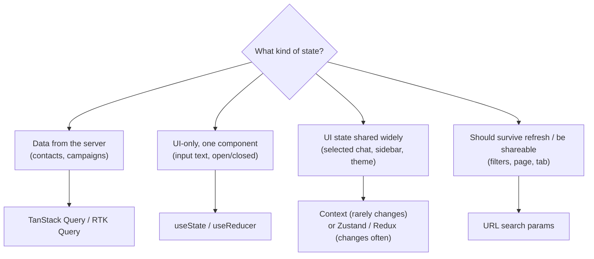
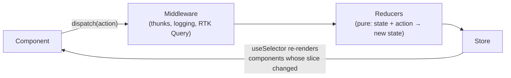
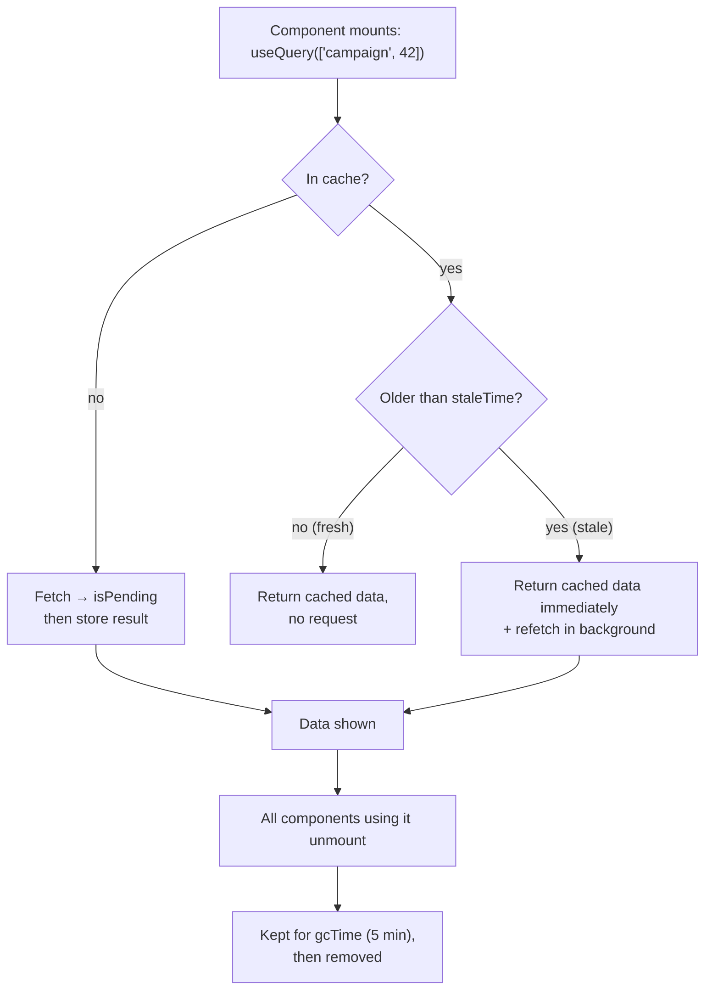
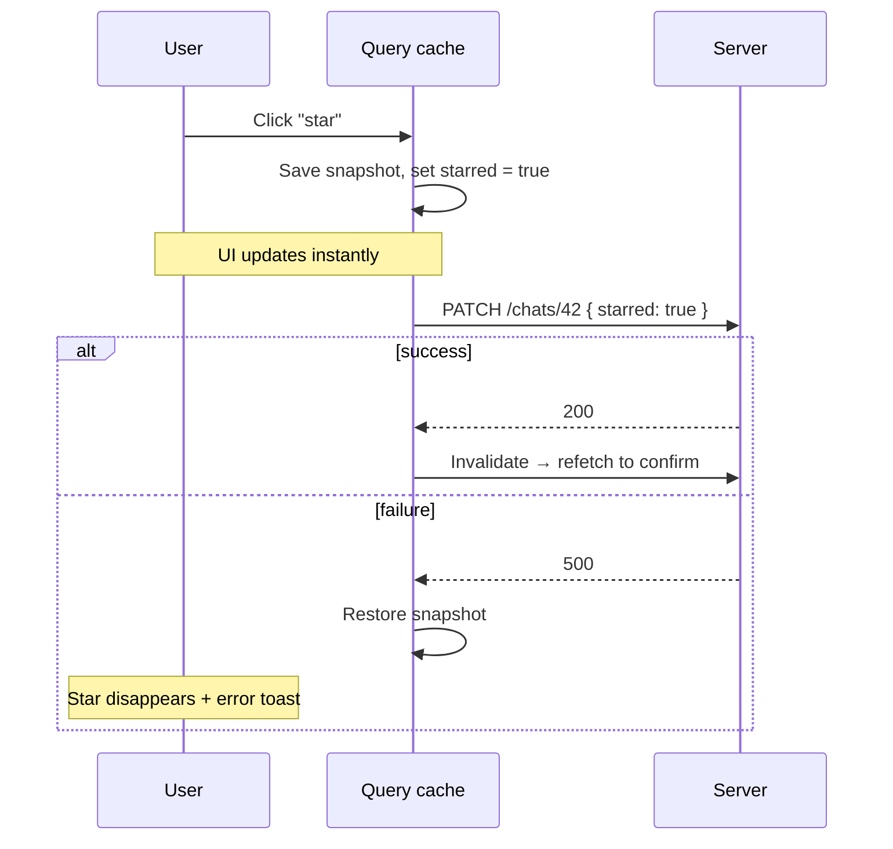

"Where should this state live?" is one of the most important decisions in a React app, and one of the most common interview topics. This chapter separates the two very different kinds of state, then walks through the tools for each: Context, Zustand and Redux Toolkit for client state; TanStack Query and RTK Query for server state; and the URL for everything shareable.

## Two kinds of state

**Client state** belongs to the UI and exists only in the browser: is the modal open, which tab is selected, what's typed in a form, the theme. You own it completely, and it's always correct.

**Server state** is a *copy* of data that lives on the server: contacts, campaigns, messages, the current user's profile. It has problems client state doesn't:

- It must be **fetched**, which takes time and can fail.
- It can become **stale**: someone else changes it, or it changes on the server.
- The same data is needed in **several places** at once.
- It needs **caching**, **refetching**, **deduplication**, **pagination** and **invalidation** after changes.



The classic mistake is putting server data into Redux by hand: `fetchContacts` thunks, `loading` and `error` flags, and manual cache updates repeated for every resource. A server-state library removes almost all of that code.

## Context

Context is built into React and solves **prop drilling**: passing a value through many components that don't use it.

```tsx
const ThemeContext = createContext<'light' | 'dark'>('dark')

function App() {
  const [theme, setTheme] = useState<'light' | 'dark'>('dark')
  return (
    <ThemeContext.Provider value={theme}>
      <Layout />
    </ThemeContext.Provider>
  )
}

function Button() {
  const theme = useContext(ThemeContext)
  // ...
}
```

Context is **not a state manager**; it's a way to pass a value down. And every component that reads it re-renders whenever the value changes, even if it only uses one field that didn't change.

Use Context for values that change rarely: the logged-in user, theme, locale, feature flags, and dependency injection (an API client). For state that changes often and is read in many places, use a store with selectors.

## Zustand

Zustand is a tiny store with a hook API. Components **subscribe to a slice** with a selector and re-render only when that slice changes. No provider is needed.

```tsx
import { create } from 'zustand'

type InboxState = {
  selectedChatId: string | null
  drafts: Record<string, string>
  selectChat: (id: string) => void
  saveDraft: (chatId: string, text: string) => void
}

export const useInbox = create<InboxState>((set) => ({
  selectedChatId: null,
  drafts: {},
  selectChat: (id) => set({ selectedChatId: id }),
  saveDraft: (chatId, text) => set((s) => ({ drafts: { ...s.drafts, [chatId]: text } })),
}))

// Only re-renders when selectedChatId changes, not when drafts change
const selectedChatId = useInbox((s) => s.selectedChatId)
```

Middleware adds persistence (`persist` to localStorage), Redux DevTools support, and Immer. For most apps, Zustand for client state plus TanStack Query for server state is a very productive combination.

## Redux Toolkit

Redux keeps all shared state in one **store**. State only changes by **dispatching actions** to **reducers**, which are pure functions that return the next state. That strict one-way flow makes changes predictable and debuggable.



**Redux Toolkit** (RTK) is the modern way to write Redux. It removes the boilerplate of classic Redux:

```ts
import { createSlice, configureStore, type PayloadAction } from '@reduxjs/toolkit'

type Filters = { status: 'all' | 'draft' | 'sent'; search: string }

const filtersSlice = createSlice({
  name: 'filters',
  initialState: { status: 'all', search: '' } as Filters,
  reducers: {
    statusChanged(state, action: PayloadAction<Filters['status']>) {
      state.status = action.payload // Immer turns this "mutation" into an immutable update
    },
    searchChanged(state, action: PayloadAction<string>) {
      state.search = action.payload
    },
  },
})

export const { statusChanged, searchChanged } = filtersSlice.actions

export const store = configureStore({
  reducer: { filters: filtersSlice.reducer },
})
export type RootState = ReturnType<typeof store.getState>
```

### Why immutability matters

`useSelector` and memoised selectors decide whether something changed by comparing references. Mutating an object in place keeps the reference the same, so nothing re-renders, and Redux DevTools' time travel breaks. Immer, built into RTK, lets you write mutation-style code that produces new objects safely.

### Selectors and memoisation

A selector reads (and derives) data from the store. `useSelector` re-renders the component when the selected value changes by reference. A selector that builds a new array every time (`filter`, `map`) therefore re-renders on *every* store update.

```ts
import { createSelector } from '@reduxjs/toolkit'

const selectCampaigns = (s: RootState) => s.campaigns.items
const selectStatus = (s: RootState) => s.filters.status

export const selectVisibleCampaigns = createSelector(
  [selectCampaigns, selectStatus],
  (items, status) => (status === 'all' ? items : items.filter((c) => c.status === status)),
) // recomputes only when items or status change
```

### Async: thunks

A **thunk** is a function you dispatch instead of an action object. The middleware calls it with `dispatch` and `getState`, so it can do async work and dispatch real actions when done. `createAsyncThunk` generates `pending`, `fulfilled` and `rejected` actions for you. For API data, though, RTK Query (below) is usually the better tool.

### Choosing between them

| | Context | Zustand | Redux Toolkit |
|---|---|---|---|
| Setup | Built in | One small package | More structure |
| Re-render precision | Every consumer on any change | Per selector | Per selector |
| Boilerplate | Low | Very low | Moderate |
| DevTools / time travel | No | Via middleware | Excellent |
| Server-state story | None | None (pair with TanStack Query) | RTK Query built in |
| Best for | Rarely-changing global values | Most apps' client state | Large apps and teams wanting strict patterns |

In an interview, the right answer isn't a favourite library. It's naming the trade-off and matching it to the project's size, team and needs.

## TanStack Query

TanStack Query (React Query) manages server state. You describe **what** data you need with a key and a function to fetch it; the library handles the rest.

```tsx
function CampaignDetail({ id }: { id: string }) {
  const { data, isPending, isError, error } = useQuery({
    queryKey: ['campaign', id],
    queryFn: () => api.getCampaign(id),
    staleTime: 30_000,
  })

  if (isPending) return <Skeleton />
  if (isError) return <ErrorState error={error} />
  return <CampaignView campaign={data} />
}
```

What you get without writing it yourself:

- **Caching by key**: two components asking for `['campaign', '42']` share one request and one cache entry.
- **Background refetching** when the window regains focus, the network reconnects, or on an interval.
- **Retries** with backoff for failed requests.
- **Stale-while-revalidate**: show cached data instantly, refresh it in the background.
- **Garbage collection** of data nobody uses any more.

### The cache lifecycle



- **`staleTime`** (default `0`): how long data counts as fresh. Fresh data is served from cache with no request.
- **`gcTime`** (default 5 minutes): how long *unused* data stays in memory.

Setting a sensible `staleTime` (30 seconds to a few minutes for most dashboards) removes a lot of unnecessary refetching.

### Query keys

Keys are arrays that uniquely describe the data, including every parameter that changes it:

```ts
['contacts', { orgId, tag: 'vip', page: 2 }]
['campaign', campaignId]
['campaign', campaignId, 'stats']
```

When a parameter changes, the key changes and TanStack Query fetches (or reads from cache) the new data automatically. Keys are hierarchical: invalidating `['campaign', id]` also invalidates `['campaign', id, 'stats']`.

### Mutations and invalidation

```tsx
const queryClient = useQueryClient()

const createContact = useMutation({
  mutationFn: api.createContact,
  onSuccess: () => {
    queryClient.invalidateQueries({ queryKey: ['contacts'] }) // mark stale, refetch if on screen
  },
})

<button onClick={() => createContact.mutate({ name, phone })} disabled={createContact.isPending}>
  Save
</button>
```

### Optimistic updates

For actions that almost always succeed (star a chat, mark as read), update the UI immediately and roll back on failure:



```tsx
useMutation({
  mutationFn: (id: string) => api.toggleStar(id),
  onMutate: async (id) => {
    await queryClient.cancelQueries({ queryKey: ['chats'] })
    const previous = queryClient.getQueryData<Chat[]>(['chats'])
    queryClient.setQueryData<Chat[]>(['chats'], (old) =>
      old?.map((c) => (c.id === id ? { ...c, starred: !c.starred } : c)),
    )
    return { previous }
  },
  onError: (_err, _id, context) => queryClient.setQueryData(['chats'], context?.previous),
  onSettled: () => queryClient.invalidateQueries({ queryKey: ['chats'] }),
})
```

### Infinite lists

```tsx
const { data, fetchNextPage, hasNextPage, isFetchingNextPage } = useInfiniteQuery({
  queryKey: ['messages', chatId],
  queryFn: ({ pageParam }) => api.getMessages(chatId, { before: pageParam }),
  initialPageParam: undefined as string | undefined,
  getNextPageParam: (lastPage) => lastPage.nextCursor ?? undefined,
})

const messages = data?.pages.flatMap((p) => p.items) ?? []
```

Trigger `fetchNextPage()` when a sentinel element near the end of the list becomes visible (an `IntersectionObserver`), and pair it with cursor-based pagination on the API.

## RTK Query

RTK Query is Redux Toolkit's answer to TanStack Query. You define an API once and get generated hooks, with cache invalidation through **tags**.

```ts
export const api = createApi({
  baseQuery: fetchBaseQuery({ baseUrl: '/api', credentials: 'include' }),
  tagTypes: ['Contact'],
  endpoints: (build) => ({
    getContacts: build.query<Contact[], { tag?: string }>({
      query: (params) => ({ url: 'contacts', params }),
      providesTags: (result) =>
        result ? [...result.map((c) => ({ type: 'Contact' as const, id: c.id })), 'Contact'] : ['Contact'],
    }),
    updateContact: build.mutation<Contact, Partial<Contact> & { id: string }>({
      query: ({ id, ...body }) => ({ url: 'contacts/' + id, method: 'PATCH', body }),
      invalidatesTags: (_r, _e, { id }) => [{ type: 'Contact', id }],
    }),
  }),
})

export const { useGetContactsQuery, useUpdateContactMutation } = api
```

Choose RTK Query if you're already on Redux and want one toolset; TanStack Query if you're not, or want its richer feature set.

## The URL is state too

Filters, search terms, sort order, the current tab and the page number usually belong in the **URL**:

- Refreshing the page keeps them.
- The back button works as users expect.
- People can share a link to exactly what they're looking at.

```tsx
const [params, setParams] = useSearchParams()
const status = params.get('status') ?? 'all'

<select
  value={status}
  onChange={(e) => setParams((p) => { p.set('status', e.target.value); p.delete('page'); return p })}
>
```

Put the URL values straight into your query key, and the list refetches whenever the filters change.

## Routing essentials

### Nested routes and layouts

A parent route renders shared UI and an `<Outlet />` where the matching child appears. Moving between children keeps the parent mounted.

```tsx
<Routes>
  <Route element={<RequireAuth />}>
    <Route path="/app" element={<AppLayout />}>
      <Route index element={<Dashboard />} />
      <Route path="campaigns" element={<Campaigns />} />
      <Route path="campaigns/:campaignId" element={<CampaignDetail />} />
      <Route path="inbox/:chatId?" element={<Inbox />} />
    </Route>
  </Route>
  <Route path="/login" element={<Login />} />
</Routes>
```

### Protected routes

```tsx
function RequireAuth() {
  const { user, isLoading } = useSession()
  const location = useLocation()
  if (isLoading) return <FullPageSpinner />
  if (!user) return <Navigate to="/login" replace state={{ from: location }} />
  return <Outlet />
}
```

Route guards are for user experience only. Every API endpoint must still check authentication and permissions itself.

## Summary

- Separate client state from server state; they need different tools.
- Context passes rarely-changing values down; it isn't a state manager.
- Zustand and Redux Toolkit give selector-based subscriptions; RTK adds structure, DevTools and RTK Query.
- TanStack Query caches server data by key, refetches in the background, retries and dedupes. Tune `staleTime`, invalidate after mutations, and use optimistic updates for instant-feeling actions.
- Keep filters, pages and tabs in the URL.
