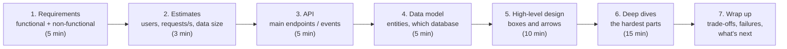
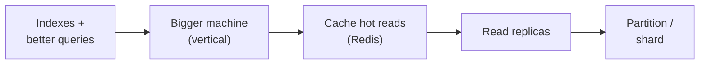
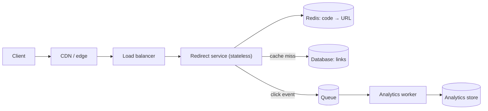
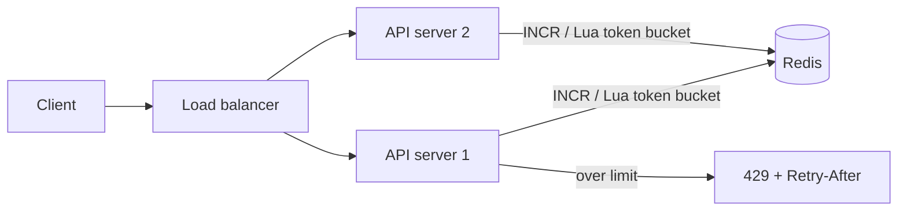
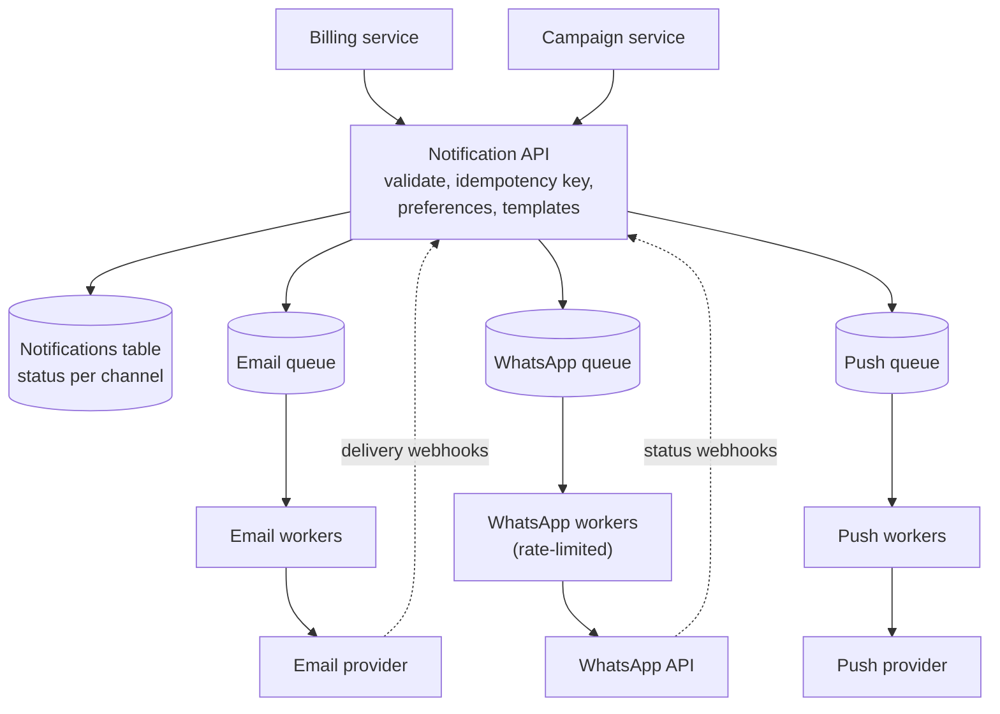
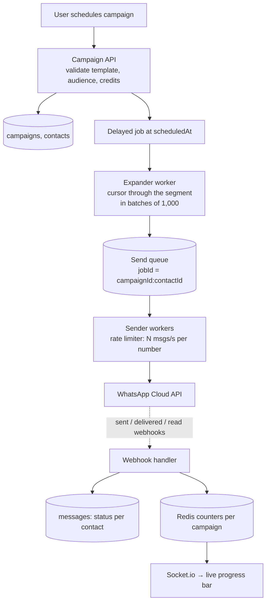
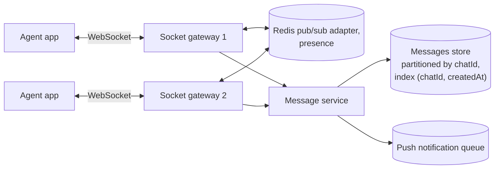

System design interviews at the mid level aren't about designing Google. They check whether you can take a vague problem, ask the right questions, sketch a sensible architecture, and reason about trade-offs: where the data lives, what's slow, what breaks, and what happens at ten times the load. This chapter gives you a method, the building blocks, and five worked designs, several of which you've already built pieces of.

## A method that works every time

1. **Requirements.** Ask before drawing. What must it do (functional)? How many users, how fast, how available, how consistent (non-functional)? Write the answers down and agree on scope.
2. **Estimates.** Rough numbers decide the design. 1 million messages a day is about 12 per second on average, maybe 100 per second at peak: one database handles that easily. 1 billion a day is a different system.
3. **API.** A few endpoints or events make the design concrete.
4. **Data model.** Main entities, their relationships, and which store fits (relational, document, key-value, object storage).
5. **High-level design.** Clients, load balancer, services, databases, cache, queue, workers. Walk one request through it.
6. **Deep dives.** The interviewer will pick, or you should pick, the hardest parts: the hot path, consistency, failures, scaling a specific component.
7. **Wrap up.** Name the trade-offs you made, how it fails, and what you'd do next with more time or scale.

> **Tip:** Think out loud. The interviewer is grading your reasoning more than your final diagram.

### Quick numbers worth remembering

| Thing | Rough value |
|---|---|
| Seconds in a day | ~86,400 (use 100,000 for easy maths) |
| Reading from memory / Redis | microseconds to ~1 ms |
| Indexed database query | ~1–10 ms |
| Network round trip within a region | ~1 ms |
| Round trip India ↔ US | ~200+ ms |
| One modest API server | hundreds to a few thousand simple requests/s |

## Building blocks

### Load balancers and stateless services

A **load balancer** spreads requests across several identical app servers and sends traffic only to healthy ones. That works only if servers are **stateless**: no user sessions, uploaded files or in-progress work kept in one server's memory. Sessions go to Redis or tokens, files to S3, background work to a queue. Then you can add or remove servers freely, and a crash loses nothing.

### Scaling the database

Go in that order: most "scaling problems" are missing indexes. **Read replicas** take read traffic off the primary, but replication is asynchronous, so a replica may lag slightly behind; read your own writes from the primary. **Sharding** splits data across machines by a key (often `orgId` for a SaaS product), and it's a big step, so only take it when you must.

### Caching

Cache at every layer where it's cheap and safe: browser (HTTP cache headers), CDN (static assets, some pages), application (Redis for expensive queries and computed results), and the database's own memory. For each cache, decide what's cached, for how long, and how it's invalidated.

### Queues and asynchronous work

A queue between the API and the work decouples them: the API responds immediately, workers process at their own pace with retries, spikes wait in the queue instead of overloading anything, and workers scale separately. The trade-off is **eventual consistency**: results appear shortly after, not instantly.

### Consistency and CAP

In a distributed system, a network partition forces a choice: refuse some requests to stay **consistent**, or answer everything and risk **stale** data (**available**). Choose per feature: a wallet balance must be consistent; a follower count can be a few seconds stale.

### Resilience patterns

- **Timeouts** on every call to another service.
- **Retries with exponential backoff and jitter**, only for idempotent operations.
- **Idempotency keys** so retries don't double-charge or double-send.
- **Circuit breakers**: after repeated failures, stop calling a broken dependency for a while and fail fast.
- **Graceful degradation**: show cached or partial data rather than an error page.
- **Bulkheads**: separate pools or queues so one noisy feature can't starve the rest.

## Design 1: a URL shortener

**Requirements**: create a short link for a long URL; redirect fast; optional custom alias and expiry; click analytics. Reads (redirects) vastly outnumber writes.

**Estimates**: 1M new links/day ≈ 12 writes/s; 100M redirects/day ≈ 1,200 reads/s average, several thousand at peak.

**API**: `POST /links { url, alias? } → { code }` and `GET /:code → 301/302 redirect`.

**Key decisions**:

- **Code generation**: base62-encode a unique ID from a sequence (short, no collisions), or generate a random 7-character code (62^7 ≈ 3.5 trillion) and retry on the rare collision caught by a unique index. Random codes don't reveal how many links exist.
- **Reads**: cache popular codes in Redis; many redirects never touch the database.
- **301 vs 302**: 301 is cached by browsers (fewer hits to you, but fewer analytics); 302 always comes through you.
- **Analytics** go through a queue so the redirect stays fast.
- **Abuse**: rate-limit creation and scan target URLs for malware and phishing.

## Design 2: a rate limiter

**Requirements**: limit each client (user, API key or IP) to N requests per window, per endpoint class; consistent across all API servers; low overhead.

**Key decisions**:

- **Algorithm**: fixed window (simplest, bursty at window edges), sliding window (accurate), or token bucket (allows short bursts, smooth average; the usual choice for APIs).
- **Storage**: Redis, updated atomically (Lua script) so concurrent requests can't race.
- **Where**: middleware in each service or an API gateway in front.
- **Responses**: `429` with `Retry-After` and remaining-quota headers.
- **Failure mode**: if Redis is down, fail **open** (allow) for normal endpoints and fail **closed** for sensitive ones like login.

## Design 3: a notification service

**Requirements**: other services send notifications through email, SMS, WhatsApp and push; respect user preferences and quiet hours; never lose or duplicate important messages; track delivery.

**Key decisions**:

- **One API, many channels**: callers say *what* to notify; the service decides *how* based on preferences.
- **A queue per channel** so a slow email provider doesn't delay WhatsApp messages, each with its own retry policy and rate limit.
- **Priorities**: OTPs and security alerts jump ahead of marketing.
- **Idempotency key** per notification so upstream retries don't send twice.
- **Status tracking** (queued → sent → delivered/failed) updated from provider webhooks, visible to support.
- **Templates** stored and versioned centrally.

## Design 4: sending a WhatsApp campaign to 100,000 contacts

**Requirements**: a user schedules a campaign (template + audience segment); at the scheduled time, send to every opted-in contact; respect WhatsApp's rate limits and the organisation's quota; show live progress; support pause and cancel; never send twice to the same contact.

**Key decisions**:

- **Expand lazily**: iterate the audience with a database cursor in batches, enqueueing as you go. Never load 100,000 contacts into memory.
- **Idempotency**: job ID `campaignId:contactId` means a crash or retry never enqueues or sends twice; a unique index on `(campaignId, contactId)` in the messages table is the final guard.
- **Rate limits**: BullMQ's limiter matches WhatsApp's throughput tier; per-organisation fairness can use separate queues or weighted priorities.
- **Errors**: retry temporary failures (timeouts, rate-limit responses) with backoff; mark permanent failures (invalid number, not on WhatsApp) and don't retry.
- **Pause / cancel**: workers check the campaign's status before each send.
- **Progress**: webhook updates increment Redis counters, which are pushed to the dashboard over sockets and periodically persisted.
- **Compliance**: only opted-in contacts, and honour opt-outs immediately.

## Design 5: a chat system

**Requirements**: one-to-one conversations between agents and customers; messages delivered in real time; history with infinite scroll; read receipts; typing indicators; works across devices and reconnects.

**Key decisions**:

- **Send path**: the client sends with a temporary ID → the server saves the message → acknowledges with the real ID → broadcasts to the conversation's room. Persist first, then emit.
- **History**: cursor pagination on `(chatId, createdAt)`, newest first.
- **Reconnects**: the client asks for everything after the last message ID it saw; the database, not the socket, is the source of truth.
- **Scale**: stateless socket gateways behind a load balancer, joined by the Redis adapter; the message store partitioned by conversation.
- **Offline users** get push notifications through a queue.
- **Ordering**: order within a conversation by server timestamp or a per-chat sequence number.
- **Receipts** are stored; **typing** events are relayed and forgotten.

## Talking about systems you've built

Your own projects are system design answers. Rehearse them in this shape:

- **SEO Analyzer**: API validates and queues audit jobs → BullMQ workers run Playwright with limited concurrency → 20+ checks → results stored as JSONB in Postgres → client polls for progress. Talk about retries, priorities, per-domain rate limits and SSRF protection.
- **AI Video Ad Generator**: a staged workflow (brief → script → scenes → render) modelled in Postgres so any stage can be regenerated; LLM calls and rendering in background jobs; structured output validated against a schema.
- **HR automation service**: email in → LLM extracts structured leave data → Discord message with approve/reject buttons → decision recorded. Talk about validating model output, idempotency, and securing button interactions.

## Monolith or microservices?

A **modular monolith** (one deployable app with clear internal boundaries, plus separate worker processes) is the right default for most teams: simple to develop, test, deploy and debug. **Microservices** let teams deploy independently and scale parts separately, but add network calls, distributed data and much more operational work. Split a service out when there's a clear reason: very different scaling needs, a separate team, or a different technology requirement.

## Summary

- Follow the method: requirements, estimates, API, data model, high-level design, deep dives, trade-offs.
- Stateless services behind a load balancer; state lives in databases, caches, object storage and queues.
- Scale databases with indexes first, then vertical, cache, replicas, and sharding last.
- Queues decouple, absorb spikes and add retries at the cost of eventual consistency.
- Design for failure: timeouts, backoff, idempotency, circuit breakers and graceful degradation.
- Your own projects are your best system design stories; practise telling them.
