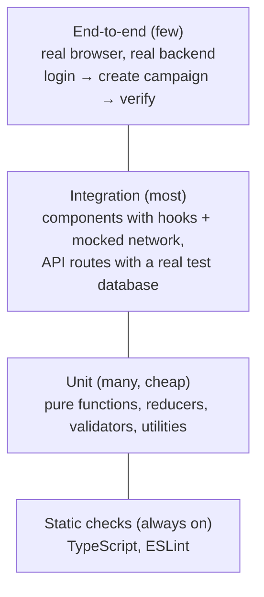
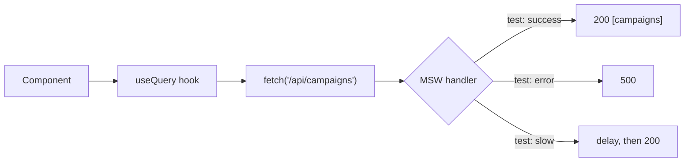

Tests are what let a team change code without fear. They're also the biggest gap on many developers' resumes, and one of the quickest to close. This chapter covers what to test and at which level, then gets practical with Vitest/Jest, React Testing Library, MSW, Supertest and Playwright, and ends with a plan for adding tests to a codebase that has none.

## Why tests pay for themselves

- **Confidence to change code.** Refactoring a shared component used in forty places is terrifying without tests and routine with them.
- **Faster feedback than manual checking.** A test suite checks hundreds of scenarios in seconds, on every push.
- **Living documentation.** A test named `rejects campaigns scheduled in the past` says exactly what the code promises.
- **Better design.** Code that's hard to test is usually doing too much or tangled with its dependencies.

## What to test, and at which level



- **Static checks** catch typos and type errors before any test runs.
- **Unit tests** check one function or small module in isolation. Fast and precise, but they can pass while the pieces fail to work together.
- **Integration tests** check several pieces together: a form component with its validation and a mocked API, or an Express route with its middleware and a real test database. They catch the most real bugs per test.
- **End-to-end tests** drive a real browser through real flows. Slowest and most brittle, so keep them to the critical journeys.

### Test behaviour, not implementation

Test what a user or caller can observe: what's rendered, what's returned, what request was sent, what changed in the database. Don't test internal details like state variable names or which private function was called. Implementation tests break on every refactor even when nothing is broken, and people stop trusting them.

A good test reads like a specification:

```ts
it('shows the number of selected contacts on the send button', async () => { /* … */ })
```

## Unit tests with Vitest or Jest

Vitest and Jest share almost the same API. Vitest is built on Vite: faster, with native ESM and TypeScript, and it reuses your Vite config, so it's the natural choice in Vite projects.

Structure each test as **Arrange, Act, Assert**, and cover edge cases, not just the happy path.

```ts
import { describe, it, expect } from 'vitest'
import { normalizePhone } from './phone'

describe('normalizePhone', () => {
  it('adds +91 to a 10-digit Indian number', () => {
    expect(normalizePhone('98123 45678')).toBe('+919812345678')
  })

  it('keeps an existing country code', () => {
    expect(normalizePhone('+44 7700 900123')).toBe('+447700900123')
  })

  it.each(['', '123', 'not a number'])('rejects %j', (input) => {
    expect(() => normalizePhone(input)).toThrow('Invalid phone number')
  })
})
```

### Test doubles

- **Stub**: replace a function with a canned answer: `vi.fn().mockResolvedValue(user)`.
- **Spy**: watch a real function's calls: `vi.spyOn(analytics, 'track')`.
- **Mock module**: replace a whole import: `vi.mock('./mailer')`.
- **Fake timers**: control time instead of waiting for it.

Mock at the **boundaries** (network, time, randomness, third-party SDKs), not your own internal modules. Mocking your own code tests the mock, not the code.

```ts
it('debounces search requests', () => {
  vi.useFakeTimers()
  const search = vi.fn()
  const debounced = debounce(search, 300)

  debounced('p'); debounced('pr'); debounced('pri')
  expect(search).not.toHaveBeenCalled()

  vi.advanceTimersByTime(300)
  expect(search).toHaveBeenCalledOnce()
  expect(search).toHaveBeenCalledWith('pri')
  vi.useRealTimers()
})
```

## Testing React components

React Testing Library renders components into a simulated DOM and gives you queries that find elements **the way a user would**.

### Query priority

1. `getByRole` (with `{ name }`): buttons, links, headings, textboxes, checkboxes. Also verifies accessibility.
2. `getByLabelText`: form fields by their label.
3. `getByPlaceholderText`, `getByText`, `getByDisplayValue`.
4. `getByTestId`: only when nothing else works.

And the variants:

| Variant | If not found | Waits? | Use for |
|---|---|---|---|
| `getBy…` | Throws | No | Things that should be there now |
| `queryBy…` | Returns `null` | No | Asserting something is **absent** |
| `findBy…` | Rejects | Yes (async) | Things that appear after async work |

### A realistic component test

```tsx
import { render, screen } from '@testing-library/react'
import userEvent from '@testing-library/user-event'
import { ContactForm } from './ContactForm'

it('validates the phone number before saving', async () => {
  const user = userEvent.setup()
  const onSave = vi.fn()
  render(<ContactForm onSave={onSave} />)

  await user.type(screen.getByLabelText(/name/i), 'Priya')
  await user.type(screen.getByLabelText(/phone/i), '123')
  await user.click(screen.getByRole('button', { name: /save/i }))

  expect(await screen.findByText(/valid phone number/i)).toBeInTheDocument()
  expect(onSave).not.toHaveBeenCalled()

  await user.clear(screen.getByLabelText(/phone/i))
  await user.type(screen.getByLabelText(/phone/i), '+919812345678')
  await user.click(screen.getByRole('button', { name: /save/i }))

  expect(onSave).toHaveBeenCalledWith({ name: 'Priya', phone: '+919812345678' })
})
```

`userEvent` simulates real interactions (every keystroke fires keydown, input and keyup; clicks include focus and pointer events; disabled elements can't be clicked), so prefer it over `fireEvent`.

### Components that need providers

Wrap renders in the providers your app uses (router, query client, theme) with a small helper, and create a fresh `QueryClient` per test so caches don't leak between tests.

```tsx
export function renderWithProviders(ui: React.ReactElement, { route = '/' } = {}) {
  const queryClient = new QueryClient({ defaultOptions: { queries: { retry: false } } })
  return render(
    <QueryClientProvider client={queryClient}>
      <MemoryRouter initialEntries={[route]}>{ui}</MemoryRouter>
    </QueryClientProvider>,
  )
}
```

### Custom hooks

```tsx
import { renderHook, act } from '@testing-library/react'

it('toggles selection', () => {
  const { result } = renderHook(() => useSelection<string>())
  act(() => result.current.toggle('c1'))
  expect(result.current.selected.has('c1')).toBe(true)
  act(() => result.current.toggle('c1'))
  expect(result.current.selected.size).toBe(0)
})
```

## Mocking the network with MSW

Mock Service Worker intercepts real `fetch` and XHR requests and answers them with handlers you define. Your components, hooks and data libraries run their real code; only the network is fake.



```ts
// test/server.ts
import { setupServer } from 'msw/node'
import { http, HttpResponse } from 'msw'

export const server = setupServer(
  http.get('/api/campaigns', () =>
    HttpResponse.json({ data: [{ id: 'c1', name: 'Diwali Sale', status: 'scheduled' }] }),
  ),
)

// test/setup.ts
beforeAll(() => server.listen({ onUnhandledRequest: 'error' }))
afterEach(() => server.resetHandlers())
afterAll(() => server.close())
```

```tsx
it('shows an error state when the API fails', async () => {
  server.use(http.get('/api/campaigns', () => new HttpResponse(null, { status: 500 })))
  renderWithProviders(<CampaignList />)
  expect(await screen.findByRole('alert')).toHaveTextContent(/could not load campaigns/i)
})
```

The same handlers can power local development and Storybook, so the whole team shares one set of mocks.

## Testing the API

### Route tests with Supertest

Supertest sends real HTTP requests to your Express app without opening a port. Export the app separately from the code that calls `listen()`.

```ts
import request from 'supertest'
import { app } from '../src/app'

describe('POST /api/campaigns', () => {
  it('rejects a schedule in the past', async () => {
    const res = await request(app)
      .post('/api/campaigns')
      .set('Authorization', 'Bearer ' + (await tokenFor('manager')))
      .send({ name: 'Old', templateId: 't1', scheduledAt: '2020-01-01T00:00:00Z' })

    expect(res.status).toBe(400)
    expect(res.body.error.code).toBe('BAD_REQUEST')
  })

  it('does not let one organisation read another organisation’s campaign', async () => {
    const other = await createCampaign({ orgId: 'org_other' })
    const res = await request(app)
      .get('/api/campaigns/' + other.id)
      .set('Authorization', 'Bearer ' + (await tokenFor('manager', 'org_mine')))

    expect(res.status).toBe(404)
  })
})
```

That second test is the kind that prevents data leaks: test authorisation, not just the happy path.

### A real database for integration tests

Mocking the database hides the bugs you most need to find (wrong query, missing index filter, constraint violations). Use a real one:

- `mongodb-memory-server` starts an in-memory MongoDB per test run.
- Testcontainers or a Docker Compose service gives you real Postgres and Redis.
- Reset data between tests (truncate tables or drop the database) so tests don't depend on each other.

## End-to-end tests with Playwright

Playwright Test drives Chromium, Firefox and WebKit. If you already use Playwright for scraping, you know the API: locators, auto-waiting and the page model are the same.

```ts
import { test, expect } from '@playwright/test'

test('manager creates and schedules a campaign', async ({ page }) => {
  await page.goto('/campaigns')
  await page.getByRole('button', { name: 'New campaign' }).click()
  await page.getByLabel('Campaign name').fill('Diwali Sale')
  await page.getByLabel('Template').selectOption('diwali_offer_v2')
  await page.getByLabel('Audience tag').fill('vip')
  await page.getByRole('button', { name: 'Schedule' }).click()

  await expect(page.getByRole('status')).toHaveText(/campaign scheduled/i)
  await expect(page.getByRole('row', { name: /Diwali Sale/ })).toContainText('Scheduled')
})
```

Practical setup:

- **Log in once** in a setup project and save the storage state; every test starts already logged in.
- **Seed data through the API**, not through the UI, so each test is fast and independent.
- **Rely on auto-waiting** (`expect(locator).toHaveText(...)` retries until it passes) instead of fixed sleeps.
- **Traces and videos on failure** (`trace: 'on-first-retry'`) make CI failures debuggable.
- Cover the **critical journeys** only: login, create and send a campaign, the payment path. Leave edge cases to faster tests.

## Flaky tests

A flaky test passes and fails without code changes, and it destroys trust in the whole suite.

| Cause | Fix |
|---|---|
| Fixed `sleep`/`waitForTimeout` | Wait for a specific condition (`findBy`, web-first assertions) |
| Tests depending on each other's data | Create data per test; reset between tests |
| Real time, dates, randomness | Fake timers, fixed seeds, injected clocks |
| Real network calls | MSW or a local test server |
| Animations and transitions | Disable them in the test environment |
| Shared global state (caches, singletons) | Fresh instances per test |

Quarantine a flaky test (mark and track it) and fix it quickly, rather than letting people learn to ignore red builds.

## Coverage

Coverage shows which lines and branches ran during tests. It's useful for finding untested areas, not as a goal: 100% coverage with weak assertions proves little. Aim for strong coverage of business logic, validation, permissions and shared components, and don't chase numbers on glue code.

## Tests in CI

Tests only protect you if they run on every change:

```yaml
- run: npm ci
- run: npm run lint
- run: npm run typecheck
- run: npm test -- --coverage
- run: npx playwright install --with-deps chromium
- run: npm run test:e2e
```

Block merging when they fail. Keep the main suite fast (a few minutes), and run slower E2E suites in parallel shards if they grow.

## Adding tests to a codebase that has none

A plan that works without stopping feature work:

1. **Set up the tools and CI first**, even with a single test, so the habit and the pipeline exist.
2. **Every bug fix gets a test**: write a failing test that reproduces the bug, then fix it. The bug never comes back.
3. **Every new feature ships with tests.**
4. **Cover the shared foundations**: the most-used components in the component library, validation schemas, permission checks, and utilities. They're cheap to test and protect everything built on them.
5. **Add a handful of E2E tests** for the journeys that would be a disaster to break.
6. **Grow coverage steadily** as you touch code; don't plan a months-long "testing project".

## Summary

- Static checks always; many cheap unit tests; the most integration tests; a few E2E tests on critical journeys.
- Test behaviour through public interfaces; mock only at the boundaries.
- In React tests, query by role and label, use `userEvent`, and `findBy` for async results.
- MSW mocks the network while everything above it runs for real.
- Test APIs with Supertest and a real test database, including authorisation cases.
- Playwright covers the critical paths; seed via API, log in once, rely on auto-waiting.
- Kill flakiness at its cause, and run everything in CI on every push.
