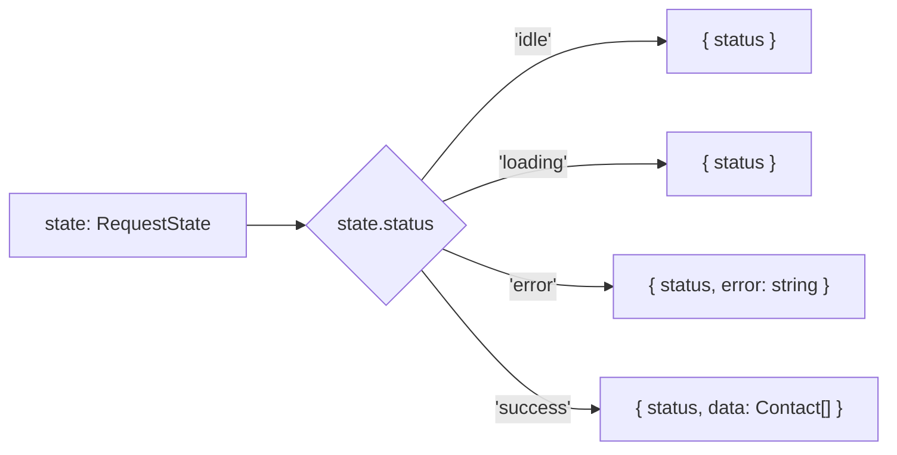
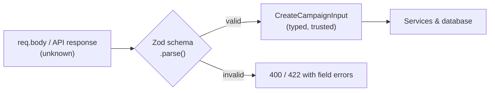

TypeScript is JavaScript with a type checker in front of it. You already use it daily, so this chapter skips the syntax tour and focuses on the type system itself: how TypeScript decides what fits where, how it narrows types as your code runs, and the handful of patterns that remove whole classes of bugs.

## What TypeScript is (and isn't)

TypeScript checks your code **before it runs**, then compiles to plain JavaScript with every type removed. That has two consequences worth remembering:

- Types cost nothing at runtime, and they also *do* nothing at runtime.
- Anything that enters your program from outside (an API response, `req.body`, `JSON.parse`, `localStorage`) is only "typed" because you said so. TypeScript cannot check it. You have to validate it.

> **Tip:** Think of types as a contract between parts of *your* code. At the edges of your system, a runtime validator like Zod is what actually enforces the contract.

## Structural typing

Many languages check types by name: a `Dog` is only a `Dog` if it was declared as one. TypeScript checks by **shape**. If a value has the properties a type requires, it fits.

```ts
type Point = { x: number; y: number }

function distance(p: Point) {
  return Math.hypot(p.x, p.y)
}

const pixel = { x: 3, y: 4, color: 'red' }
distance(pixel) // OK: pixel has x and y; the extra property is fine
```

There's one exception: when you pass an object **literal** directly, TypeScript flags extra properties, because that's usually a typo.

```ts
distance({ x: 3, y: 4, colour: 'red' }) // Error: 'colour' does not exist in type 'Point'
```

## `type` vs `interface`

Both describe object shapes and mostly behave the same way.

| | `interface` | `type` |
|---|---|---|
| Object shapes | Yes | Yes |
| Unions (`'a' \| 'b'`) | No | Yes |
| Tuples, primitives, mapped and conditional types | No | Yes |
| Extending | `extends` | Intersections (`&`) |
| Declaration merging (reopening to add fields) | Yes | No |

A reasonable team rule: use `type` by default because it can express everything, and reach for `interface` when you want to extend a library's type through declaration merging (for example, adding `user` to Express's `Request`).

## Unions, intersections and literal types

A **union** says "one of these":

```ts
type Id = string | number
type Status = 'draft' | 'scheduled' | 'sent' | 'failed' // literal types
```

A value of a union type only lets you use what all members have in common, until you narrow it.

An **intersection** says "all of these at once":

```ts
type Timestamps = { createdAt: Date; updatedAt: Date }
type Campaign = { id: string; name: string } & Timestamps
```

Literal types plus unions replace most enums. They cost nothing at runtime and work naturally with JSON.

```ts
const STATUSES = ['draft', 'scheduled', 'sent', 'failed'] as const
type Status = (typeof STATUSES)[number] // 'draft' | 'scheduled' | 'sent' | 'failed'
```

`as const` tells TypeScript to infer the narrowest types it can: string literals instead of `string`, and a readonly tuple instead of an array.

## Narrowing

**Narrowing** is TypeScript following your checks and working out a more specific type inside each branch. It's the reason union types are practical.

```ts
function label(value: string | number | Date | null) {
  if (value === null) return 'empty'              // equality
  if (typeof value === 'string') return value      // typeof
  if (value instanceof Date) return value.toDateString() // instanceof
  return value.toFixed(2)                          // only number is left
}
```

The narrowing tools:

- `typeof x === 'string' | 'number' | 'boolean' | 'object' | 'function' | 'undefined'`
- `x instanceof SomeClass`
- `'key' in x` for objects with different properties
- Truthiness: `if (x)` removes `null`, `undefined`, `0` and `''`
- Equality: `x === 'admin'`
- Checking a shared property (discriminated unions, below)
- Your own **type guards**

### Custom type guards

A function that returns `value is SomeType` teaches TypeScript a new check.

```ts
type ApiError = { error: { code: string; message: string } }

function isApiError(body: unknown): body is ApiError {
  return typeof body === 'object' && body !== null && 'error' in body
}

const body: unknown = await res.json()
if (isApiError(body)) {
  toast(body.error.message) // body is ApiError here
}
```

## Discriminated unions

If you learn one pattern from this chapter, make it this one. A **discriminated union** is a union of object types that share one literal property, the *discriminant*. Checking it narrows to exactly one member.

Compare two ways to model a request's state:

```ts
// Loose: many impossible combinations are allowed
type Loose = { loading: boolean; error?: string; data?: Contact[] }
// { loading: true, error: 'x', data: [...] } — what would the UI even show?

// Discriminated: only valid states can exist
type RequestState =
  | { status: 'idle' }
  | { status: 'loading' }
  | { status: 'error'; error: string }
  | { status: 'success'; data: Contact[] }
```

```tsx
function ContactList({ state }: { state: RequestState }) {
  switch (state.status) {
    case 'idle':
      return null
    case 'loading':
      return <Spinner />
    case 'error':
      return <ErrorMessage text={state.error} /> // error exists here
    case 'success':
      return <Table rows={state.data} />         // data exists here
  }
}
```

The same pattern models API responses, Redux actions, form steps, websocket events and queue job types.




### Exhaustiveness checking with `never`

`never` is the type with no values. If every case of a union has been handled, the variable's type in the `default` branch is `never`. Assigning it to a `never` parameter turns "forgot a case" into a compile error.

```ts
function assertNever(value: never): never {
  throw new Error('Unhandled value: ' + JSON.stringify(value))
}

switch (state.status) {
  case 'idle': ...
  case 'loading': ...
  case 'error': ...
  case 'success': ...
  default:
    return assertNever(state) // add a new status and this line errors until you handle it
}
```

## Generics

Generics let one piece of code work with many types while keeping the relationship between them. Without them you'd reach for `any` and lose all checking.

```ts
function first<T>(items: T[]): T | undefined {
  return items[0]
}

first([1, 2, 3])       // number | undefined
first(['a', 'b'])      // string | undefined
```

TypeScript usually infers `T` from the arguments, so you rarely write it out.

### Constraints and defaults

`extends` limits what `T` can be, so you can safely use its properties. `keyof T` is the union of `T`'s keys.

```ts
function pluck<T, K extends keyof T>(items: T[], key: K): T[K][] {
  return items.map((item) => item[key])
}

pluck(users, 'email')  // string[]
pluck(users, 'emial')  // Error: not a key of User
```

Defaults work like default parameters:

```ts
type ApiResponse<T = unknown> = { data: T; meta?: { nextCursor: string | null } }
```

### Generic components

```tsx
type SelectProps<T> = {
  options: T[]
  value: T | null
  onChange: (value: T) => void
  getLabel: (option: T) => string
}

function Select<T>({ options, value, onChange, getLabel }: SelectProps<T>) {
  // ...
}

<Select options={teams} value={team} onChange={setTeam} getLabel={(t) => t.name} />
// onChange receives a Team, not unknown
```

## Utility types

TypeScript ships helpers that transform types. Knowing them saves you from writing the same shape twice.

| Utility | What it does | Typical use |
|---|---|---|
| `Partial<T>` | All properties optional | Update (PATCH) payloads |
| `Required<T>` | All properties required | After defaults are applied |
| `Readonly<T>` | All properties readonly | Frozen config, props |
| `Pick<T, K>` | Only keys `K` | A summary view of a record |
| `Omit<T, K>` | Everything except `K` | Public user without `password` |
| `Record<K, V>` | Object with keys `K`, values `V` | Lookup tables |
| `ReturnType<F>` | What a function returns | Deriving types from code |
| `Parameters<F>` | Tuple of argument types | Wrapping functions |
| `Awaited<T>` | Unwraps promises | Result of an async function |
| `NonNullable<T>` | Removes `null` and `undefined` | After a check |

```ts
type User = { id: string; name: string; email: string; passwordHash: string }

type PublicUser = Omit<User, 'passwordHash'>
type UpdateUserInput = Partial<Pick<User, 'name' | 'email'>>

async function getUser(id: string) { /* ... */ return user as PublicUser }
type LoadedUser = Awaited<ReturnType<typeof getUser>> // PublicUser
```

### How they're built: mapped types

Utility types are ordinary TypeScript. A **mapped type** loops over keys with `[K in keyof T]`:

```ts
type MyPartial<T> = { [K in keyof T]?: T[K] }
type MyReadonly<T> = { readonly [K in keyof T]: T[K] }
type Nullable<T> = { [K in keyof T]: T[K] | null }
```

### Conditional types and `infer`

A **conditional type** picks a type based on a check, and `infer` captures part of a type:

```ts
type ElementOf<T> = T extends (infer E)[] ? E : never
type MyReturnType<F> = F extends (...args: any[]) => infer R ? R : never

type A = ElementOf<Campaign[]> // Campaign
```

You rarely write these in app code, but reading them makes library types much less scary.

## `any`, `unknown` and `never`

- **`any`** switches checking off. Anything goes in, anything comes out, and one `any` can spread silently through your code.
- **`unknown`** means "could be anything, so prove it before use". You can't call methods on it or pass it where a specific type is needed until you narrow it. It's the correct type for anything from outside.
- **`never`** means "cannot happen": a function that always throws, or the leftover type once every case is handled.

```ts
try {
  await sendCampaign(id)
} catch (err) {            // err is unknown with strict settings
  const message = err instanceof Error ? err.message : String(err)
  logger.error(message)
}
```

## Validating at the boundary

Since types vanish at runtime, validate external data where it enters, then infer the type from the validator so the two can never drift apart.




```ts
import { z } from 'zod'

export const CreateCampaign = z.object({
  name: z.string().min(1).max(100),
  templateId: z.string(),
  audience: z.object({ tags: z.array(z.string()).default([]) }),
  scheduledAt: z.coerce.date().optional(),
})

export type CreateCampaignInput = z.infer<typeof CreateCampaign>

// In an Express handler
const input = CreateCampaign.parse(req.body) // throws a ZodError with details if invalid
```

The same schema can validate a React form (through React Hook Form's resolver) and the API, so the frontend and backend agree on the rules.

## `satisfies` vs `as`

`as` is a type *assertion*: "trust me". It can hide real mistakes.

`satisfies` *checks* that a value matches a type but keeps the value's own, more precise type.

```ts
const routes = {
  dashboard: '/dashboard',
  campaigns: '/campaigns',
} satisfies Record<string, `/${string}`>

routes.campaigns    // known to exist, typed as the literal
// routes.contacts  // Error: typo caught
```

## Typing the backend

### Express handlers

```ts
import type { Request, Response, NextFunction } from 'express'

type Params = { id: string }
type Body = CreateCampaignInput

export async function update(req: Request<Params, unknown, Body>, res: Response, next: NextFunction) {
  const { id } = req.params
  // req.body is typed, but only trust it after validation middleware ran
}
```

### Extending library types

Add fields to a library's types with a declaration file:

```ts
// src/types/express.d.ts
declare global {
  namespace Express {
    interface Request {
      user?: { id: string; orgId: string; role: 'admin' | 'manager' | 'member' }
    }
  }
}
export {}
```

## `tsconfig` settings that matter

Turn on `"strict": true`. It enables several checks; the important ones are:

- **`strictNullChecks`**: `null` and `undefined` are only allowed where the type says so. This single flag catches more real bugs than any other.
- **`noImplicitAny`**: error when TypeScript can't infer a type.
- **`useUnknownInCatchVariables`**: caught errors are `unknown`, not `any`.

Worth adding on top: `noUncheckedIndexedAccess` (indexing an array or record may return `undefined`), `noUnusedLocals` and `noUnusedParameters`.

## Removing `any` from a real codebase

A practical approach, and a good interview story:

1. Turn on `strict` and count the errors per folder.
2. Start at the edges: type API responses as `unknown` and validate them, so correct types flow inward.
3. Replace `useState<any>` state objects with discriminated unions.
4. Replace `any` in shared helpers with generics.
5. Add an ESLint rule (`@typescript-eslint/no-explicit-any`) so new ones don't appear.

## Summary

- Types are checked at compile time and erased at runtime; validate external data with a runtime schema and infer types from it.
- TypeScript compares shapes, not names.
- Narrowing turns unions into specific types; type guards let you add your own checks.
- Discriminated unions make impossible states impossible, and `never` makes sure you handle every case.
- Generics keep the link between inputs and outputs; constraints make them safe.
- Prefer `unknown` to `any`, `satisfies` to `as`, and `strict` mode always.
