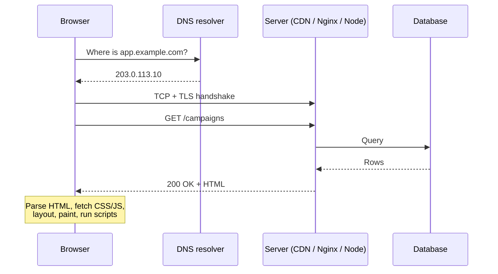
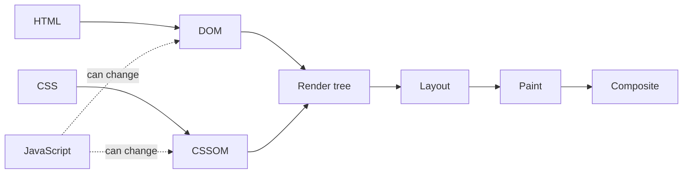
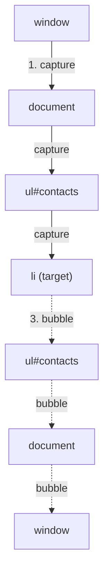
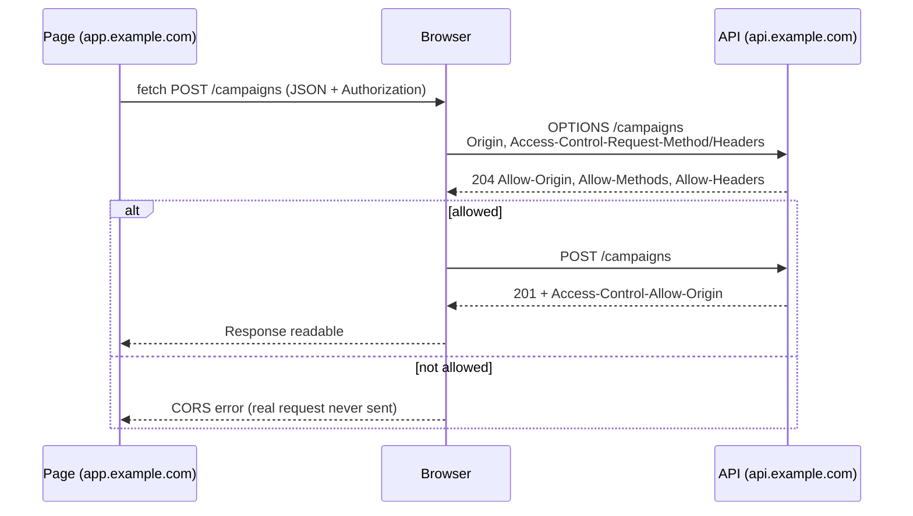
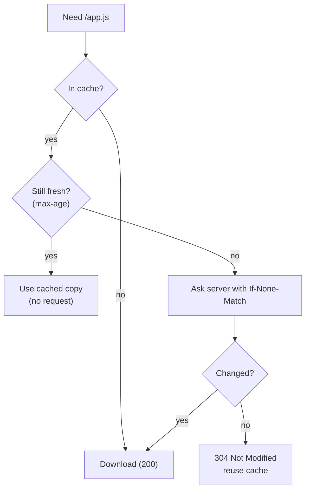

Every feature you build ends up as bytes travelling over a network and pixels drawn by a browser. This chapter follows that journey: how a request reaches a server, what HTTP actually says, how the browser turns HTML into a page, and the security and caching rules that sit in between. CORS alone will save you hours once you understand it properly.

## From URL to page

When you type `https://app.example.com/campaigns` and press Enter:

1. **DNS lookup.** The browser needs an IP address for `app.example.com`. It checks its own cache, the operating system's cache, then asks a DNS resolver, which may ask the root, `.com` and `example.com` name servers in turn.
2. **TCP connection.** The browser opens a connection to that IP on port 443 (a three-step handshake).
3. **TLS handshake.** For HTTPS, the browser and server agree on encryption keys, and the server proves its identity with a certificate signed by a trusted authority.
4. **HTTP request.** The browser sends `GET /campaigns` with headers (cookies, accepted formats, and so on).
5. **Server work.** The request may pass through a CDN, a load balancer and Nginx before reaching your Node app, which checks auth, queries the database and builds a response.
6. **Response.** Status code, headers, body.
7. **Rendering.** The browser parses the HTML, fetches CSS, JavaScript, fonts and images it references, builds the page and runs your scripts.




Connections are reused (keep-alive), and HTTP/2 and HTTP/3 send many requests over one connection at once, so steps 1 to 3 usually happen only once per site.

## HTTP in practice

HTTP is a text-based request/response protocol. A request has a **method**, a **path**, **headers** and an optional **body**. A response has a **status code**, headers and a body.

### Methods

| Method | Meaning | Safe (no changes) | Idempotent (repeat = same effect) |
|---|---|---|---|
| `GET` | Read a resource | Yes | Yes |
| `POST` | Create, or trigger an action | No | No |
| `PUT` | Replace a resource completely | No | Yes |
| `PATCH` | Change part of a resource | No | Not guaranteed |
| `DELETE` | Remove a resource | No | Yes |

Idempotency matters because networks retry. Retrying a `PUT` is harmless; retrying a `POST /payments` could charge twice unless you design for it (idempotency keys, covered in the API chapter).

### Status codes

- **2xx success**: `200 OK`, `201 Created` (return the new resource), `204 No Content`.
- **3xx redirection**: `301` permanent, `302`/`307` temporary, `304 Not Modified` (use your cached copy).
- **4xx client errors**: `400 Bad Request`, `401 Unauthorized` (not logged in), `403 Forbidden` (logged in, not allowed), `404 Not Found`, `409 Conflict`, `422 Unprocessable Entity` (validation failed), `429 Too Many Requests`.
- **5xx server errors**: `500 Internal Server Error`, `502 Bad Gateway` (the proxy got a bad answer from your app), `503 Service Unavailable`, `504 Gateway Timeout`.

> **Tip:** 401 vs 403 is a favourite question. 401 means "who are you?"; 403 means "I know who you are, and the answer is no".

### Headers you'll meet constantly

- `Content-Type`: the format of the body (`application/json`, `multipart/form-data`).
- `Authorization`: credentials, usually `Bearer <token>`.
- `Cookie` / `Set-Cookie`: cookies sent by the browser / set by the server.
- `Cache-Control`, `ETag`: caching.
- `Origin` and the `Access-Control-*` family: CORS.
- `X-Forwarded-For`: the original client IP when behind a proxy.

## How the browser renders a page

The browser turns bytes into pixels through the **critical rendering path**:

1. **Parse HTML → DOM.** A tree of elements.
2. **Parse CSS → CSSOM.** A tree of style rules.
3. **Render tree.** DOM + CSSOM, only the visible elements with their computed styles.
4. **Layout** (reflow): calculate each element's size and position.
5. **Paint**: fill in pixels: text, colours, borders, images.
6. **Composite**: combine painted layers on the GPU in the right order.




### What blocks rendering

- **CSS blocks rendering.** The browser won't paint until it has the CSS, or you'd see unstyled content flash.
- **Normal `<script>` tags block HTML parsing.** The parser stops, downloads and runs the script, then continues.

| Script tag | Downloads | Runs | Order kept |
|---|---|---|---|
| `<script>` | Blocks parsing | Immediately | Yes |
| `<script async>` | In parallel | As soon as downloaded | No |
| `<script defer>` | In parallel | After HTML is parsed | Yes |
| `<script type="module">` | In parallel | Deferred by default | Yes |

### Reflow, repaint and composite

Changing styles costs different amounts depending on which step it re-runs:

- Changing `width`, `height`, `top`, font size or adding elements triggers **layout**, then paint and composite. Expensive, and it can affect the whole page.
- Changing `color` or `background` triggers **paint** and composite.
- Changing `transform` or `opacity` can be done in **composite** only. Cheapest, which is why animations should use them.

**Layout thrashing** is forcing layout over and over by alternating reads and writes:

```js
// Each offsetHeight read forces a fresh layout because of the write before it
for (const el of cards) {
  el.style.height = el.offsetHeight + 10 + 'px'
}

// Better: read everything first, then write everything
const heights = cards.map((el) => el.offsetHeight)
cards.forEach((el, i) => { el.style.height = heights[i] + 10 + 'px' })
```

## The DOM and events

### Event propagation

When you click a button, the event travels in three phases:

1. **Capture**: from `window` down through each ancestor to the target.
2. **Target**: at the element itself.
3. **Bubble**: back up from the target to `window`.

Listeners run during bubbling by default; pass `{ capture: true }` to run during capture. `event.stopPropagation()` stops the journey; `event.preventDefault()` cancels the browser's default action (like submitting a form or following a link). They are different things.




### Event delegation

Because events bubble, one listener on a parent can handle clicks for all its children, including ones added later.

```js
document.querySelector('#contacts').addEventListener('click', (event) => {
  const row = event.target.closest('[data-contact-id]')
  if (!row) return
  openContact(row.dataset.contactId)
})
```

React uses this idea internally: it attaches listeners at the root and dispatches to your components.

## Storage in the browser

| | Cookies | localStorage | sessionStorage | IndexedDB |
|---|---|---|---|---|
| Size | About 4 KB each | About 5 MB | About 5 MB | Large (hundreds of MB+) |
| Lifetime | Set by `Expires`/`Max-Age` | Until cleared | Until the tab closes | Until cleared |
| Sent to server automatically | Yes, with every matching request | No | No | No |
| Readable by JavaScript | Unless `HttpOnly` | Yes | Yes | Yes |
| API | Headers / `document.cookie` | Synchronous | Synchronous | Asynchronous |

### Cookie flags

- **`HttpOnly`**: JavaScript can't read it, so an XSS bug can't steal it.
- **`Secure`**: only sent over HTTPS.
- **`SameSite`**: controls whether it's sent with requests from other sites.
  - `Strict`: never on cross-site requests.
  - `Lax` (the default in modern browsers): sent when the user clicks a link to your site, not on cross-site form POSTs, images or iframes.
  - `None`: always sent; requires `Secure`. Needed for cookies used across different sites.
- **`Domain` / `Path`**: which URLs receive it.

```http
Set-Cookie: refresh=abc123; HttpOnly; Secure; SameSite=Strict; Path=/auth/refresh; Max-Age=1209600
```

## CORS, properly

### The same-origin policy

An **origin** is scheme + host + port. `https://app.example.com` and `https://api.example.com` are *different origins*. So are `http://localhost:5173` and `http://localhost:3000`.

Browsers apply the **same-origin policy**: JavaScript on one origin can *send* requests to another origin, but it can't *read the response* unless that other origin allows it. Without this rule, any website you visit could call your bank's API with your cookies and read your balance.

### CORS is the permission slip

**CORS** (Cross-Origin Resource Sharing) is how a server says "these other origins may read my responses". It does so with response headers:

```http
Access-Control-Allow-Origin: https://app.example.com
Access-Control-Allow-Credentials: true
```

Key facts:

- CORS is enforced **by the browser**. Postman, curl and your Node server calling another API are not affected. "It works in Postman but not in the browser" is almost always CORS.
- The fix is **always on the server** (or a proxy). Nothing in frontend code can grant itself permission.

### Preflight requests

"Simple" requests (GET/POST with basic headers and form-style content types) are sent directly. Anything else, such as `PUT`, `DELETE`, `Content-Type: application/json` or an `Authorization` header, triggers a **preflight**: the browser first sends an `OPTIONS` request asking permission.

```http
OPTIONS /api/campaigns
Origin: https://app.example.com
Access-Control-Request-Method: POST
Access-Control-Request-Headers: content-type, authorization
```

The server must answer with matching `Access-Control-Allow-Methods` and `Access-Control-Allow-Headers`, or the real request is never sent. `Access-Control-Max-Age` lets the browser cache the answer so it doesn't preflight every call.




### Cookies across origins

To send cookies with a cross-origin request:

- The frontend uses `fetch(url, { credentials: 'include' })` (axios: `withCredentials: true`).
- The server replies with `Access-Control-Allow-Credentials: true`.
- `Access-Control-Allow-Origin` must be the **exact origin**, never `*`.
- The cookie itself needs `SameSite=None; Secure` if the two sites are truly cross-site.

```js
import cors from 'cors'

const allowed = ['https://app.example.com', 'http://localhost:5173']

app.use(cors({
  origin: (origin, cb) => cb(null, !origin || allowed.includes(origin)),
  credentials: true,
}))
```

> **Tip:** In development, a Vite proxy (`server.proxy` in `vite.config`) makes API calls same-origin and sidesteps CORS entirely.

## HTTP caching

Caching avoids downloading the same thing twice. The server controls it with headers.

### `Cache-Control`

- `max-age=3600`: reuse without asking for an hour.
- `no-cache`: you may store it, but check with the server before each use.
- `no-store`: never store it (sensitive data).
- `private`: only the browser may cache it, not shared caches like CDNs.
- `public, s-maxage=600`: CDNs may cache it for 10 minutes.
- `immutable`: it will never change; don't even revalidate.

### Revalidation with ETags

The server sends an `ETag` (a fingerprint of the content). Next time, the browser asks `If-None-Match: "<etag>"`. If nothing changed, the server answers `304 Not Modified` with no body, saving bandwidth.




### The standard setup for a single-page app

- Build tools name files with a content hash: `app.3f9a1c.js`. Serve them with `Cache-Control: public, max-age=31536000, immutable`. A new build produces new file names, so caching forever is safe.
- Serve `index.html` with `no-cache`, so users always get the latest list of hashed files.

## Security in the browser

### HTTPS

TLS encrypts data in transit and proves the server's identity. It protects against people on the network reading or changing traffic. Add `Strict-Transport-Security` so browsers refuse plain HTTP for your domain.

### XSS

Cross-site scripting is attacker-controlled script running on your page, usually through user content rendered as HTML. React escapes text by default, so the main risks are `dangerouslySetInnerHTML`, user-supplied URLs (`javascript:` links) and third-party scripts. A **Content-Security-Policy** header limits where scripts may load from, reducing the damage.

### CSRF

Cross-site request forgery tricks a user's browser into sending a request to your site from another site, with your cookies attached. `SameSite` cookies are the main modern defence, backed by CSRF tokens for sensitive forms and by never changing data on `GET`.

### Clickjacking

Another site loads yours in an invisible iframe and tricks users into clicking. Prevent it with `Content-Security-Policy: frame-ancestors 'self'` (or the older `X-Frame-Options: DENY`).

## Web performance

### Core Web Vitals

| Metric | Measures | Good | Common fixes |
|---|---|---|---|
| LCP (Largest Contentful Paint) | When the main content appears | ≤ 2.5 s | Optimise the hero image, preload key fonts, server-render, use a CDN |
| INP (Interaction to Next Paint) | How fast the page reacts to input | ≤ 200 ms | Break up long JavaScript tasks, less work per click, fewer re-renders |
| CLS (Cumulative Layout Shift) | How much content jumps | ≤ 0.1 | Set image dimensions, reserve space for late content, `font-display` |

### Techniques that move the numbers

- **Code splitting**: load each route's JavaScript only when needed (`import()`, `React.lazy`).
- **Lazy loading** offscreen images with `loading="lazy"`.
- **Responsive images**: `srcset` and `sizes` so phones don't download desktop images; modern formats (WebP, AVIF).
- **Compression**: Brotli or gzip for text assets.
- **Fewer, smaller dependencies**: check the bundle with an analyser.
- **Preload** critical resources (`<link rel="preload">`) and **preconnect** to third-party origins.

### Web workers

A **web worker** runs JavaScript on a separate thread, so heavy work (parsing a big CSV of contacts, image processing) doesn't freeze the UI. Workers can't touch the DOM; they talk to the page with `postMessage`.

## Summary

- A request goes DNS → TCP → TLS → HTTP → your server → response → render. Connections are reused.
- Use methods and status codes precisely; idempotency is what makes retries safe.
- The browser builds DOM and CSSOM, then does layout, paint and composite. Animate `transform` and `opacity`; don't interleave DOM reads and writes.
- Events capture down and bubble up; delegation uses bubbling.
- Tokens you need to protect belong in `HttpOnly`, `Secure`, `SameSite` cookies.
- CORS is the browser enforcing the server's permission. Fix it on the server, and never combine `*` with credentials.
- Cache hashed assets forever and `index.html` never.
